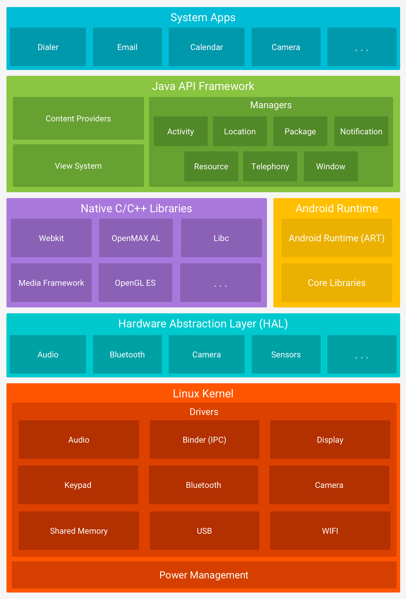
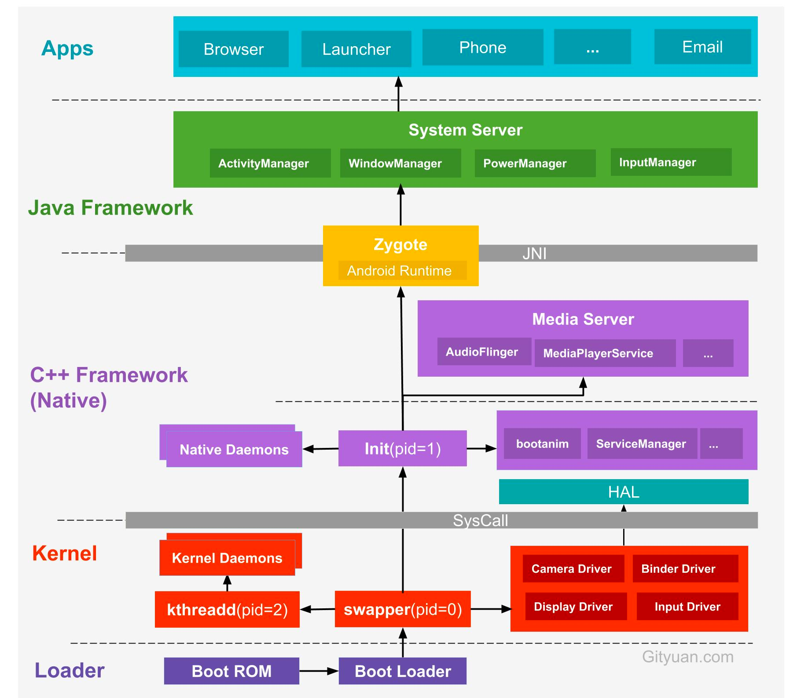

# 二、Android系统架构概览

Android整个体系分为5层结构，遇到复杂的问题必然是分层思想，让每一层负责自己相关的功能。互不干扰，架构清晰。 因此，从上往下为：

```
app 应用层 (微信、浏览器等App。。。)
v
v
framework层(System 服务 managers：Activity、package、window、resource、notification、telephone、location
、；Google封装的组件库：view system、content provider)
v
v
c++ native层，两个部分：
1，Android运行时：虚拟机层(ART) (虚拟机逻辑，栈、堆、方法区、线程、进程等维护；核心库 core libraries。
JNI层 通信 (通过jni，直接从java调用到动态链接库))； 
2，c++库：webkit、opengl es、libc、media framework...;
v
v
硬件抽象层 HALL (统一硬件调用接口，对上层透明)。 audio、bluetooth、sensors、camera...
v
v
操作系统OS 层 (linux内核；真正的指令执行、内核线程、内核逻辑处理、内核栈维护、CPU调度)。两个部分
1 驱动drivers： audio、camera、Bluetooth、Binder、display、keypad、share memory、WiFi、USB。
2 电源管理power managerment： 

疑问：
1， framework层到底指的是哪些？ 
support库、 Androidx库属于吗？
Android系统属于framework？ 

```

架构图：


# 从进程的角度理解

如图：
从进程建立开始，从下到上：

```
App 层： 电话、微信、浏览器。
^
^
Java Framework层： 
1, System Server进程，是Zygote进程第一个孵化的进程。 负责各种Managers：ams、pms、wms等。
2，Media Server进程，由init进程fork而来，负责整个c++ framework的工作，AudioFlinger、Camera Service。
2，view 系统
^
==============================JNI==============================
^                           Zygote进程 Android ART
主要工作：
1，加载ZygoteInit类，注册Zygote Socket套接字服务 
2，加载虚拟机
3，预加载一些类
4，预加载一些资源

^                           至此，java的世界才真正开始。
============================================================
^
c++/native层： swapper(pid=0) fork()出 init进程(pid=1)：
init进程是用户进程的鼻祖。  Zygote进程也是由init进程通过解析init.rc文件从而fork出来。 Zygote进程是第一个java进程，为什么这么说，
因为它有虚拟机。能够加载.class/dex 文件。

1，Native daemons 
2， 开机动画 bootanim、ServiceManager... 
3，HALL 硬件抽象层接口 
4，mediaServer audioFlinger、MediaPlayerService。
^
==============================sys call==============================
^
Kernel层： swapper(pid=0)进程 开始第一个进程，初始化操作系统
1 加载驱动：camera driver、binder driver、display driver、audio 
driver、input driver。
2，fork()一个子进程kthreadd(pid=2), 这是kernel的内核进程，会创建内核的工作线程kworker。它是所有内核进程的鼻祖。
^
^
Boot Loader层：开机引导程序执行引导区扇区()的指令ROM，把操作系统加载到RAM立起来，开辟第一个进程pid=0.
按下电源键开机，系统开机后做了什么？ 

```

# 胶水层 SysCall和jni

java与native之间需要通过jni来调用 native与kernel之间需要syscall系统调用

# 三、通信方式

- Linux上的ipc通信方式有： 信号 如killProcess、信号量、管道、共享内存、Socket套接字 如Zygote进程和System Server进程之间、队列。
- Android 除了以上这些，还有Binder 通信。 Binder通信适用于App与App之间、App与System Server之间。

## binder原理

基于c/s架构，包含5个部分： 客户端、服务端、ServiceManager、binder驱动。

## socket 原理

基于c/s 架构， zygote 进程使用这中方式。

## handler 原理

消息循环机制。

# 四、核心提纲

## 系统启动系列

## 系统稳定性系列

## 四大组件系列

## 图形系列

## 系统服务篇

## 内存&&存储篇

## 工具篇

## 实战篇


