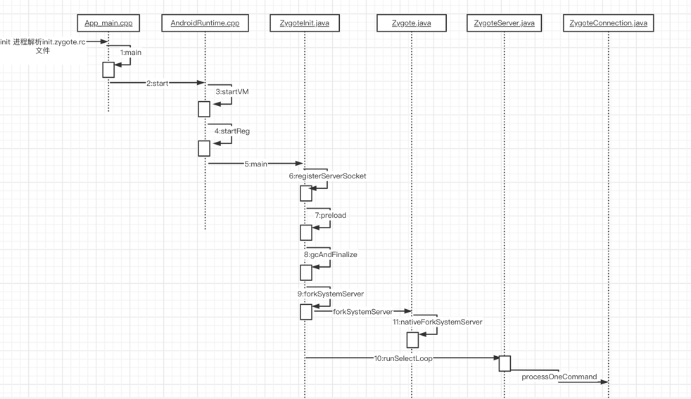

经过前面的init进程简介，接下来就进入zygote进程部分了。

# 一、Zygote的启动

init进程会解析init.zygoteXX.rc 文件，如下： XX 分别对应加载32或64系统。
> > system/core/rootdir/init.zygote64.rc

```
service zygote /system/bin/app_process64 -Xzygote /system/bin --zygote --start-system-server
    class main
    priority -20
    user root
    group root readproc reserved_disk
    socket zygote stream 660 root system
    socket usap_pool_primary stream 660 root system
    onrestart exec_background - system system -- /system/bin/vdc volume abort_fuse
    onrestart write /sys/power/state on
    onrestart restart audioserver
    onrestart restart cameraserver
    onrestart restart media
    onrestart restart media.tuner
    onrestart restart netd
    onrestart restart wificond
    task_profiles ProcessCapacityHigh
    critical window=${zygote.critical_window.minute:-off} target=zygote-fatal

```

这其实就是个配置文件。

1. init首先会创建zygote服务。服务名字为 "zygote"
   如果该service启动过就return，如果没有启动，则调用fork()创建子进程，然后在子进程中调用execv(),进而进入可执行文件的main方法中。
2. 找到服务对应的可执行文件 /system/bin/app_process64/app_main.cpp，通过execev()系统调用
3. 执行app_main.cpp中的main方法

至于为什么是app_main.cpp，Android.bp给出了答案：
> > frameworks/base/cmds/app_process/Android.bp

```
   //.....
cc_binary {
    name: "app_process",
    //对应的就是app_main.cpp
    srcs: ["app_main.cpp"],

    multilib: {
        lib32: {
            suffix: "32",
        },
        lib64: {
            suffix: "64",
        },
    },

   //.....
}

```

# 二、app_main.cpp
```
int main(int argc, char* const argv[])
{
    if (!LOG_NDEBUG) {
      String8 argv_String;
      for (int i = 0; i < argc; ++i) {
        argv_String.append("\"");
        argv_String.append(argv[i]);
        argv_String.append("\" ");
      }
      ALOGV("app_process main with argv: %s", argv_String.string());
    }
    //1 创建runtime对象
    AppRuntime runtime(argv[0], computeArgBlockSize(argc, argv));
    // Process command line arguments
    // ignore argv[0]
    argc--;
    argv++;

    // Everything up to '--' or first non '-' arg goes to the vm.
    //
    // The first argument after the VM args is the "parent dir", which
    // is currently unused.
    //
    // After the parent dir, we expect one or more the following internal
    // arguments :
    //
    // --zygote : Start in zygote mode
    // --start-system-server : Start the system server.
    // --application : Start in application (stand alone, non zygote) mode.
    // --nice-name : The nice name for this process.
    //
    // For non zygote starts, these arguments will be followed by
    // the main class name. All remaining arguments are passed to
    // the main method of this class.
    //
    // For zygote starts, all remaining arguments are passed to the zygote.
    // main function.
    //
    // Note that we must copy argument string values since we will rewrite the
    // entire argument block when we apply the nice name to argv0.
    //
    // As an exception to the above rule, anything in "spaced commands"
    // goes to the vm even though it has a space in it.
    const char* spaced_commands[] = { "-cp", "-classpath" };
    // Allow "spaced commands" to be succeeded by exactly 1 argument (regardless of -s).
    bool known_command = false;

    int i;
    for (i = 0; i < argc; i++) {
        if (known_command == true) {
          runtime.addOption(strdup(argv[i]));
          // The static analyzer gets upset that we don't ever free the above
          // string. Since the allocation is from main, leaking it doesn't seem
          // problematic. NOLINTNEXTLINE
          ALOGV("app_process main add known option '%s'", argv[i]);
          known_command = false;
          continue;
        }

        for (int j = 0;
             j < static_cast<int>(sizeof(spaced_commands) / sizeof(spaced_commands[0]));
             ++j) {
          if (strcmp(argv[i], spaced_commands[j]) == 0) {
            known_command = true;
            ALOGV("app_process main found known command '%s'", argv[i]);
          }
        }

        if (argv[i][0] != '-') {
            break;
        }
        if (argv[i][1] == '-' && argv[i][2] == 0) {
            ++i; // Skip --.
            break;
        }

        runtime.addOption(strdup(argv[i]));
        // The static analyzer gets upset that we don't ever free the above
        // string. Since the allocation is from main, leaking it doesn't seem
        // problematic. NOLINTNEXTLINE
        ALOGV("app_process main add option '%s'", argv[i]);
    }

    // Parse runtime arguments.  Stop at first unrecognized option.
    bool zygote = false;
    bool startSystemServer = false;
    bool application = false;
    String8 niceName;
    String8 className;

    //2 解析 启动参数 
    ++i;  // Skip unused "parent dir" argument.
    while (i < argc) {
        const char* arg = argv[i++];
       
        if (strcmp(arg, "--zygote") == 0) {
        // 如果运行在zygote进程
            zygote = true;
            niceName = ZYGOTE_NICE_NAME;
        } else if (strcmp(arg, "--start-system-server") == 0) {
         // 如果运行在SystemServer进程
            startSystemServer = true;
        } else if (strcmp(arg, "--application") == 0) {
            application = true;
        } else if (strncmp(arg, "--nice-name=", 12) == 0) {
            niceName.setTo(arg + 12);
        } else if (strncmp(arg, "--", 2) != 0) {
            className.setTo(arg);
            break;
        } else {
            --i;
            break;
        }
    }

    Vector<String8> args;
    if (!className.isEmpty()) {
        // We're not in zygote mode, the only argument we need to pass
        // to RuntimeInit is the application argument.
        //
        // The Remainder of args get passed to startup class main(). Make
        // copies of them before we overwrite them with the process name.
        args.add(application ? String8("application") : String8("tool"));
        runtime.setClassNameAndArgs(className, argc - i, argv + i);

        if (!LOG_NDEBUG) {
          String8 restOfArgs;
          char* const* argv_new = argv + i;
          int argc_new = argc - i;
          for (int k = 0; k < argc_new; ++k) {
            restOfArgs.append("\"");
            restOfArgs.append(argv_new[k]);
            restOfArgs.append("\" ");
          }
          ALOGV("Class name = %s, args = %s", className.string(), restOfArgs.string());
        }
    } else {
        // We're in zygote mode.
        maybeCreateDalvikCache();

        if (startSystemServer) {
            args.add(String8("start-system-server"));
        }

        char prop[PROP_VALUE_MAX];
        if (property_get(ABI_LIST_PROPERTY, prop, NULL) == 0) {
            LOG_ALWAYS_FATAL("app_process: Unable to determine ABI list from property %s.",
                ABI_LIST_PROPERTY);
            return 11;
        }

        String8 abiFlag("--abi-list=");
        abiFlag.append(prop);
        args.add(abiFlag);

        // In zygote mode, pass all remaining arguments to the zygote
        // main() method.
        for (; i < argc; ++i) {
            args.add(String8(argv[i]));
        }
    }

    if (!niceName.isEmpty()) {
        runtime.setArgv0(niceName.string(), true /* setProcName */);
    }
    // 3 调用runtime的方法
    if (zygote) {
    // 如果运行在zygote进程
        runtime.start("com.android.internal.os.ZygoteInit", args, zygote);
    } else if (className) {
   
        runtime.start("com.android.internal.os.RuntimeInit", args, zygote);
    } else {
        fprintf(stderr, "Error: no class name or --zygote supplied.\n");
        app_usage();
        LOG_ALWAYS_FATAL("app_process: no class name or --zygote supplied.");
    }
}
```

主要做了三件事：

1. 创建AndroidRuntime 对象
2. 解析启动参数， 如--zygote --start-system-server
   由于SystemServer进程也是zygote进程fork而来，因此也会走这个main方法，因此通过参数来区分是哪一个进程
3. 根据不同进程执行环境来调用runtime不同的方法

# 三、runtime.start()

如果是zygote进程：

```
runtime.start("com.android.internal.os.ZygoteInit", args, zygote);
```

```
void AndroidRuntime::start(const char* className, const Vector<String8>& options, bool zygote)
{
    ALOGD(">>>>>> START %s uid %d <<<<<<\n",
            className != NULL ? className : "(unknown)", getuid());

    static const String8 startSystemServer("start-system-server");
    // Whether this is the primary zygote, meaning the zygote which will fork system server.
    bool primary_zygote = false;

    /*
     * 'startSystemServer == true' means runtime is obsolete and not run from
     * init.rc anymore, so we print out the boot start event here.
     */
    for (size_t i = 0; i < options.size(); ++i) {
        if (options[i] == startSystemServer) {
            primary_zygote = true;
           /* track our progress through the boot sequence */
           const int LOG_BOOT_PROGRESS_START = 3000;
           LOG_EVENT_LONG(LOG_BOOT_PROGRESS_START,  ns2ms(systemTime(SYSTEM_TIME_MONOTONIC)));
        }
    }

    const char* rootDir = getenv("ANDROID_ROOT");
    if (rootDir == NULL) {
        rootDir = "/system";
        if (!hasDir("/system")) {
            LOG_FATAL("No root directory specified, and /system does not exist.");
            return;
        }
        setenv("ANDROID_ROOT", rootDir, 1);
    }

    const char* artRootDir = getenv("ANDROID_ART_ROOT");
    if (artRootDir == NULL) {
        LOG_FATAL("No ART directory specified with ANDROID_ART_ROOT environment variable.");
        return;
    }

    const char* i18nRootDir = getenv("ANDROID_I18N_ROOT");
    if (i18nRootDir == NULL) {
        LOG_FATAL("No runtime directory specified with ANDROID_I18N_ROOT environment variable.");
        return;
    }

    const char* tzdataRootDir = getenv("ANDROID_TZDATA_ROOT");
    if (tzdataRootDir == NULL) {
        LOG_FATAL("No tz data directory specified with ANDROID_TZDATA_ROOT environment variable.");
        return;
    }

    //const char* kernelHack = getenv("LD_ASSUME_KERNEL");
    //ALOGD("Found LD_ASSUME_KERNEL='%s'\n", kernelHack);
    
    //1 开启虚拟机VM
    /* start the virtual machine */
    JniInvocation jni_invocation;
    // 加载libart.so
    jni_invocation.Init(NULL);
    JNIEnv* env;
    if (startVm(&mJavaVM, &env, zygote, primary_zygote) != 0) {
        return;
    }
    onVmCreated(env);

    // 2 注册jni
    /*
     * Register android functions.
     */
    if (startReg(env) < 0) {
        ALOGE("Unable to register all android natives\n");
        return;
    }

    /*
     * We want to call main() with a String array with arguments in it.
     * At present we have two arguments, the class name and an option string.
     * Create an array to hold them.
     */
    jclass stringClass;
    jobjectArray strArray;
    jstring classNameStr;

    stringClass = env->FindClass("java/lang/String");
    assert(stringClass != NULL);
    strArray = env->NewObjectArray(options.size() + 1, stringClass, NULL);
    assert(strArray != NULL);
    classNameStr = env->NewStringUTF(className);
    assert(classNameStr != NULL);
    env->SetObjectArrayElement(strArray, 0, classNameStr);

    for (size_t i = 0; i < options.size(); ++i) {
        jstring optionsStr = env->NewStringUTF(options.itemAt(i).string());
        assert(optionsStr != NULL);
        env->SetObjectArrayElement(strArray, i + 1, optionsStr);
    }

    /*
     * Start VM.  This thread becomes the main thread of the VM, and will
     * not return until the VM exits.
     
     开始VM。 虚拟机的线程变成了主线程，永远不会return。除非VM 退出。
     */
    char* slashClassName = toSlashClassName(className != NULL ? className : "");
    jclass startClass = env->FindClass(slashClassName);
    if (startClass == NULL) {
        ALOGE("JavaVM unable to locate class '%s'\n", slashClassName);
        /* keep going */
    } else {
        jmethodID startMeth = env->GetStaticMethodID(startClass, "main",
            "([Ljava/lang/String;)V");
        if (startMeth == NULL) {
            ALOGE("JavaVM unable to find main() in '%s'\n", className);
            /* keep going */
        } else {
        // 3 回调java测com.android.internal.os.ZygoteInit的main方法
            env->CallStaticVoidMethod(startClass, startMeth, strArray);

#if 0
            if (env->ExceptionCheck())
                threadExitUncaughtException(env);
#endif
        }
    }
    free(slashClassName);

    ALOGD("Shutting down VM\n");
    if (mJavaVM->DetachCurrentThread() != JNI_OK)
        ALOGW("Warning: unable to detach main thread\n");
    if (mJavaVM->DestroyJavaVM() != 0)
        ALOGW("Warning: VM did not shut down cleanly\n");
}

```

职责：

1. 开启虚拟机VM 先加载libart.so，找到虚拟机so文件中的JNI_CreateJavaVM_符号的地址，当真正执行startVM的时候，
   就调用到so库中的JNI_CreateJavaVM的方法，启动虚拟机，至此虚拟机已经启动完成。具体内部如何执行，后面学习。
2. 注册jni方法
3. 回调java测com.android.internal.os.ZygoteInit的main方法

## 3.1  AndroidRuntime::startVm()

> > frameworks/base/core/jni/AndroidRuntime.cpp

```
int AndroidRuntime::startVm(JavaVM** pJavaVM, JNIEnv** pEnv, bool zygote, bool primary_zygote)
{
    //...
 initArgs.version = JNI_VERSION_1_4;
    initArgs.options = mOptions.editArray();
    initArgs.nOptions = mOptions.size();
    initArgs.ignoreUnrecognized = JNI_FALSE;

    /*
     * Initialize the VM.
     *
     * The JavaVM* is essentially per-process, and the JNIEnv* is per-thread.
     * If this call succeeds, the VM is ready, and we can start issuing
     * JNI calls.
     */
    if (JNI_CreateJavaVM(pJavaVM, pEnv, &initArgs) < 0) {
        ALOGE("JNI_CreateJavaVM failed\n");
        return -1;
    }

    return 0;
}
```

职责：

JNI_CreateJavaVM 会调用之前从libart.so库中找到的方法，进入虚拟机的共享库中去执行。

1. JavaVM* 是每个进程的上下文 , 每个进程都有自己的VM
2. JNIEnv* 是每个线程的上下文，每个线程有自己的jniEnv指针对象
3. 当虚拟机初始化完成，jni就可以发布了。

如何理解上面的三句话？

从进程角度出发，每个进程有且只有一个虚拟机实例。java层所有想要调用native层的方法都只能通过虚拟机中的jni层来实现。

而真正的调用是发生在某个线程上的。因此，从线程的角度来看，多线程条件下，每个线程都有能独立的调用自己的native方法，拥有 独立的函数调用栈。因此jnienv就表示函数调用的上下文。

因此，想要打通java和native的互相调用，那么就必须要依赖jni。而jni的映射注册又必须依赖虚拟机的创建完成。

## 3.2 注册jni startReg()

最终调用register_jni_procs：

```
static int register_jni_procs(const RegJNIRec array[], size_t count, JNIEnv* env)
{
    for (size_t i = 0; i < count; i++) {
        if (array[i].mProc(env) < 0) {
#ifndef NDEBUG
            ALOGD("----------!!! %s failed to load\n", array[i].mName);
#endif
            return -1;
        }
    }
    return 0;
}
```

array[i] 是一个数组，这个数组包含很多成员函数地址，真正执行对应的函数时候，就会注册java和native方法对应关系。
jni本质上就是建立java方法和native方法的一个映射关系，让java和native能够实现互相调用。

## 3.3 进入Java层

通过jni的CallStaticVoidMethod方法，native调用java层的ZygoteInit.main()方法。 至此，zygote进程从native层到了java层。

注意，至此，代码所在线程还是在zygote进程的主线程！

# 四、Java层 ZygoteInit.main()

native层的zygote进程，已完成了部分工作，现在到了java层。理所当然，侧重点肯定要处理class相关的逻辑。

```
public static void main(String argv[]) {
        ZygoteServer zygoteServer = new ZygoteServer();

        // Mark zygote start. This ensures that thread creation will throw
        // an error. 标记zygote的开始，此时如果创建线程，则会抛出错误
        ZygoteHooks.startZygoteNoThreadCreation();

        // Zygote goes into its own process group.
        try {
            Os.setpgid(0, 0);
        } catch (ErrnoException ex) {
            throw new RuntimeException("Failed to setpgid(0,0)", ex);
        }

        final Runnable caller;
        try {
            // Report Zygote start time to tron unless it is a runtime restart
            if (!"1".equals(SystemProperties.get("sys.boot_completed"))) {
                MetricsLogger.histogram(null, "boot_zygote_init",
                        (int) SystemClock.elapsedRealtime());
            }

            String bootTimeTag = Process.is64Bit() ? "Zygote64Timing" : "Zygote32Timing";
            TimingsTraceLog bootTimingsTraceLog = new TimingsTraceLog(bootTimeTag,
                    Trace.TRACE_TAG_DALVIK);
            bootTimingsTraceLog.traceBegin("ZygoteInit");
            RuntimeInit.enableDdms();

            boolean startSystemServer = false;
            String socketName = "zygote";
            String abiList = null;
            boolean enableLazyPreload = false;
            //1 遍历native传递过来的参数 
            for (int i = 1; i < argv.length; i++) {
                if ("start-system-server".equals(argv[i])) {
                    // 是否开启systemServer进程 
                    startSystemServer = true;
                } else if ("--enable-lazy-preload".equals(argv[i])) {
                    enableLazyPreload = true;
                } else if (argv[i].startsWith(ABI_LIST_ARG)) {
                    abiList = argv[i].substring(ABI_LIST_ARG.length());
                } else if (argv[i].startsWith(SOCKET_NAME_ARG)) {
                    socketName = argv[i].substring(SOCKET_NAME_ARG.length());
                } else {
                    throw new RuntimeException("Unknown command line argument: " + argv[i]);
                }
            }

            if (abiList == null) {
                throw new RuntimeException("No ABI list supplied.");
            }
            //2 创建并监听zygote socket服务
            zygoteServer.registerServerSocket(socketName);
            // In some configurations, we avoid preloading resources and classes eagerly.
            // In such cases, we will preload things prior to our first fork.
            if (!enableLazyPreload) {
                bootTimingsTraceLog.traceBegin("ZygotePreload");
                EventLog.writeEvent(LOG_BOOT_PROGRESS_PRELOAD_START,
                    SystemClock.uptimeMillis());
                    //3 预加载 Android 资源
                preload(bootTimingsTraceLog);
                EventLog.writeEvent(LOG_BOOT_PROGRESS_PRELOAD_END,
                    SystemClock.uptimeMillis());
                bootTimingsTraceLog.traceEnd(); // ZygotePreload
            } else {
                Zygote.resetNicePriority();
            }

            // Do an initial gc to clean up after startup
            bootTimingsTraceLog.traceBegin("PostZygoteInitGC");
            // 4 初始化gc 
            gcAndFinalize();
            bootTimingsTraceLog.traceEnd(); // PostZygoteInitGC

            bootTimingsTraceLog.traceEnd(); // ZygoteInit
            // Disable tracing so that forked processes do not inherit stale tracing tags from
            // Zygote.
            Trace.setTracingEnabled(false, 0);

            // Zygote process unmounts root storage spaces.
            Zygote.nativeUnmountStorageOnInit();

            // Set seccomp policy
            Seccomp.setPolicy();

            ZygoteHooks.stopZygoteNoThreadCreation();
            // 5 拉起systemServer进程
            if (startSystemServer) {
                Runnable r = forkSystemServer(abiList, socketName, zygoteServer);

                // {@code r == null} in the parent (zygote) process, and {@code r != null} in the
                // child (system_server) process.
                if (r != null) {
                    // 进入 systemServer进程 
                    r.run();
                    return;
                }
            }

            Log.i(TAG, "Accepting command socket connections");
            //5 开启slectLoop
            // The select loop returns early in the child process after a fork and
            // loops forever in the zygote.
            caller = zygoteServer.runSelectLoop(abiList);
        } catch (Throwable ex) {
            Log.e(TAG, "System zygote died with exception", ex);
            throw ex;
        } finally {
            zygoteServer.closeServerSocket();
        }

        // We're in the child process and have exited the select loop. Proceed to execute the
        // command.
        if (caller != null) {
        // 6 最终，执行子进程的逻辑
            caller.run();
        }
    }

```

职责：

1. 解析native测传递的参数
2. 创建并注册zygote socket服务
3. preload Android资源
4. 拉起SystemServer进程
5. 开启selectLoop

## 4.1 解析参数

解析获取是否开启systemServer进程标志

解析获取zygote server socket的名字

## 4.2 创建zygote进程socket服务

创建本进程的socket服务，响应后续其他进程的请求。

```
   
 void registerServerSocket(String socketName) {
        if (mServerSocket == null) {
            int fileDesc;
            final String fullSocketName = ANDROID_SOCKET_PREFIX + socketName;
            // socket 名字为 ："ANDROID_SOCKET_zygote"
            try {
                // 从进程的环境变量中取出fd描述符 
               // init进程在初始化的时候就已经add了这个环境变量，因此，从init进程fork出来的进程如 zygote，
               //就可以直接获取。
                String env = System.getenv(fullSocketName);
                fileDesc = Integer.parseInt(env);
            } catch (RuntimeException ex) {
                throw new RuntimeException(fullSocketName + " unset or invalid", ex);
            }

            try {
                FileDescriptor fd = new FileDescriptor();
                fd.setInt$(fileDesc);
                mServerSocket = new LocalServerSocket(fd);
            } catch (IOException ex) {
                throw new RuntimeException(
                        "Error binding to local socket '" + fileDesc + "'", ex);
            }
        }
    }

```

职责：

监听fd对应的文件描述符的变化， 当子进程通过fd对应的客户端socket连接服务端的地址，发送消息的时候，zygote服务端socket收到信息， 进行逻辑处理。

此时的socket与网络中的socket是不一样的。此时的socket是跟某个文件描述符绑定的。网络中socket则是对tcp/udp的包装。

疑问：为什么不用binder而是用socket呢？

## 4.3 preload Android资源

```
 static void preload(TimingsTraceLog bootTimingsTraceLog) {
        Log.d(TAG, "begin preload");
        bootTimingsTraceLog.traceBegin("BeginPreload");
        beginPreload();
        bootTimingsTraceLog.traceEnd(); // BeginPreload
        bootTimingsTraceLog.traceBegin("PreloadClasses");
        
        preloadClasses();
        bootTimingsTraceLog.traceEnd(); // PreloadClasses
        bootTimingsTraceLog.traceBegin("CacheNonBootClasspathClassLoaders");
        cacheNonBootClasspathClassLoaders();
        bootTimingsTraceLog.traceEnd(); // CacheNonBootClasspathClassLoaders
        bootTimingsTraceLog.traceBegin("PreloadResources");
        preloadResources();
        bootTimingsTraceLog.traceEnd(); // PreloadResources
        Trace.traceBegin(Trace.TRACE_TAG_DALVIK, "PreloadAppProcessHALs");
        nativePreloadAppProcessHALs();
        Trace.traceEnd(Trace.TRACE_TAG_DALVIK);
        Trace.traceBegin(Trace.TRACE_TAG_DALVIK, "PreloadGraphicsDriver");
        maybePreloadGraphicsDriver();
        Trace.traceEnd(Trace.TRACE_TAG_DALVIK);
        preloadSharedLibraries();
        preloadTextResources();
        // Ask the WebViewFactory to do any initialization that must run in the zygote process,
        // for memory sharing purposes.
        WebViewFactory.prepareWebViewInZygote();
        
        endPreload();
        warmUpJcaProviders();
        Log.d(TAG, "end preload");

        sPreloadComplete = true;
    }

```

预加载系统类、资源、共享库so、文字、webview等，后续fork的子进程就能直接使用，提升新进程的启动速度。

## 4.4 拉起SystemServer进程

```
 /**
     * Prepare the arguments and forks for the system server process.
     * @return A {@code Runnable} that provides an entrypoint into system_server code in the child
     * process; {@code null} in the parent.
     
     准备参数，fork出 systemServer 进程。如果返回一个runnable对象不为null，则包含了systemServer进程的入口。
     如果为null，则表示是zygote进程。
     
     
     */
private static Runnable forkSystemServer(String abiList, String socketName,
            ZygoteServer zygoteServer) {
        try {
            parsedArgs = new ZygoteArguments(args);
            Zygote.applyDebuggerSystemProperty(parsedArgs);
            Zygote.applyInvokeWithSystemProperty(parsedArgs);

            if (Zygote.nativeSupportsTaggedPointers()) {
                /* Enable pointer tagging in the system server. Hardware support for this is present
                 * in all ARMv8 CPUs. */
                parsedArgs.mRuntimeFlags |= Zygote.MEMORY_TAG_LEVEL_TBI;
            }

            /* Enable gwp-asan on the system server with a small probability. This is the same
             * policy as applied to native processes and system apps. */
            parsedArgs.mRuntimeFlags |= Zygote.GWP_ASAN_LEVEL_LOTTERY;

            if (shouldProfileSystemServer()) {
                parsedArgs.mRuntimeFlags |= Zygote.PROFILE_SYSTEM_SERVER;
            }

            /* Request to fork the system server process */
            pid = Zygote.forkSystemServer(
                    parsedArgs.mUid, parsedArgs.mGid,
                    parsedArgs.mGids,
                    parsedArgs.mRuntimeFlags,
                    null,
                    parsedArgs.mPermittedCapabilities,
                    parsedArgs.mEffectiveCapabilities);
        } catch (IllegalArgumentException ex) {
            throw new RuntimeException(ex);
        }

        /* For child process */
        if (pid == 0) {
            if (hasSecondZygote(abiList)) {
                waitForSecondaryZygote(socketName);
            }
            // 子进程创建完成，关闭服务端socket。因为子进程不需要 
            zygoteServer.closeServerSocket();
            return handleSystemServerProcess(parsedArgs);
        }
```

根据解析得到的参数， fork出systemServer进程。 当进入到子进程的代码中时，需要关闭从zygote进程继承而来的serverSocket服务。

handleSystemServerProcess()方法，完成systemServer进程剩余的工作。

## 4.5 开启selectLoop

```
/**
     * Runs the zygote process's select loop. Accepts new connections as
     * they happen, and reads commands from connections one spawn-request's
     * worth at a time.
     开启zygote进程的loop循环：同时处理
     1 接收新的进程连接请求
     2 处理已连接进程的的创建新进程的命令
     */
    Runnable runSelectLoop(String abiList) {
        ArrayList<FileDescriptor> socketFDs = new ArrayList<>();
        ArrayList<ZygoteConnection> peers = new ArrayList<>();
         //把zygote进程添加进去
        socketFDs.add(mZygoteSocket.getFileDescriptor());   
        peers.add(null);

        mUsapPoolRefillTriggerTimestamp = INVALID_TIMESTAMP;
         //开启无线循环
        while (true) {
            fetchUsapPoolPolicyPropsWithMinInterval();
            mUsapPoolRefillAction = UsapPoolRefillAction.NONE;

            int[] usapPipeFDs = null;
            StructPollfd[] pollFDs;

            // Allocate enough space for the poll structs, taking into account
            // the state of the USAP pool for this Zygote (could be a
            // regular Zygote, a WebView Zygote, or an AppZygote).
            if (mUsapPoolEnabled) {
                usapPipeFDs = Zygote.getUsapPipeFDs();
                pollFDs = new StructPollfd[socketFDs.size() + 1 + usapPipeFDs.length];
            } else {
                pollFDs = new StructPollfd[socketFDs.size()];
            }

            /*
             * For reasons of correctness the USAP pool pipe and event FDs
             * must be processed before the session and server sockets.  This
             * is to ensure that the USAP pool accounting information is
             * accurate when handling other requests like API blacklist
             * exemptions.
             */

            int pollIndex = 0;
            for (FileDescriptor socketFD : socketFDs) {
                pollFDs[pollIndex] = new StructPollfd();
                pollFDs[pollIndex].fd = socketFD;
                pollFDs[pollIndex].events = (short) POLLIN;
                ++pollIndex;
            }

            ...

            int pollTimeoutMs;

            if (mUsapPoolRefillTriggerTimestamp == INVALID_TIMESTAMP) {
                pollTimeoutMs = -1;
            } else {
                long elapsedTimeMs = System.currentTimeMillis() - mUsapPoolRefillTriggerTimestamp;

                if (elapsedTimeMs >= mUsapPoolRefillDelayMs) {
                    // Normalize the poll timeout value when the time between one poll event and the
                    // next pushes us over the delay value.  This prevents poll receiving a 0
                    // timeout value, which would result in it returning immediately.
                    pollTimeoutMs = -1;

                } else if (elapsedTimeMs <= 0) {
                    // This can occur if the clock used by currentTimeMillis is reset, which is
                    // possible because it is not guaranteed to be monotonic.  Because we can't tell
                    // how far back the clock was set the best way to recover is to simply re-start
                    // the respawn delay countdown.
                    pollTimeoutMs = mUsapPoolRefillDelayMs;

                } else {
                    pollTimeoutMs = (int) (mUsapPoolRefillDelayMs - elapsedTimeMs);
                }
            }

            int pollReturnValue;
            try {
            // 如果fd没有消息 则会阻塞在这里
                pollReturnValue = Os.poll(pollFDs, pollTimeoutMs);
            } catch (ErrnoException ex) {
                throw new RuntimeException("poll failed", ex);
            }

            if (pollReturnValue == 0) {
                // The poll timeout has been exceeded.  This only occurs when we have finished the
                // USAP pool refill delay period.

                mUsapPoolRefillTriggerTimestamp = INVALID_TIMESTAMP;
                mUsapPoolRefillAction = UsapPoolRefillAction.DELAYED;

            } else {
                boolean usapPoolFDRead = false;

                while (--pollIndex >= 0) {
                    if ((pollFDs[pollIndex].revents & POLLIN) == 0) {
                        continue;
                    }

                    if (pollIndex == 0) {
                        // Zygote server socket
                         // 是Zygote server socket，建立新的连接 
                        ZygoteConnection newPeer = acceptCommandPeer(abiList);
                        peers.add(newPeer);
                        socketFDs.add(newPeer.getFileDescriptor());

                    } else if (pollIndex < usapPoolEventFDIndex) {
                        // Session socket accepted from the Zygote server socket

                        try {
                            ZygoteConnection connection = peers.get(pollIndex);
                            final Runnable command = connection.processOneCommand(this);

                            // TODO (chriswailes): Is this extra check necessary?
                            if (mIsForkChild) {
                                // We're in the child. We should always have a command to run at
                                // this stage if processOneCommand hasn't called "exec".
                                if (command == null) {
                                    throw new IllegalStateException("command == null");
                                }

                                return command;
                            } else {
                                // We're in the server - we should never have any commands to run.
                                if (command != null) {
                                    throw new IllegalStateException("command != null");
                                }

                                // We don't know whether the remote side of the socket was closed or
                                // not until we attempt to read from it from processOneCommand. This
                                // shows up as a regular POLLIN event in our regular processing
                                // loop.
                                if (connection.isClosedByPeer()) {
                                    connection.closeSocket();
                                    peers.remove(pollIndex);
                                    socketFDs.remove(pollIndex);
                                }
                            }
                        } catch (Exception e) {
                            if (!mIsForkChild) {
                                // We're in the server so any exception here is one that has taken
                                // place pre-fork while processing commands or reading / writing
                                // from the control socket. Make a loud noise about any such
                                // exceptions so that we know exactly what failed and why.

                                Slog.e(TAG, "Exception executing zygote command: ", e);

                                // Make sure the socket is closed so that the other end knows
                                // immediately that something has gone wrong and doesn't time out
                                // waiting for a response.
                                ZygoteConnection conn = peers.remove(pollIndex);
                                conn.closeSocket();

                                socketFDs.remove(pollIndex);
                            } else {
                                // We're in the child so any exception caught here has happened post
                                // fork and before we execute ActivityThread.main (or any other
                                // main() method). Log the details of the exception and bring down
                                // the process.
                                Log.e(TAG, "Caught post-fork exception in child process.", e);
                                throw e;
                            }
                        } finally {
                            // Reset the child flag, in the event that the child process is a child-
                            // zygote. The flag will not be consulted this loop pass after the
                            // Runnable is returned.
                            mIsForkChild = false;
                        }

                    } else {
                        // Either the USAP pool event FD or a USAP reporting pipe.

                        // If this is the event FD the payload will be the number of USAPs removed.
                        // If this is a reporting pipe FD the payload will be the PID of the USAP
                        // that was just specialized.  The `continue` statements below ensure that
                        // the messagePayload will always be valid if we complete the try block
                        // without an exception.
                        long messagePayload;

                        try {
                            byte[] buffer = new byte[Zygote.USAP_MANAGEMENT_MESSAGE_BYTES];
                            int readBytes =
                                    Os.read(pollFDs[pollIndex].fd, buffer, 0, buffer.length);

                            if (readBytes == Zygote.USAP_MANAGEMENT_MESSAGE_BYTES) {
                                DataInputStream inputStream =
                                        new DataInputStream(new ByteArrayInputStream(buffer));

                                messagePayload = inputStream.readLong();
                            } else {
                                Log.e(TAG, "Incomplete read from USAP management FD of size "
                                        + readBytes);
                                continue;
                            }
                        } catch (Exception ex) {
                            if (pollIndex == usapPoolEventFDIndex) {
                                Log.e(TAG, "Failed to read from USAP pool event FD: "
                                        + ex.getMessage());
                            } else {
                                Log.e(TAG, "Failed to read from USAP reporting pipe: "
                                        + ex.getMessage());
                            }

                            continue;
                        }

                        if (pollIndex > usapPoolEventFDIndex) {
                            Zygote.removeUsapTableEntry((int) messagePayload);
                        }

                        usapPoolFDRead = true;
                    }
                }
            }
         ...
        }
    }


```

主要职责： 开启zygote进程的select loop 无限循环(没有消息会阻塞)：同时处理 1 接收新的进程连接请求 2 处理已连接进程的的创建新进程的命令

## 4.6 继续执行子进程的逻辑

当zygote进程的socket处理完成，那么新进程就可以做自己的事情了。

# 5 总结




