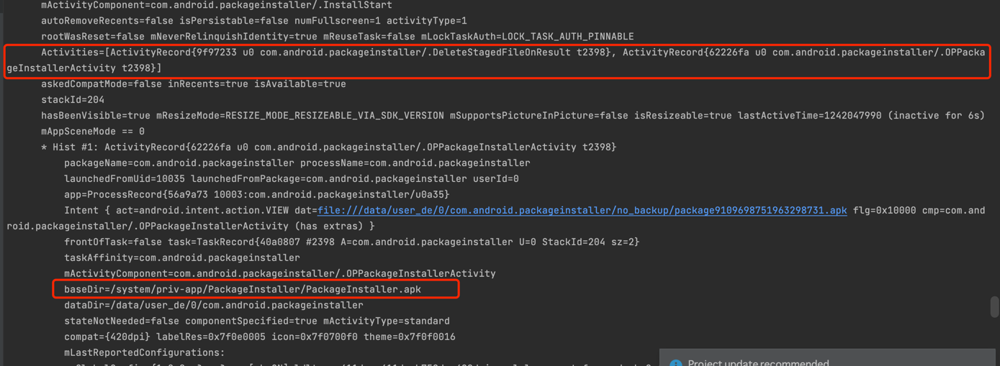
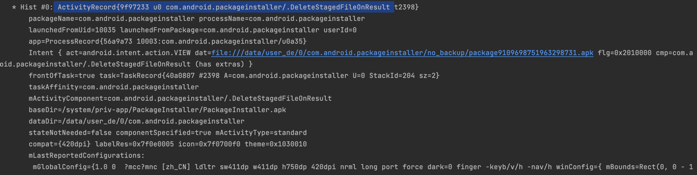
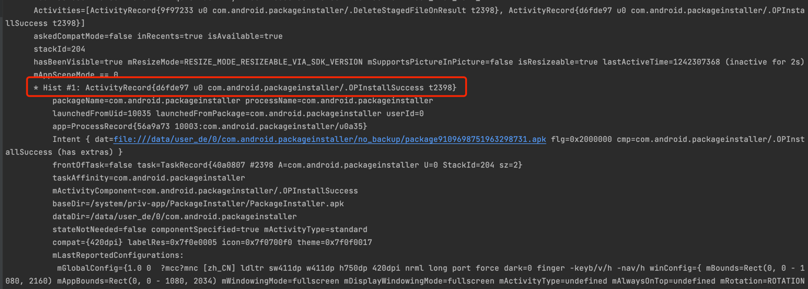
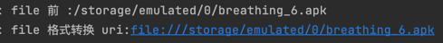

# 安装过程

疑问： 1, 一个apk是怎么被安装的？

当 PMS 启动后，本质上所有的包都应该被扫描出来了。也就是说从静态的文件包 转变成了内存的数据结构。 那么先看下这个转变的过程是如何转变的吧。 所以，先看扫描。


> frameworks/base/core/java/android/content/pm/IPackageInstaller.aidl

```
 interface IPackageInstaller {
31      int createSession(in PackageInstaller.SessionParams params, String installerPackageName, int userId);
32  
33      void updateSessionAppIcon(int sessionId, in Bitmap appIcon);
34      void updateSessionAppLabel(int sessionId, String appLabel);
35  
36      void abandonSession(int sessionId);
37  
38      IPackageInstallerSession openSession(int sessionId);
39  
40      PackageInstaller.SessionInfo getSessionInfo(int sessionId);
41  
42      ParceledListSlice getAllSessions(int userId);
43      ParceledListSlice getMySessions(String installerPackageName, int userId);
44  
45      ParceledListSlice getStagedSessions();
46  
47      void registerCallback(IPackageInstallerCallback callback, int userId);
48      void unregisterCallback(IPackageInstallerCallback callback);
49  
50      @UnsupportedAppUsage
51      void uninstall(in VersionedPackage versionedPackage, String callerPackageName, int flags,
52              in IntentSender statusReceiver, int userId);
53  
54      void installExistingPackage(String packageName, int installFlags, int installReason,
55              in IntentSender statusReceiver, int userId, in List<String> whiteListedPermissions);
56  
57      void setPermissionsResult(int sessionId, boolean accepted);
58  }
```

## 通过qq/浏览器下载后，点击apk，进入安装页面

有界面。

1. 通过qq下载的apk，然后点击打开。 会进入到 android/com.android.internal.app.ResolverActivity 界面。 2，选择用程序安装打开 apk
   
   信息如下： 看起来像是系统的安装器，系统内置的应用程序。 com.android.packageinstaller/.OPPackageInstallerActivity
   baseDir=/system/priv-app/PackageInstaller/PackageInstaller.apk
   dataDir=/data/user_de/0/com.android.packageinstaller

栈中下面的是： ActivityRecord{9f97233 u0 com.android.packageinstaller/.DeleteStagedFileOnResult


3. 安装完成变成了这样
   

ActivityRecord{d6fde97 u0 com.android.packageinstaller/.OPInstallSuccess t2398}

```
DeleteStagedFileOnResult.java	H A D	31-Dec-2021	1.6 KiB	52	25
DeviceUtils.java	H A D	31-Dec-2021	1.3 KiB	37	16
EventResultPersister.java	H A D	31-Dec-2021	12.4 KiB	354	210
InstallEventReceiver.java	H A D	31-Dec-2021	2.5 KiB	77	30
InstallFailed.java	H A D	31-Dec-2021	6.1 KiB	169	109
InstallInstalling.java	H A D	31-Dec-2021	15.5 KiB	419	296
InstallStaging.java	H A D	31-Dec-2021	7.2 KiB	221	152
InstallStart.java	H A D	31-Dec-2021	9.3 KiB	226	157
InstallSuccess.java	H A D	31-Dec-2021	4.3 KiB	114	81
PackageInstalledNotificationUtils.java	H A D	31-Dec-2021	13.9 KiB	348	227
PackageInstalledReceiver.java	H A D	31-Dec-2021	2.4 KiB	74	43
PackageInstallerActivity.java	H A D	31-Dec-2021	30.9 KiB	775	581
PackageInstallerApplication.java	H A D	31-Dec-2021	919	29	10
PackageUtil.java	H A D	31-Dec-2021	7.5 KiB	191	113
RemoveReceiver.java	H A D	31-Dec-2021	1.5 KiB	43	23
TemporaryFileManager.java	H A D	31-Dec-2021	3 KiB	96	44
UninstallEventReceiver.java	H A D	31-Dec-2021	2.8 KiB	86	33
UninstallFinish.java	H A D	31-Dec-2021	12.1 KiB	266	186
UninstallUninstalling.java	H A D	31-Dec-2021	7.6 KiB	189	134
UninstallerActivity.java	H A D	31-Dec-2021	16.1 KiB	399	314

```

## 文件格式转换逻辑

# 1， 绝对路径转换为file格式的 Uri路径



```
/storage/emulated/0/breathing_6.apk  
file:///storage/emulated/0/breathing_6.apk
```

本质就是在前面加上了一个file：前缀。

# 7.0 contentProvider 规则

因为file 是永久权限。因此，要转成content：内容分享者，变成临时权限。 保证安全。

## 使用file格式的uri 报错信息：

```
android.os.FileUriExposedException: file:///storage/emulated/0/breathing_6.apk exposed beyond app through Intent.getData()
```

## 使用content格式的uri 正常信息

```
file 前： /storage/emulated/0/breathing_6.apk
content 格式转换后：   content://com.zygote.insight.fileprovider/external/breathing_6.apk
```

## apk安装页面

installingActivity.java PackageInstallerActivity.java FilesActivity.java 


