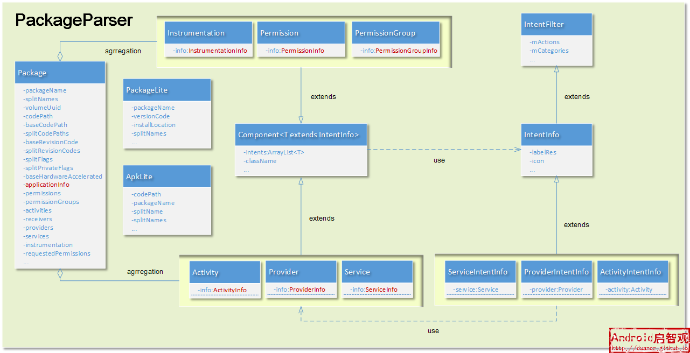

# 一、背景

静态apk与内存中的apk数据结构之间的对应关系，然后在去分析流程。 为什么要这样的顺序？ 因为解析的过程本质上是得到内存中的数据结构，然后往内存中数据结构中填充数据。
我们最关心的就是内部数据结构的变化。

包的形式有各种各样的包，如 apk、xxx.jar、xx.
so。PMS作为包的管理中心，管理Android中各种各样的包。而管理是需要在内存中才能进行的，因此，如何把静态形式的数据转变为内存中对应的数据额结构，这就需要通过扫描来完成。



# 二、 PMS的扫描包过程

我们关心apk的扫描过程。本质我们关心从静态apk文件 转变成内存中的数据结构是什么样的！

不管是 system/framework分区 还是 data/分区。都会调用这个方法来进行扫描。

## 2.1 scanDirTracedLI()

> xxxLI结尾的方法表明需要 mInstaller 锁。 xxxLP结尾的方法表明需要 mPackages 锁。

```
  private void scanDirTracedLI(File scanDir, final int parseFlags, int scanFlags, long currentTime) {
        Trace.traceBegin(TRACE_TAG_PACKAGE_MANAGER, "scanDir [" + scanDir.getAbsolutePath() + "]");
        try {
            scanDirLI(scanDir, parseFlags, scanFlags, currentTime);
        } finally {
            Trace.traceEnd(TRACE_TAG_PACKAGE_MANAGER);
        }
    }
```

这个方法仅仅追加了trace日志。 scanDir： parseFlags： scanFlags： currentTime：

```
 private void scanDirLI(File scanDir, int parseFlags, int scanFlags, long currentTime) {
        final File[] files = scanDir.listFiles();
       .......
        try (ParallelPackageParser parallelPackageParser = new ParallelPackageParser(
                mSeparateProcesses, mOnlyCore, mMetrics, mCacheDir,
                mParallelPackageParserCallback)) {
            // Submit files for parsing in parallel
            int fileCount = 0;
            // 遍历文件
            for (File file : files) {
                final boolean isPackage = (isApkFile(file) || file.isDirectory())
                        && !PackageInstallerService.isStageName(file.getName());
                if (!isPackage) {
                    // Ignore entries which are not packages
                    continue;
                }
                //1 解析 
                parallelPackageParser.submit(file, parseFlags);
                fileCount++;
            }


            // Process results one by one 2 解析完成后，处理结果
            for (; fileCount > 0; fileCount--) {
                ParallelPackageParser.ParseResult parseResult = parallelPackageParser.take();
                Throwable throwable = parseResult.throwable;
                int errorCode = PackageManager.INSTALL_SUCCEEDED;

                if (throwable == null) {
                    // TODO(toddke): move lower in the scan chain
                    // Static shared libraries have synthetic package names
                    if (parseResult.pkg.applicationInfo.isStaticSharedLibrary()) {
                        renameStaticSharedLibraryPackage(parseResult.pkg);
                    }
                    try {
                        scanPackageChildLI(parseResult.pkg, parseFlags, scanFlags,
                                currentTime, null);
                    } catch (PackageManagerException e) {
                        errorCode = e.error;
                        Slog.w(TAG, "Failed to scan " + parseResult.scanFile + ": " + e.getMessage());
                    }
                } else if (throwable instanceof PackageParser.PackageParserException) {
                    PackageParser.PackageParserException e = (PackageParser.PackageParserException)
                            throwable;
                    errorCode = e.error;
                    Slog.w(TAG, "Failed to parse " + parseResult.scanFile + ": " + e.getMessage());
                } else {
                    throw new IllegalStateException("Unexpected exception occurred while parsing "
                            + parseResult.scanFile, throwable);
                }

                // Delete invalid userdata apps
                if ((scanFlags & SCAN_AS_SYSTEM) == 0 &&
                        errorCode != PackageManager.INSTALL_SUCCEEDED) {
                    logCriticalInfo(Log.WARN,
                            "Deleting invalid package at " + parseResult.scanFile);
                    removeCodePathLI(parseResult.scanFile);
                }
            }
        }
    }
```

遍历给到目录下文件，开始解析。我们看看 ParallelPackageParse 类的submit()方法。

## 2.2 ParallelPackageParse.submit()

```
public void submit(File scanFile, int parseFlags) {
       //mService是线程池 
        mService.submit(() -> {
            ParseResult pr = new ParseResult();
            Trace.traceBegin(TRACE_TAG_PACKAGE_MANAGER, "parallel parsePackage [" + scanFile + "]");
            try {
                // 1
                PackageParser pp = new PackageParser();
                pp.setSeparateProcesses(mSeparateProcesses);
                pp.setOnlyCoreApps(mOnlyCore);
                pp.setDisplayMetrics(mMetrics);
                pp.setCacheDir(mCacheDir);
                pp.setCallback(mPackageParserCallback);
                pr.scanFile = scanFile; // 解析的文件
                // 2 
                pr.pkg = parsePackage(pp, scanFile, parseFlags);
            } catch (Throwable e) {
                pr.throwable = e;
            } finally {
                Trace.traceEnd(TRACE_TAG_PACKAGE_MANAGER);
            }
            try {
                mQueue.put(pr); // 3
            } catch (InterruptedException e) {
                Thread.currentThread().interrupt();
                // Propagate result to callers of take().
                // This is helpful to prevent main thread from getting stuck waiting on
                // ParallelPackageParser to finish in case of interruption
                mInterruptedInThread = Thread.currentThread().getName();
            }
        });
    }
```

1. 构建解析对象，设置解析参数
2. 解析得到 package 对象 ，赋值给result返回
3. 把解析结果加入队列

具体看看第二步的解析过程，如何得到package对象的。

```
 @VisibleForTesting
    protected PackageParser.Package parsePackage(PackageParser packageParser, File scanFile,
            int parseFlags) throws PackageParser.PackageParserException {
        return packageParser.parsePackage(scanFile, parseFlags, true /* useCaches */);
    }
```

最终调用了 packageParser类的 方法。

```
 @UnsupportedAppUsage
    public Package parsePackage(File packageFile, int flags, boolean useCaches)
            throws PackageParserException {
            // 如果useCaches=true，优先获取缓存
        Package parsed = useCaches ? getCachedResult(packageFile, flags) : null;
        if (parsed != null) {
            return parsed;
        }

        long parseTime = LOG_PARSE_TIMINGS ? SystemClock.uptimeMillis() : 0;
        if (packageFile.isDirectory()) { 
           // cluster 多个splits apk 情况
            parsed = parseClusterPackage(packageFile, flags);
        } else {
           // monolithic 完整包。只要一个apk 
            parsed = parseMonolithicPackage(packageFile, flags);
        }

        long cacheTime = LOG_PARSE_TIMINGS ? SystemClock.uptimeMillis() : 0;
        cacheResult(packageFile, flags, parsed);
        if (LOG_PARSE_TIMINGS) {
            parseTime = cacheTime - parseTime;
            cacheTime = SystemClock.uptimeMillis() - cacheTime;
            if (parseTime + cacheTime > LOG_PARSE_TIMINGS_THRESHOLD_MS) {
                Slog.i(TAG, "Parse times for '" + packageFile + "': parse=" + parseTime
                        + "ms, update_cache=" + cacheTime + " ms");
            }
        }
        return parsed;
    }

```

如果是文件夹，则对于的是splits包，否则则是完整包。
> splits包： 对应一个baseApk和一系列的aplits apk。
> 完整包，就是单个的apk文件。

先看完整包的解析。

## 2.2 parseMonolithicPackage()

- PackageLite：对于单个包轻量级的信息 Lightweight parsed details about a single package.
- ApkLite：关于单个apk文件的一些简单的信息 Lightweight parsed details about a single APK file.

```
public Package parseMonolithicPackage(File apkFile, int flags) throws PackageParserException {
        // 1 
        final PackageLite lite = parseMonolithicPackageLite(apkFile, flags);
        if (mOnlyCoreApps) {
            if (!lite.coreApp) {
                throw new PackageParserException(INSTALL_PARSE_FAILED_MANIFEST_MALFORMED,
                        "Not a coreApp: " + apkFile);
            }
        }

        final SplitAssetLoader assetLoader = new DefaultSplitAssetLoader(lite, flags);
        try {// 2
            final Package pkg = parseBaseApk(apkFile, assetLoader.getBaseAssetManager(), flags);
            pkg.setCodePath(apkFile.getCanonicalPath());
            pkg.setUse32bitAbi(lite.use32bitAbi);
            return pkg;
        } catch (IOException e) {
            throw new PackageParserException(INSTALL_PARSE_FAILED_UNEXPECTED_EXCEPTION,
                    "Failed to get path: " + apkFile, e);
        } finally {
            IoUtils.closeQuietly(assetLoader);
        }
    }


```

1. 解析清单文件，得到 PackageLite 对象，它包含了一些包的轻量级的信息。如 安装位置、代码路径、ApkLite的基本信息等。
2. 最终调用 核心接口 parseBaseApk()，得到 Package 对象。

### 2.2.1 parseBaseApk()

```
private Package parseBaseApk(File apkFile, AssetManager assets, int flags)
            throws PackageParserException {
        final String apkPath = apkFile.getAbsolutePath();
            
            ......
            // 1
            parser = assets.openXmlResourceParser(cookie, ANDROID_MANIFEST_FILENAME);
            // 2 
            final Resources res = new Resources(assets, mMetrics, null);

            final String[] outError = new String[1];
            // 3
            final Package pkg = parseBaseApk(apkPath, res, parser, flags, outError);
            // 4 
            pkg.setVolumeUuid(volumeUuid);
            pkg.setApplicationVolumeUuid(volumeUuid);
            pkg.setBaseCodePath(apkPath);
            pkg.setSigningDetails(SigningDetails.UNKNOWN);

            return pkg;
      
    }
```

1. 通过AssetManager 得到清单文件的解析器 parser
2. 新建一个 resources 资源对象
3. 调用重载方法同名方法 parseBaseApk()
4. 赋值pkg一些信息

### 2.2.2 parseBaseApk() 重名方法

```
 private Package parseBaseApk(String apkPath, Resources res, XmlResourceParser parser, int flags,
            String[] outError) throws XmlPullParserException, IOException {
        final String splitName;
        final String pkgName;

        try {
            Pair<String, String> packageSplit = parsePackageSplitNames(parser, parser);
            pkgName = packageSplit.first;
            splitName = packageSplit.second;

            if (!TextUtils.isEmpty(splitName)) { //1 
                outError[0] = "Expected base APK, but found split " + splitName;
                mParseError = PackageManager.INSTALL_PARSE_FAILED_BAD_PACKAGE_NAME;
                return null;
            }
        } catch (PackageParserException e) {
            mParseError = PackageManager.INSTALL_PARSE_FAILED_BAD_PACKAGE_NAME;
            return null;
        }

        ......
        // 2 
        final Package pkg = new Package(pkgName);

        TypedArray sa = res.obtainAttributes(parser,
                com.android.internal.R.styleable.AndroidManifest);

        pkg.mVersionCode = sa.getInteger(
                com.android.internal.R.styleable.AndroidManifest_versionCode, 0);
        pkg.mVersionCodeMajor = sa.getInteger(
                com.android.internal.R.styleable.AndroidManifest_versionCodeMajor, 0);
        pkg.applicationInfo.setVersionCode(pkg.getLongVersionCode());
        pkg.baseRevisionCode = sa.getInteger(
                com.android.internal.R.styleable.AndroidManifest_revisionCode, 0);
        pkg.mVersionName = sa.getNonConfigurationString(
                com.android.internal.R.styleable.AndroidManifest_versionName, 0);
        if (pkg.mVersionName != null) {
            pkg.mVersionName = pkg.mVersionName.intern();
        }
        ......
        pkg.mCompileSdkVersion = sa.getInteger(
                com.android.internal.R.styleable.AndroidManifest_compileSdkVersion, 0);
        pkg.applicationInfo.compileSdkVersion = pkg.mCompileSdkVersion;
        pkg.mCompileSdkVersionCodename = sa.getNonConfigurationString(
                com.android.internal.R.styleable.AndroidManifest_compileSdkVersionCodename, 0);
        if (pkg.mCompileSdkVersionCodename != null) {
            pkg.mCompileSdkVersionCodename = pkg.mCompileSdkVersionCodename.intern();
        }
        pkg.applicationInfo.compileSdkVersionCodename = pkg.mCompileSdkVersionCodename;

        sa.recycle();
        // 3 
        return parseBaseApkCommon(pkg, null, res, parser, flags, outError);
    }
```

1. 这里只解析 baseApk，如果是splitApk，则返回
2. 创建package 对象，并赋值基础的信息
3. 调用 parseBaseApkCommon()

### 2.2.3 parseBaseApkCommon()

```
private Package parseBaseApkCommon(Package pkg, Set<String> acceptedTags, Resources res,
           XmlResourceParser parser, int flags, String[] outError) throws XmlPullParserException,
           IOException {
     ......
     // 1 
     while ((type = parser.next()) != XmlPullParser.END_DOCUMENT
                && (type != XmlPullParser.END_TAG || parser.getDepth() > outerDepth)) {
            if (type == XmlPullParser.END_TAG || type == XmlPullParser.TEXT) {
                continue;
            }

            String tagName = parser.getName();    
            ......   
            if (tagName.equals(TAG_APPLICATION)) {
               ......
                foundApp = true;
                // 2
                if (!parseBaseApplication(pkg, res, parser, flags, outError)) {
                    return null;
                }
            } else if (tagName.equals(TAG_KEY_SETS)) {
                if (!parseKeySets(pkg, res, parser, outError)) {
                    return null;
                }
                // 3 
            } else if (tagName.equals(TAG_PERMISSION_GROUP)) { //权限组
                if (!parsePermissionGroup(pkg, flags, res, parser, outError)) {
                    return null;
                }
            } else if (tagName.equals(TAG_PERMISSION)) {  //权限
                if (!parsePermission(pkg, res, parser, outError)) {
                    return null;
                }
            } else if (tagName.equals(TAG_PERMISSION_TREE)) { //权限相关
                if (!parsePermissionTree(pkg, res, parser, outError)) {
                    return null;
                }
            } else if (tagName.equals(TAG_USES_PERMISSION)) {//用户权限
                if (!parseUsesPermission(pkg, res, parser)) {
                    return null;
                }
            }  else if (tagName.equals(TAG_PROTECTED_BROADCAST)) {
            ......
     }
     return 
}      
```

1. 遍历清单文件的xml节点
2. 解析application标签节点
3. 解析权限相关的节点
4. 其他节点

方法很长，我们只关注重点部分： application标签的解析。

### 2.2.4 parseBaseApplication()

```
private boolean parseBaseApplication(Package owner, Resources res,
          XmlResourceParser parser, int flags, String[] outError)
      throws XmlPullParserException, IOException {
      final ApplicationInfo ai = owner.applicationInfo;
      final String pkgName = owner.applicationInfo.packageName;

      TypedArray sa = res.obtainAttributes(parser,
              com.android.internal.R.styleable.AndroidManifestApplication);
              
      ......        
      int type;
        boolean hasActivityOrder = false;
        boolean hasReceiverOrder = false;
        boolean hasServiceOrder = false;
        while ((type = parser.next()) != XmlPullParser.END_DOCUMENT
                && (type != XmlPullParser.END_TAG || parser.getDepth() > innerDepth)) {
            if (type == XmlPullParser.END_TAG || type == XmlPullParser.TEXT) {
                continue;
            }

            String tagName = parser.getName();
            // 1
            if (tagName.equals("activity")) {
                Activity a = parseActivity(owner, res, parser, flags, outError, cachedArgs, false,
                        owner.baseHardwareAccelerated);
                if (a == null) {
                    mParseError = PackageManager.INSTALL_PARSE_FAILED_MANIFEST_MALFORMED;
                    return false;
                }

                hasActivityOrder |= (a.order != 0);
                owner.activities.add(a);
            // 2
            } else if (tagName.equals("receiver")) {
                Activity a = parseActivity(owner, res, parser, flags, outError, cachedArgs,
                        true, false);
                if (a == null) {
                    mParseError = PackageManager.INSTALL_PARSE_FAILED_MANIFEST_MALFORMED;
                    return false;
                }

                hasReceiverOrder |= (a.order != 0);
                owner.receivers.add(a);
            // 3
            } else if (tagName.equals("service")) {
                Service s = parseService(owner, res, parser, flags, outError, cachedArgs);
                if (s == null) {
                    mParseError = PackageManager.INSTALL_PARSE_FAILED_MANIFEST_MALFORMED;
                    return false;
                }

                hasServiceOrder |= (s.order != 0);
                owner.services.add(s);
             //  4
            } else if (tagName.equals("provider")) {
                Provider p = parseProvider(owner, res, parser, flags, outError, cachedArgs);
                if (p == null) {
                    mParseError = PackageManager.INSTALL_PARSE_FAILED_MANIFEST_MALFORMED;
                    return false;
                }

                owner.providers.add(p);

            } else if (tagName.equals("activity-alias")) {
                Activity a = parseActivityAlias(owner, res, parser, flags, outError, cachedArgs);
                if (a == null) {
                    mParseError = PackageManager.INSTALL_PARSE_FAILED_MANIFEST_MALFORMED;
                    return false;
                }

                hasActivityOrder |= (a.order != 0);
                owner.activities.add(a);

            } else if (parser.getName().equals("meta-data")) {
                // note: application meta-data is stored off to the side, so it can
                // remain null in the primary copy (we like to avoid extra copies because
                // it can be large)
                if ((owner.mAppMetaData = parseMetaData(res, parser, owner.mAppMetaData,
                        outError)) == null) {
                    mParseError = PackageManager.INSTALL_PARSE_FAILED_MANIFEST_MALFORMED;
                    return false;
                }
            }else 
            ......
            
        }
      
      }
      retur true;
}                   
```

1. 解析得到 Activity标签对应的内存中Activity对象。 Activity a = new Activity(cachedArgs.mActivityArgs, new
   ActivityInfo());
2. 解析 receiver标签，
3. 解析 service 标签，得到 Service s = new Service(cachedArgs.mServiceArgs, new ServiceInfo());
4. 解析 provider 标签，得到 Provider p = new Provider(cachedArgs.mProviderArgs, new ProviderInfo());
5. 解析 meta-data、activity-alias等标签

至此，我们得到了 application和四大组件在内存中的信息。 至于在内存中的数据结构是怎么样的，放到最后总结。

再看看splits包的解析。

## 2.3 parseClusterPackage()

```
 private Package parseClusterPackage(File packageDir, int flags) throws PackageParserException {
       
        final PackageLite lite = parseClusterPackageLite(packageDir, 0); // 1
        if (mOnlyCoreApps && !lite.coreApp) {
            throw new PackageParserException(INSTALL_PARSE_FAILED_MANIFEST_MALFORMED,
                    "Not a coreApp: " + packageDir);
        }

        // Build the split dependency tree.
        SparseArray<int[]> splitDependencies = null;
        final SplitAssetLoader assetLoader;
        if (lite.isolatedSplits && !ArrayUtils.isEmpty(lite.splitNames)) {
            try {
                splitDependencies = SplitAssetDependencyLoader.createDependenciesFromPackage(lite);
                assetLoader = new SplitAssetDependencyLoader(lite, splitDependencies, flags);
            } catch (SplitAssetDependencyLoader.IllegalDependencyException e) {
                throw new PackageParserException(INSTALL_PARSE_FAILED_BAD_MANIFEST, e.getMessage());
            }
        } else {
            assetLoader = new DefaultSplitAssetLoader(lite, flags);
        }

        try {
            final AssetManager assets = assetLoader.getBaseAssetManager();
            final File baseApk = new File(lite.baseCodePath);
            // 2 
            final Package pkg = parseBaseApk(baseApk, assets, flags);
            if (pkg == null) {
                throw new PackageParserException(INSTALL_PARSE_FAILED_NOT_APK,
                        "Failed to parse base APK: " + baseApk);
            }

            if (!ArrayUtils.isEmpty(lite.splitNames)) {
                final int num = lite.splitNames.length;
                pkg.splitNames = lite.splitNames;
                pkg.splitCodePaths = lite.splitCodePaths;
                pkg.splitRevisionCodes = lite.splitRevisionCodes;
                pkg.splitFlags = new int[num];
                pkg.splitPrivateFlags = new int[num];
                pkg.applicationInfo.splitNames = pkg.splitNames;
                pkg.applicationInfo.splitDependencies = splitDependencies;
                pkg.applicationInfo.splitClassLoaderNames = new String[num];

                for (int i = 0; i < num; i++) {
                    final AssetManager splitAssets = assetLoader.getSplitAssetManager(i);
                    // 3 
                    parseSplitApk(pkg, i, splitAssets, flags);
                }
            }

            pkg.setCodePath(packageDir.getCanonicalPath());
            pkg.setUse32bitAbi(lite.use32bitAbi);
            return pkg;
        } catch (IOException e) {
            throw new PackageParserException(INSTALL_PARSE_FAILED_UNEXPECTED_EXCEPTION,
                    "Failed to get path: " + lite.baseCodePath, e);
        } finally {
            IoUtils.closeQuietly(assetLoader);
        }
    }
```

1. 也是先解析得到包的轻量级信息 packageLite,里面包含了一个 apkLite对象。
2. 解析baseApk，流程跟解析完整包一样
3. 解析splits apk，内部也是通过解析清单文件来构建内存中对应的数据结构

综上， 包扫描的最终目的就是得到内存中包对应的数据结构，那么这些数据结构是什么关系呢？

# 三、解析后的数据结构


## 3.1 Package

PackageParser中的内部类。Package 对象在内存中表示一个完整apk文件。 包含一个baseApk以及0个或者多个splits Apks。 包含了所有四大组件的集合。 此外还有
PackageLite、ApkLite等值包含轻量级信息(如 包名、版本号、代码路径等)的对象。

```
 public final static class Package implements Parcelable {

        @UnsupportedAppUsage
        public String packageName;

        public String manifestPackageName;

        /** Names of any split APKs, ordered by parsed splitName */
        public String[] splitNames;

        // TODO: work towards making these paths invariant
        public String volumeUuid;

        /**
         * Path where this package was found on disk. For monolithic packages
         * this is path to single base APK file; for cluster packages this is
         * path to the cluster directory.
         */
        public String codePath;

        /** Path of base APK */
        public String baseCodePath;
        /** Paths of any split APKs, ordered by parsed splitName */
        public String[] splitCodePaths;

        /** Revision code of base APK */
        public int baseRevisionCode;
        /** Revision codes of any split APKs, ordered by parsed splitName */
        public int[] splitRevisionCodes;

        /** Flags of any split APKs; ordered by parsed splitName */
        public int[] splitFlags;

        /**
         * Private flags of any split APKs; ordered by parsed splitName.
         *
         * {@hide}
         */
        public int[] splitPrivateFlags;

        public boolean baseHardwareAccelerated;

        // For now we only support one application per package.
        @UnsupportedAppUsage
        public ApplicationInfo applicationInfo = new ApplicationInfo();

        @UnsupportedAppUsage
        public final ArrayList<Permission> permissions = new ArrayList<Permission>(0);
        @UnsupportedAppUsage
        public final ArrayList<PermissionGroup> permissionGroups = new ArrayList<PermissionGroup>(0);
        @UnsupportedAppUsage
        public final ArrayList<Activity> activities = new ArrayList<Activity>(0);
        @UnsupportedAppUsage
        public final ArrayList<Activity> receivers = new ArrayList<Activity>(0);
        @UnsupportedAppUsage
        public final ArrayList<Provider> providers = new ArrayList<Provider>(0);
        @UnsupportedAppUsage
        public final ArrayList<Service> services = new ArrayList<Service>(0);
        @UnsupportedAppUsage
        public final ArrayList<Instrumentation> instrumentation = new ArrayList<Instrumentation>(0);

        @UnsupportedAppUsage
        public final ArrayList<String> requestedPermissions = new ArrayList<String>();

        /** Permissions requested but not in the manifest. */
        public final ArrayList<String> implicitPermissions = new ArrayList<>();

        @UnsupportedAppUsage
        public ArrayList<String> protectedBroadcasts;
        ......
 }
        
```

## 3.2 Component

PackageParser中的内部类。 这是一个抽象类，具体的子类为四大组件以及权限。如 Activity、Service、Permission等 每个 Component
都喊一个info成员变量，对应一个ComponentInfo结构。 组件中真正的数据存放在info中。此外，每个组件可能还有 一个或多个 IntentFilter信息，对应内存中
IntentInfo。

## 3.3 ComponentInfo

PackageParser中的内部类。 真正存放数据的地方。 ActivityInfo、ServiceInfo等。

## 3.4 IntentInfo

PackageParser中的内部类。Component中有个 intents 成员集合，用来存放intent相关的信息。如：ActivityIntentInfo、ServiceIntentInfo
和ProviderIntentInfo。

# 四、总结

静态包的文件形式，通过PackageParser解析最终得以转变为内存中的数据结构Package，它包含了整个apk包的信息，如
Application、Activity、Service等。PMS就可以愉快的管理起来了！

# 五、参考 


