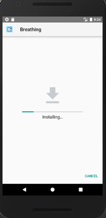

# 一、 背景

一个apk安装在手机上，这个安装的过程是怎么样的？ 我觉得有必要去深入的了解。

# 二、APK安装方式

apk安装有多种方式。大体可分为两种方式：有安装界面和无安装界面。

- 有安装界面 在文件管理器中点击apk文件、应用通过intent启动安装程序。本质上，这种方式都是通过启动系统安装程序 packageinstaller 来完成安装的。
  packageinstaller是一个系统级应用。 它对应的apk为 packageinstaller.apk。
  在system/priv-app/GooglePcakgeInstaller/目录下。
- 无安装界面 adb命令直接安装、应用商店下载安装。 这两种本质上都是通过调用PMS接口直接安装。

## 2.1 通过界面安装

通过packageinstaller.apk程序来完成安装，如：pack在文件管理器中点击apk文件和在应用通过intent启动安装程序两种方式。

## 2.2 无界面安装

### 2.2.1 开机时候安装

系统应用，比如system/app 、 system/priv-app/ 目录下；已预置的应用，如data/app分区。直接在开机过程中就完成了安装。

### 2.2.2 通过adb安装

通过adb install xxx/xx/xx.apk命令来完成安装。 最终会调用PMS的接口来完成安装。

疑问：adb的原理是什么？为什么通过一个命令就完成了调用PMS的接口呢？

#### 2.2.2.1 adb原理

adb原理包含三个角色。 adb客户端、adb服务端、adbd守护进程。 前两者在PC端上，adbd守护进程则是手机上的一个进程。在开机的时候
第一个用户空间的进程——init进程会拉起adbd守护进程。它可以直接访问手机的运行信息，如内存、CPU、进程等等。

当通过adb客户端发起命令时候，如果adb服务器没有起来，则会先启动adb服务器。一个PC上只有一个adb服务器，可以响应多个adb客户端的请求，是一对多的关系。 当手机通过USB驱动或
tcp来连接到PC某个端口时候时，服务进程会检测这些端口，一旦检测有adbd守护进程就连接这个端口。这样服务进程就和远端的设备建立了链接。同理，一个服务进程可以连接多个设备。

至此，我们可以通过adb命令访问任何一个台连接的设备。

#### 2.2.2.2  adb调用PMS

具体的调用细节再次不深入，内部会通过adbd进程来调用PMS服务接口完成安装。

### 2.2.3 应用市场安装

应用商店本身属于系统应用，因此他有权限直接通过 PMS接口安装，而不需要通过packageInstaller.
apk。不过像应用宝这种非系统级别的商店，则还是要通过packageInstaller程序安装。

以有界面的情况进行分析，基本涵盖了整个安装的过程~

# 三、安装的过程

大体分为两个阶段：

1. 界面安装阶段
2. PMS安装阶段

# 四、 界面安装阶段

## 4.1 界面表现

以Google模拟器进行安装测试，系统版本为Android11。

1. 第一步解析 栈内Activity从上到下：

```
ActivityRecord{afdf8a0 u0 com.android.packageinstaller/.InstallStaging t10}
ActivityRecord{87bbf5b u0 com.android.documentsui/.files.FilesActivity t10},
```

如图：


t10 表示ActivityStack编号。

2.解析完成后，自动跳转到PackageInstallerActivity界面

```
ActivityRecord{b42c832 u0 com.android.packageinstaller/.PackageInstallerActivity t10}
ActivityRecord{76ceec5 u0 com.android.packageinstaller/.DeleteStagedFileOnResult t10},
ActivityRecord{87bbf5b u0 com.android.documentsui/.files.FilesActivity t10}
```

如图：

此时会询问未知来源。如果取消，则只会剩下 FilesActivity。

3. 点击继续，安装中... 栈内Activity从上到下：

```
ActivityRecord{2f446bd u0 com.android.packageinstaller/.InstallInstalling t10}
ActivityRecord{76ceec5 u0 com.android.packageinstaller/.DeleteStagedFileOnResult t10}
ActivityRecord{87bbf5b u0 com.android.documentsui/.files.FilesActivity t10}

```

如图：


4. 安装成功 栈内Activity从上到下：

```
ActivityRecord{4b0a12a u0 com.android.packageinstaller/.InstallSuccess t10}
ActivityRecord{76ceec5 u0 com.android.packageinstaller/.DeleteStagedFileOnResult t10}
ActivityRecord{87bbf5b u0 com.android.documentsui/.files.FilesActivity t10}
```

如图：


5. 安装失败

栈内Activity从上到下：

```
ActivityRecord{fcd7d23 u0 com.google.android.packageinstaller/com.android.packageinstaller.InstallFailed t10}
ActivityRecord{76ceec5 u0 com.android.packageinstaller/.DeleteStagedFileOnResult t10}
ActivityRecord{2de8349 u0 com.android.documentsui/.files.FilesActivity t10}
```

至此， APK安装的界面流程基本完成。

总的来说，通过这种方式安装apk，本质上是通过系统的应用packageInstaller.apk来完成的。因此，我们需要查看的是packageInstaller的源码。

第一个响应的是 Activity 是 InstallStart，为什么呢？ 因为我们安装apk的方式是启动一个intent：

```
Intent intent = new Intent(Intent.ACTION_VIEW);
    if (>= 7.0 ) { // 7.0
        Uri uriForFile = FileProvider.getUriForFile(getApplicationContext(),
                getApplicationContext().getPackageName() + ".fileprovider", file);
                // 1 
        intent.setDataAndType(uriForFile, "application/vnd" +
                ".android" +
                ".package-archive");
        //origin:  /storage/emulated/0/brea_6.apk
        //changed:  cont9il./ent://com.zygote.insight.fileprovider/external/brea_6.apk
    } else {
        Uri uri = Uri.fromFile(new File(file.getAbsolutePath()));
        // 2 
        intent.setDataAndType(Uri.fromFile(new File(file.getAbsolutePath())),
         "application/vnd.android.package-archive");
    }

    startActivity(intent);

```

遇到的问题：

如果provider的配置的路径如有问题，那么就会发生解析包错误！

```
Failed to find configured root that contains /storage/emulated/0/breathing_6.apk
```

我们自己的应用侧，在 1、2处 都设置了intent的类型为：application/vnd.android.package-archive。 接着启动了Activity。
而能够匹配到这个隐式intent的Activity 就是 InstallStart：
> /frameworks/base/packages/PackageInstaller/AndroidManifest.xml

```
<activity android:name=".InstallStart"
39                 android:theme="@android:style/Theme.Translucent.NoTitleBar"
40                 android:exported="true"
41                 android:excludeFromRecents="true">
                    // 1
42             <intent-filter android:priority="1">
43                 <action android:name="android.intent.action.VIEW" />
44                 <action android:name="android.intent.action.INSTALL_PACKAGE" />
45                 <category android:name="android.intent.category.DEFAULT" />
46                 <data android:scheme="content" />
47                 <data android:mimeType="application/vnd.android.package-archive" />
48             </intent-filter>

49             <intent-filter android:priority="1">
50                 <action android:name="android.intent.action.INSTALL_PACKAGE" />
51                 <category android:name="android.intent.category.DEFAULT" />
52                 <data android:scheme="package" />
53                 <data android:scheme="content" />
54             </intent-filter>

55             <intent-filter android:priority="1">
56                 <action android:name="android.content.pm.action.CONFIRM_INSTALL" />
57                 <category android:name="android.intent.category.DEFAULT" />
58             </intent-filter>
59         </activity>
```

在1处，匹配了一个intent-filter。包含mimeType为：application/vnd.android.package-archive。系统会拉起该安装程序的进程，继而启动InstallActivity界面。因此，我们继续看看
InstallStart 的 onCreate()方法：

## 4.2 InstallStart

> /frameworks/base/packages/PackageInstaller/src/com/android/packageinstaller/InstallStart.java

### 4.2.1 onCreate()

```
 @Override
51      protected void onCreate(@Nullable Bundle savedInstanceState) {
52          super.onCreate(savedInstanceState);
53          ...
56          // 1 是否设置了 ACTION_CONFIRM_INSTALL 
57          final boolean isSessionInstall =
58                  PackageInstaller.ACTION_CONFIRM_INSTALL.equals(intent.getAction());
59  
60          ... 
70  
            // 2 受信任的来源
73          boolean isTrustedSource = false;
74          if (sourceInfo != null
75                  && (sourceInfo.privateFlags & ApplicationInfo.PRIVATE_FLAG_PRIVILEGED) != 0) {
76              isTrustedSource = intent.getBooleanExtra(Intent.EXTRA_NOT_UNKNOWN_SOURCE, false);
77          }
78  
79          if (!isTrustedSource && originatingUid != PackageInstaller.SessionParams.UID_UNKNOWN) {
80              final int targetSdkVersion = getMaxTargetSdkVersionForUid(this, originatingUid);
81              if (targetSdkVersion < 0) {
                    // 如果<0，则取消安装 
82                  Log.w(LOG_TAG, "Cannot get target sdk version for uid " + originatingUid);
83                  // Invalid originating uid supplied. Abort install.
84                  mAbortInstall = true;
85              } else if (targetSdkVersion >= Build.VERSION_CODES.O && !declaresAppOpPermission(
                        // 如果sdk 》=>26且没有REQUEST_INSTALL_PACKAGES权限，则取消安装
86                      originatingUid, Manifest.permission.REQUEST_INSTALL_PACKAGES)) {
87                  Log.e(LOG_TAG, "Requesting uid " + originatingUid + " needs to declare permission "
88                          + Manifest.permission.REQUEST_INSTALL_PACKAGES);
89                  mAbortInstall = true;
90              }
91          }
            // 2.1 取消安装
92          if (mAbortInstall) {
93              setResult(RESULT_CANCELED);
94              finish();
95              return;
96          }
97  
98          Intent nextActivity = new Intent(intent);
99          nextActivity.setFlags(Intent.FLAG_ACTIVITY_FORWARD_RESULT);
100         ...
106  
107          if (isSessionInstall) { //3.1   设置了ACTION_CONFIRM_INSTALL
108              nextActivity.setClass(this, PackageInstallerActivity.class);
109          } else {
110              Uri packageUri = intent.getData();
111                 
112              if (packageUri != null && packageUri.getScheme().equals(
                    // 3.2  如果scheme是 content：
113                      ContentResolver.SCHEME_CONTENT)) {
114                  // [IMPORTANT] This path is deprecated, but should still work. Only necessary
115                  // features should be added.
116  
117                  // Copy file to prevent it from being changed underneath this process
118                  nextActivity.setClass(this, InstallStaging.class);
119              } else if (packageUri != null && packageUri.getScheme().equals(
120                      PackageInstallerActivity.SCHEME_PACKAGE)) {
                        // 3.3  scheme 是 package 
121                  nextActivity.setClass(this, PackageInstallerActivity.class);
122              } else {
                        // 3.4 uri非法 取消安装 
123                  Intent result = new Intent();
124                  result.putExtra(Intent.EXTRA_INSTALL_RESULT,
125                          PackageManager.INSTALL_FAILED_INVALID_URI);
126                  setResult(RESULT_FIRST_USER, result);
127  
128                  nextActivity = null;
129              }
130          }
131  
132          if (nextActivity != null) {
133              startActivity(nextActivity);
134          }
             // 关闭当前InstallStart界面
135          finish();
136      }

```

onCreate()方法会判断：

1. 判断是否勾选了不受信用的未知来源
2. intent中的 action是否设置了ACTION_CONFIRM_INSTALL，如果是则跳转到 PackageInstallerActivity
3. 如果scheme是 content:// 格式，则跳转到 InstallStaging，如果是package:// ，则跳转到 PackageInstallerActivity。
4. finish当前 InstallStart 界面

## 4.3 InstallStaging

### 4.3.1 onCreate()

```
  @Override
58      protected void onCreate(@Nullable Bundle savedInstanceState) {
59          super.onCreate(savedInstanceState);
60          // 1 弹出解析进度条对话框
61          mAlert.setIcon(R.drawable.ic_file_download);
62          mAlert.setTitle(getString(R.string.app_name_unknown));
63          mAlert.setView(R.layout.install_content_view);
64          mAlert.setButton(DialogInterface.BUTTON_NEGATIVE, getString(R.string.cancel),
65                  (ignored, ignored2) -> {
66                      if (mStagingTask != null) {
67                          mStagingTask.cancel(true);
68                      }
69                      setResult(RESULT_CANCELED);
70                      finish();
71                  }, null);
72          setupAlert();
73          requireViewById(R.id.staging).setVisibility(View.VISIBLE);
74  
75          if (savedInstanceState != null) {
                // 2 如果savedInstanceState不为null，创建stagedFile的路径 
76              mStagedFile = new File(savedInstanceState.getString(STAGED_FILE));
77  
78              if (!mStagedFile.exists()) {
79                  mStagedFile = null;
80              }
81          }
82      }
```

弹出解析界面。 接着看onResume()方法：

### 4.3.2 onResume()

```
   @Override
85      protected void onResume() {
86          super.onResume();
87  
88          // This is the first onResume in a single life of the activity
89          if (mStagingTask == null) {
90              // File does not exist, or became invalid
91              if (mStagedFile == null) {
92                  //1  Create file delayed to be able to show error
93                  try {
                        // 创建临时阶段的存储路径
94                      mStagedFile = TemporaryFileManager.getStagedFile(this);
95                  } catch (IOException e) {
96                      showError();
97                      return;
98                  }
99              }
100              // 2 
101              mStagingTask = new StagingAsyncTask();
102              mStagingTask.execute(getIntent().getData());
103          }
104      }

```

1. 创建临时文件存储路径
2. 新建一个异步任务，传入packageUri参数，启动任务 注意：
   因为大于Android7.0的分享文件都必须要通过fileprovider来完成。因此，这里的参数就是content：//格式的临时授权路径。

### 4.3.3 asyncTask异步任务

```
 private final class StagingAsyncTask extends AsyncTask<Uri, Void, Boolean> {
168          @Override
169          protected Boolean doInBackground(Uri... params) {
170              if (params == null || params.length <= 0) {
171                  return false;
172              }
                  // 读取参数，临时授权的路径
173              Uri packageUri = params[0];
                  // 通过内容解析者打开 
174              try (InputStream in = getContentResolver().openInputStream(packageUri)) {
175                  // Despite the comments in ContentResolver#openInputStream the returned stream can
176                  // be null.
177                  if (in == null) {
178                      return false;
179                  }
180                     // 1 把packageUri路径中的apk，拷贝到 mStagedFile 临时文件夹中
181                  try (OutputStream out = new FileOutputStream(mStagedFile)) {
182                      byte[] buffer = new byte[1024 * 1024];
183                      int bytesRead;
184                      while ((bytesRead = in.read(buffer)) >= 0) {
185                          // Be nice and respond to a cancellation
186                          if (isCancelled()) {
187                              return false;
188                          }
189                          out.write(buffer, 0, bytesRead);
190                      }
191                  }
192              } catch (IOException | SecurityException | IllegalStateException e) {
193                  Log.w(LOG_TAG, "Error staging apk from content URI", e);
194                  return false;
195              }
196              return true;
197          }
198  
199          @Override
200          protected void onPostExecute(Boolean success) {
201              if (success) {
202                  // Now start the installation again from a file
                     // 2 拷贝完成后，启动 DeleteStagedFileOnResult 类
203                  Intent installIntent = new Intent(getIntent());
204                  installIntent.setClass(InstallStaging.this, DeleteStagedFileOnResult.class);
205                  installIntent.setData(Uri.fromFile(mStagedFile));
206  
207                  if (installIntent.getBooleanExtra(Intent.EXTRA_RETURN_RESULT, false)) {
208                      installIntent.addFlags(Intent.FLAG_ACTIVITY_FORWARD_RESULT);
209                  }
210  
211                  installIntent.addFlags(Intent.FLAG_ACTIVITY_NO_ANIMATION);
212                  startActivity(installIntent);
213                  // 关闭 InstallStaging 页面
214                  InstallStaging.this.finish();
215              } else {
216                  showError();
217              }
218          }
219      }

```

1. 开启子线程，把临时路径的apk文件拷贝到 mStaggerFile路径下。
2. 完成拷贝后，回到主线程，开启 DeleteStagedFileOnResult 界面。

## 4.4 DeleteStagedFileOnResult

### 4.4.1 onCreate()

```
 @Override
31      protected void onCreate(@Nullable Bundle savedInstanceState) {
32          super.onCreate(savedInstanceState);
33  
34          if (savedInstanceState == null) {
35              Intent installIntent = new Intent(getIntent());
                // 启动 PackageInstallerActivity 
36              installIntent.setClass(this, PackageInstallerActivity.class);
37              
38              installIntent.setFlags(Intent.FLAG_ACTIVITY_NO_ANIMATION);
39              startActivityForResult(installIntent, 0);
40          }
41      }
42  
43      @Override
44      protected void onActivityResult(int requestCode, int resultCode, Intent data) {
45          File sourceFile = new File(getIntent().getData().getPath());
46          sourceFile.delete();
47          // 成功后，关闭页面。且传递result
48          setResult(resultCode, data);
49          finish();
50      }
```

最终会走到 PackageInstallerActivity 界面。

## 4.5 PackageInstallerActivity

### 4.5.1 onCreate()

```
 @Override
283      protected void onCreate(Bundle icicle) {
284          getWindow().addSystemFlags(SYSTEM_FLAG_HIDE_NON_SYSTEM_OVERLAY_WINDOWS);
285  
286          super.onCreate(null);
287  
292          mPm = getPackageManager();
293          mIpm = AppGlobals.getPackageManager();
294          mAppOpsManager = (AppOpsManager) getSystemService(Context.APP_OPS_SERVICE);
295          mInstaller = mPm.getPackageInstaller();
296          mUserManager = (UserManager) getSystemService(Context.USER_SERVICE);
297  
298          final Intent intent = getIntent();
            ... 
342  
348          // load dummy layout with OK button disabled until we override this layout in
349          // startInstallConfirm
            // 安装确认对话框
350          bindUi();
351          checkIfAllowedAndInitiateInstall();
352      }

```

1. 初始化一些数据
2. 构建弹出安装确认对话框

### 4.5.2 buildUI()

```
private void bindUi() {
381          mAlert.setIcon(mAppSnippet.icon);
382          mAlert.setTitle(mAppSnippet.label);
383          mAlert.setView(R.layout.install_content_view);
384          mAlert.setButton(DialogInterface.BUTTON_POSITIVE, getString(R.string.install),
385                  (ignored, ignored2) -> {
386                      if (mOk.isEnabled()) {
387                          if (mSessionId != -1) {
388                              mInstaller.setPermissionsResult(mSessionId, true);
389                              finish();
390                          } else {
                                // 开始安装
391                              startInstall();
392                          }
393                      }
394                  }, null);
395          mAlert.setButton(DialogInterface.BUTTON_NEGATIVE, getString(R.string.cancel),
396                  (ignored, ignored2) -> {
397                      // Cancel and finish 取消安装并且关闭界面
398                      setResult(RESULT_CANCELED);
399                      if (mSessionId != -1) {
400                          mInstaller.setPermissionsResult(mSessionId, false);
401                      }
402                      finish();
403                  }, null);
404          setupAlert();
405  
406          mOk = mAlert.getButton(DialogInterface.BUTTON_POSITIVE);
407          mOk.setEnabled(false);
408      }
409  
```

点击安装，那么则开始安装。

### 4.5.3 startInstall()

```
 private void startInstall() {
556          // Start subactivity to actually install the application
557          Intent newIntent = new Intent();
558          newIntent.putExtra(PackageUtil.INTENT_ATTR_APPLICATION_INFO,
559                  mPkgInfo.applicationInfo);
560          newIntent.setData(mPackageURI);
             // 启动了InstallInstalling 界面
561          newIntent.setClass(this, InstallInstalling.class);
562          String installerPackageName = getIntent().getStringExtra(
563                  Intent.EXTRA_INSTALLER_PACKAGE_NAME);
564          if (mOriginatingURI != null) {
565              newIntent.putExtra(Intent.EXTRA_ORIGINATING_URI, mOriginatingURI);
566          }
567          if (mReferrerURI != null) {
568              newIntent.putExtra(Intent.EXTRA_REFERRER, mReferrerURI);
569          }
570          if (mOriginatingUid != PackageInstaller.SessionParams.UID_UNKNOWN) {
571              newIntent.putExtra(Intent.EXTRA_ORIGINATING_UID, mOriginatingUid);
572          }
573          if (installerPackageName != null) {
574              newIntent.putExtra(Intent.EXTRA_INSTALLER_PACKAGE_NAME,
575                      installerPackageName);
576          }
577          if (getIntent().getBooleanExtra(Intent.EXTRA_RETURN_RESULT, false)) {
578              newIntent.putExtra(Intent.EXTRA_RETURN_RESULT, true);
579          }
580          newIntent.addFlags(Intent.FLAG_ACTIVITY_FORWARD_RESULT);
581          if(localLOGV) Log.i(TAG, "downloaded app uri="+mPackageURI);
582          startActivity(newIntent);
583          finish();
584      }
585  
```

启动了 InstallInstalling 界面。

## 4.6 InstallStalling

此时界面处于安装中状态。

发送安装包给PM，同时等待PM的结果返回。一旦成功或者失败就打开 InstallSuccess/InstallFailed 界面。

总共包含两个阶段：

1. 发送数据给PM；
2. 等待PM的处理的结果。

### 4.6.1 onCreate()

```
     @Override
80      protected void onCreate(@Nullable Bundle savedInstanceState) {
81          super.onCreate(savedInstanceState);
82          // 从intent中解析得到parcelable对象  ApplicationInfo
83          ApplicationInfo appInfo = getIntent()
84                  .getParcelableExtra(PackageUtil.INTENT_ATTR_APPLICATION_INFO);
85          mPackageURI = getIntent().getData();
86          // 1 判断已经安装过的包
87          if ("package".equals(mPackageURI.getScheme())) {
88              try {
89                  getPackageManager().installExistingPackage(appInfo.packageName);
90                  launchSuccess();
91              } catch (PackageManager.NameNotFoundException e) {
92                  launchFailure(PackageManager.INSTALL_FAILED_INTERNAL_ERROR, null);
93              }
94          } else {
//              // 2 如果是新包
95              final File sourceFile = new File(mPackageURI.getPath());
                         PackageUtil.AppSnippet as = PackageUtil.getAppSnippet(this, appInfo, sourceFile);
97              // 创建正在准备安装的对话框，包含进度条等信息
98              mAlert.setIcon(as.icon);
99              mAlert.setTitle(as.label);
100              mAlert.setView(R.layout.install_content_view);
101              mAlert.setButton(DialogInterface.BUTTON_NEGATIVE, getString(R.string.cancel),
102                      (ignored, ignored2) -> {
103                          if (mInstallingTask != null) {
104                              mInstallingTask.cancel(true);
105                          }
106  
107                          if (mSessionId > 0) {
108                              getPackageManager().getPackageInstaller().abandonSession(mSessionId);
109                              mSessionId = 0;
110                          }
111  
112                          setResult(RESULT_CANCELED);
113                          finish();
114                      }, null);
115              setupAlert();
116              requireViewById(R.id.installing).setVisibility(View.VISIBLE);
117                 // 3 如果savedInstanceState不为空，则获取installId、sessionId，再次注册安装返回广播
118              if (savedInstanceState != null) {
119                  mSessionId = savedInstanceState.getInt(SESSION_ID);
120                  mInstallId = savedInstanceState.getInt(INSTALL_ID);
121  
122                  // Reregister for result; might instantly call back if result was delivered while
123                  // activity was destroyed
124                  try {
                            // 注册 安装广播
125                      InstallEventReceiver.addObserver(this, mInstallId,
126                              this::launchFinishBasedOnResult);
127                  } catch (EventResultPersister.OutOfIdsException e) {
128                      // Does not happen
129                  }
130              } else {
                     // 4 如果savedInstanceState为空,新建一个sessionParams对象，构建新的installId、sessionId  
131                  PackageInstaller.SessionParams params = new PackageInstaller.SessionParams(
132                          PackageInstaller.SessionParams.MODE_FULL_INSTALL);
133                  params.setInstallAsInstantApp(false);
134                  params.setReferrerUri(getIntent().getParcelableExtra(Intent.EXTRA_REFERRER));
143                 ...
                     File file = new File(mPackageURI.getPath());
144                  try {
                         // 4.1 解析安装包的轻量级信息 ，赋值给sessionParams
145                      PackageParser.PackageLite pkg = PackageParser.parsePackageLite(file, 0);
146                      params.setAppPackageName(pkg.packageName);
147                      params.setInstallLocation(pkg.installLocation);
148                      params.setSize(
149                              PackageHelper.calculateInstalledSize(pkg, false, params.abiOverride));
150                  }
                     ...
161                  try {
                            //监听安装完成广播 
162                      mInstallId = InstallEventReceiver
163                              .addObserver(this, EventResultPersister.GENERATE_NEW_ID,
164                                      this::launchFinishBasedOnResult);
165                  }
                        ...
169                  try {
                        // 创建安装会话id
170                      mSessionId = getPackageManager().getPackageInstaller().createSession(params);
171                  }
                        ...
174              }
179            }
180      }
```

**session是什么？**

createSession()。 是IPackageInstaller 服务提供的方法。 具体实现肯定是父类stub。在PMS的构造方法中构造的服务。

```
public class PackageInstallerService extends IPackageInstaller.Stub implements
PackageSessionProvider
```

createSession() 到底在做什么？

跨进程调用后，服务进程会创建唯一的会话sessionId作为key 和session会话对象作为value。存入一个map中。返回
sessionId到客户端进程。因此，只要通过sessioniD就可以拿到安装会话的session数据。完成安装。

既然跨进程，那么 PackageInstaller.SessionParams肯定会实现 Parcelable 接口。

1. 安装过的包，则覆盖安装
2. 创建正在准备安装对话框，只有取消按钮 见下图
3. 创建 installId、sessionId
4. 注册安装结果返回广播 launchFinishBasedOnResult


继续看onResume() :

### 4.6.2 onResume()

```
218      @Override
219      protected void onResume() {
220          super.onResume();
221  
222          // This is the first onResume in a single life of the activity
               // 第一次onResume 
223          if (mInstallingTask == null) {
224              PackageInstaller installer = getPackageManager().getPackageInstaller();
225              PackageInstaller.SessionInfo sessionInfo = installer.getSessionInfo(mSessionId);
226  
227              if (sessionInfo != null && !sessionInfo.isActive()) {
                     // 开启任务把包信息发送sessionInfo 中
228                  mInstallingTask = new InstallingAsyncTask();
229                  mInstallingTask.execute();
230              } else {
231                  // we will receive a broadcast when the install is finished
                     // 对话框不能取消，直到收到安装完成的广播
232                  mCancelButton.setEnabled(false);
233                  setFinishOnTouchOutside(false);
234              }
235          }
236      }
```

创建安装的异步task，开始安装。此时，对话框不能关闭，直到安装结果的返回。 我们继续看 InstallAsyncTask的 doBackground() 方法：

### 4.6.3 InstallingAsyncTask

```
             @Override
337          protected PackageInstaller.Session doInBackground(Void... params) {
338              PackageInstaller.Session session;
339              try {
                    // 根据sessionID获取 session 
340                  session = getPackageManager().getPackageInstaller().openSession(mSessionId);
341              } 
344              ... 
345              session.setStagingProgress(0);
346  
347              try {
                      // 获取包信息
348                  File file = new File(mPackageURI.getPath());
349                     
350                  try (InputStream in = new FileInputStream(file)) {
351                      long sizeBytes = file.length();
                            // 1 把apk写入到session中 ，
352                      try (OutputStream out = session
353                              .openWrite("PackageInstaller", 0, sizeBytes)) {
354                          byte[] buffer = new byte[1024 * 1024];
355                          while (true) {
356                              int numRead = in.read(buffer);
357  
358                              if (numRead == -1) {
359                                  session.fsync(out);
360                                  break;
361                              }
362  
363                              if (isCancelled()) {
364                                  session.close();
365                                  break;
366                              }
367  
368                              out.write(buffer, 0, numRead);
369                              if (sizeBytes > 0) {
370                                  float fraction = ((float) numRead / (float) sizeBytes);
371                                  session.addProgress(fraction);
372                              }
373                          }
374                      }
375                  }
376  
377                  return session;
                      ...          
}
391  

             @Override
393          protected void onPostExecute(PackageInstaller.Session session) {
394              if (session != null) {
                    // 隐式启动一个广播接受者 action为： BROADCAST_ACTION
395                  Intent broadcastIntent = new Intent(BROADCAST_ACTION);
396                  broadcastIntent.setFlags(Intent.FLAG_RECEIVER_FOREGROUND);
397                  broadcastIntent.setPackage(getPackageName());
398                  broadcastIntent.putExtra(EventResultPersister.EXTRA_ID, mInstallId);
399  
400                  PendingIntent pendingIntent = PendingIntent.getBroadcast(
401                          InstallInstalling.this,
402                          mInstallId,
403                          broadcastIntent,
404                          PendingIntent.FLAG_UPDATE_CURRENT);
405                   // 提交到session到 pms 
406                  session.commit(pendingIntent.getIntentSender());
407                  mCancelButton.setEnabled(false);
408                  setFinishOnTouchOutside(false);
409              } else {
410                  getPackageManager().getPackageInstaller().abandonSession(mSessionId);
411  
412                  if (!isCancelled()) {
413                      launchFailure(PackageManager.INSTALL_FAILED_INVALID_APK, null);
414                  }
415              }
416          }
```

1. 在onResume()方法中，创建task。把包信息数据写入到session中，
2. 然后在 onPostExecute() 方法中把session提交到PMS，开始真正的安装工作。

最终，安装成功或者失败都会回调到监听的广播中。 是哪一个广播呢？ BROADCAST_ACTION对应的常量为： private static final String
BROADCAST_ACTION = "com.android.packageinstaller.ACTION_INSTALL_COMMIT";

该广播的注册在清单文件中可以查看：

```
 <receiver android:name=".InstallEventReceiver"
76                 android:permission="android.permission.INSTALL_PACKAGES"
77                 android:exported="true">
78             <intent-filter android:priority="1">
79                 <action android:name="com.android.packageinstaller.ACTION_INSTALL_COMMIT" />
80             </intent-filter>
81         </receiver>
```

可以看到就是installing 的onCreate()方法中注册的广播接收者：launchFinishBasedOnResult。

### 4.6.4 launchFinishBasedOnResult监听广播

```
   private void launchFinishBasedOnResult(int statusCode, int legacyStatus, String statusMessage) {
289          if (statusCode == PackageInstaller.STATUS_SUCCESS) {
290              launchSuccess();
291          } else {
292              launchFailure(legacyStatus, statusMessage);
293          }
294      }
```

接收成功和失败的结果。

- 成功：

```
   private void launchSuccess() {
186          Intent successIntent = new Intent(getIntent());
187          successIntent.setClass(this, InstallSuccess.class);
188          successIntent.addFlags(Intent.FLAG_ACTIVITY_FORWARD_RESULT);
189  
190          startActivity(successIntent);
            //销毁 Installing 界面
191          finish();
192      }
```

- 失败：

```
   private void launchFailure(int legacyStatus, String statusMessage) {
201          Intent failureIntent = new Intent(getIntent());
202          failureIntent.setClass(this, InstallFailed.class);
203          failureIntent.addFlags(Intent.FLAG_ACTIVITY_FORWARD_RESULT);
204          failureIntent.putExtra(PackageInstaller.EXTRA_LEGACY_STATUS, legacyStatus);
205          failureIntent.putExtra(PackageInstaller.EXTRA_STATUS_MESSAGE, statusMessage);
207          startActivity(failureIntent);
208          finish();
209      }
```

至此，packageInstaller侧的工作已经完成。 其实真正的安装过程是在PMS中。

# 五、 PMS安装阶段

session.commit()方法通过binder跨进程调用了 PackageInstallerSession 服务中。

通过aidl文件定义的接口，可以指导跨进程访问服务 IPackageInstallerSession。

```
/frameworks/base/core/java/android/content/pm/IPackageInstallerSession.aidl
```

IPackageInstallerSession 的实现类为：

```
/frameworks/base/services/core/java/com/android/server/pm/PackageInstallerSession.java
```

因此，可以看 commit()方法:

## 5.1 PackageInstallerSession

### 5.1.1 commit()

```
 @Override
877      public void commit(@NonNull IntentSender statusReceiver, boolean forTransfer) {
              ... 
883          if (!markAsCommitted(statusReceiver, forTransfer)) {
884              return;
885          }
886          if (isMultiPackage()) {
887              final SparseIntArray remainingSessions = mChildSessionIds.clone();
888              final IntentSender childIntentSender =
889                      new ChildStatusIntentReceiver(remainingSessions, statusReceiver)
890                              .getIntentSender();
891              RuntimeException commitException = null;
892              boolean commitFailed = false;
893              for (int i = mChildSessionIds.size() - 1; i >= 0; --i) {
894                  final int childSessionId = mChildSessionIds.keyAt(i);
895                  try {
896                      // commit all children, regardless if any of them fail; we'll throw/return
897                      // as appropriate once all children have been processed
898                      if (!mSessionProvider.getSession(childSessionId)
899                              .markAsCommitted(childIntentSender, forTransfer)) {
900                          commitFailed = true;
901                      }
902                  } catch (RuntimeException e) {
903                      commitException = e;
904                  }
905              }
906              if (commitException != null) {
907                  throw commitException;
908              }
909              if (commitFailed) {
910                  return;
911              }
912          }
                /// 发送了一个消息
913          mHandler.obtainMessage(MSG_COMMIT).sendToTarget();
914      }
```

发送了 MSG_COMMIT 消息到 mHandler。 消息接收：

### 5.1.2 handleCommit()

```
private final Handler.Callback mHandlerCallback = new Handler.Callback() {
333          @Override
334          public boolean handleMessage(Message msg) {
335              switch (msg.what) {
336                  case MSG_COMMIT:
337                      handleCommit();
338                      break;
339                  case MSG_ON_PACKAGE_INSTALLED:
340                      final SomeArgs args = (SomeArgs) msg.obj;
341                      final String packageName = (String) args.arg1;
342                      final String message = (String) args.arg2;
343                      final Bundle extras = (Bundle) args.arg3;
344                      final IPackageInstallObserver2 observer = (IPackageInstallObserver2) args.arg4;
345                      final int returnCode = args.argi1;
346                      args.recycle();
347  
348                      try {
349                          observer.onPackageInstalled(packageName, returnCode, message, extras);
350                      } catch (RemoteException ignored) {
351                      }
352  
353                      break;
354              }
355  
356              return true;
357          }
358      };
359  
```

handleCommit() 内部最终调用了 commitNonStagedLocked() :

### 5.1.3 commitNonStagedLocked()

```
            @GuardedBy("mLock")
1309      private void commitNonStagedLocked(List<PackageInstallerSession> childSessions)
1310              throws PackageManagerException {
1311          final PackageManagerService.ActiveInstallSession committingSession =
1312                  makeSessionActiveLocked();
                
1316          if (isMultiPackage()) {
1317              List<PackageManagerService.ActiveInstallSession> activeChildSessions =
1318                      new ArrayList<>(childSessions.size());
1319              boolean success = true;
1320              PackageManagerException failure = null;
1321              for (int i = 0; i < childSessions.size(); ++i) {
1322                  final PackageInstallerSession session = childSessions.get(i);
1323                  try {
1324                      final PackageManagerService.ActiveInstallSession activeSession =
1325                              session.makeSessionActiveLocked();
1326                      if (activeSession != null) {
1327                          activeChildSessions.add(activeSession);
1328                      }
1329                  } catch (PackageManagerException e) {
1330                      failure = e;
1331                      success = false;
1332                  }
1333              }
1334              if (!success) {
1335                  try {
1336                      mRemoteObserver.onPackageInstalled(
1337                              null, failure.error, failure.getLocalizedMessage(), null);
1338                  } catch (RemoteException ignored) {
1339                  }
1340                  return;
1341              }
                  // 同时安装多个包的情况：最终调用了 PMS 的方法 installStage
1342              mPm.installStage(activeChildSessions);
1343          } else {
                  // 一次安装一个个包的情况：最终调用了 PMS 的方法 installStage
1344              mPm.installStage(committingSession);
1345          }
1346      }
```

多个包一起安装，其实也是遍历，一个一个安装。因此，我们只需要看单个包的安装逻辑就行了。

调用了 PackageManagerService的 installStage():

## 5.2 PackageManagerService.java

### 5.2.1 installStage()

```
  void installStage(ActiveInstallSession activeInstallSession) {
13142          if (DEBUG_INSTANT) {
13143              if ((activeInstallSession.getSessionParams().installFlags
13144                      & PackageManager.INSTALL_INSTANT_APP) != 0) {
13145                  Slog.d(TAG, "Ephemeral install of " + activeInstallSession.getPackageName());
13146              }
13147          }
                // init_copy 消息 
13148          final Message msg = mHandler.obtainMessage(INIT_COPY);
                // 创建installParams 对象，传入message
13149          final InstallParams params = new InstallParams(activeInstallSession);
13150          params.setTraceMethod("installStage").setTraceCookie(System.identityHashCode(params));
13151          msg.obj = params;
13152  
13153          Trace.asyncTraceBegin(TRACE_TAG_PACKAGE_MANAGER, "installStage",
13154                  System.identityHashCode(msg.obj));
13155          Trace.asyncTraceBegin(TRACE_TAG_PACKAGE_MANAGER, "queueInstall",
13156                  System.identityHashCode(msg.obj));
13157           // 发送消息
13158          mHandler.sendMessage(msg);
13159      }
```

1. 创建 InstallParams 对象，传入message消息
2. 发送了 INIT_COPY 消息到 mHandler。

这个在PackageManagerService中的 mHandler是 PackageHandler，这是在pms构造方法中创建的。 INIT_COPY 分支：

```
void doHandleMessage(Message msg) {
        switch (msg.what) {
            case INIT_COPY: {
                // 得到安装参数  HandlerParams 
                HandlerParams params = (HandlerParams) msg.obj;
                if (params != null) {
                    if (DEBUG_INSTALL) Slog.i(TAG, "init_copy: " + params);
                    Trace.asyncTraceEnd(TRACE_TAG_PACKAGE_MANAGER, "queueInstall",
                            System.identityHashCode(params));
                    Trace.traceBegin(TRACE_TAG_PACKAGE_MANAGER, "startCopy");
                    // 2 调用  startCopy() 方法
                    params.startCopy();
                    Trace.traceEnd(TRACE_TAG_PACKAGE_MANAGER);
                }
                break;
            }
            ...
        } 
}          
```

里面调用了 HandlerParams的 startCopy() 方法。HandlerParams 是PMS的内部抽象类。PMS的内部类
InstallParams、MultiPackageInstallParams 是其实现类。

接着看 HandlerParams的 startCopy():

### 5.2.2 HandlerParams.startCopy()

```
final void startCopy() {
            if (DEBUG_INSTALL) Slog.i(TAG, "startCopy " + mUser + ": " + this);
            handleStartCopy();
            handleReturnCode();
        }
```

handleStartCopy()、handleReturnCode() 都是是抽象的方法。因此，这里的对象是哪一个呢？ 经过之前的分析我们知道是 InstallParams。

### 5.2.3 InstallParams.handleStartCopy()

> PackageManagerService.InstallParams.java

```
 public void handleStartCopy() {
            int ret = PackageManager.INSTALL_SUCCEEDED;

            ...
            final boolean onInt = (installFlags & PackageManager.INSTALL_INTERNAL) != 0;
            final boolean ephemeral = (installFlags & PackageManager.INSTALL_INSTANT_APP) != 0;
            PackageInfoLite pkgLite = null;

            // 获取包的轻量简单的信息
            pkgLite = PackageManagerServiceUtils.getMinimalPackageInfo(mContext,
                    origin.resolvedPath, installFlags, packageAbiOverride

            // 安装空间大小校验
            if (!origin.staged && pkgLite.recommendedInstallLocation
                    == PackageHelper.RECOMMEND_FAILED_INSUFFICIENT_STORAGE) {
                ... 
            }

            // 安装位置有效校验        
            if (ret == PackageManager.INSTALL_SUCCEEDED) {
                int loc = pkgLite.recommendedInstallLocation;
                if (loc == PackageHelper.RECOMMEND_FAILED_INVALID_LOCATION) {
                    ret = PackageManager.INSTALL_FAILED_INVALID_INSTALL_LOCATION;
                } else if (loc == PackageHelper.RECOMMEND_FAILED_ALREADY_EXISTS) {
                    ret = PackageManager.INSTALL_FAILED_ALREADY_EXISTS;
                } else if (loc == PackageHelper.RECOMMEND_FAILED_INSUFFICIENT_STORAGE) {
                    ret = PackageManager.INSTALL_FAILED_INSUFFICIENT_STORAGE;
                } else if (loc == PackageHelper.RECOMMEND_FAILED_INVALID_APK) {
                    ret = PackageManager.INSTALL_FAILED_INVALID_APK;
                } else if (loc == PackageHelper.RECOMMEND_FAILED_INVALID_URI) {
                    ret = PackageManager.INSTALL_FAILED_INVALID_URI;
                } else if (loc == PackageHelper.RECOMMEND_MEDIA_UNAVAILABLE) {
                    ret = PackageManager.INSTALL_FAILED_MEDIA_UNAVAILABLE;
                } else {
                    ...
                }
            }
             //  创建 InstallArgs， 内部创建的 FileInstallArgs
            final InstallArgs args = createInstallArgs(this);
            mVerificationCompleted = true;
            mEnableRollbackCompleted = true;
            mArgs = args;

            if (ret == PackageManager.INSTALL_SUCCEEDED) {
                UserHandle verifierUser = getUser();
                  // user、apk完整性校验 
                if (verifierUser == UserHandle.ALL) {
                    verifierUser = UserHandle.SYSTEM;
                }
                    ... 
                    final PackageVerificationState verificationState = new PackageVerificationState(
                            requiredUid, this);

                    mPendingVerification.append(verificationId, verificationState);

                    final List<ComponentName> sufficientVerifiers = matchVerifiers(pkgLite,
                            receivers, verificationState);

                    DeviceIdleController.LocalService idleController = getDeviceIdleController();
                    final long idleDuration = getVerificationTimeout();
                
                }
                    ...
                }
            }

            mRet = ret; //返回
        }

```

扫描了apk的轻量信息、安装空间、apk完整性的校验等。创建 FileInstallArgs 对象，赋值返回code。 继续看 handleReturnCode()。

### 5.2.4 InstallParams.handleReturnCode()

```
 @Override
        void handleReturnCode() {
                ...
                if (mRet == PackageManager.INSTALL_SUCCEEDED) {
                    // 开始拷贝apk
                    mRet = mArgs.copyApk();
                }
                // 开始安装 
                processPendingInstall(mArgs, mRet);
            }
        }
```

1. 调用了 InstallArgs 的 copyApk()方法。从/data/app-stagging 临时目录把apk拷贝到/data/app目录。
2. 开始安装。

### 5.2.5 copyApk()

> FileInstallArgs.java

FileInstallArgs 继承了 InstallArgs类。 copyApk() 内部调用了 doCopyApk():

## 5.3 FileInstallArgs.doCopyApk()

```
private int doCopyApk() {
    // 如果stagged，则跳过拷贝
    if (origin.staged) {
        if (DEBUG_INSTALL) Slog.d(TAG, origin.file + " already staged; skipping copy");
        codeFile = origin.file;
        resourceFile = origin.file;
        return PackageManager.INSTALL_SUCCEEDED;
    }

    try {
        final boolean isEphemeral = (installFlags & PackageManager.INSTALL_INSTANT_APP) != 0;
        final File tempDir =
                mInstallerService.allocateStageDirLegacy(volumeUuid, isEphemeral);
        // 1 赋值
        codeFile = tempDir;
        resourceFile = tempDir;
    } catch (IOException e) {
        Slog.w(TAG, "Failed to create copy file: " + e);
        return PackageManager.INSTALL_FAILED_INSUFFICIENT_STORAGE;
    }
    // 2 开始拷贝
    int ret = PackageManagerServiceUtils.copyPackage(
            origin.file.getAbsolutePath(), codeFile);
    if (ret != PackageManager.INSTALL_SUCCEEDED) {
        Slog.e(TAG, "Failed to copy package");
        return ret;
    }

    final File libraryRoot = new File(codeFile, LIB_DIR_NAME);
    NativeLibraryHelper.Handle handle = null;
    try {
        // 3 拷贝native so库
        handle = NativeLibraryHelper.Handle.create(codeFile);
        ret = NativeLibraryHelper.copyNativeBinariesWithOverride(handle, libraryRoot,
                abiOverride);
    } catch (IOException e) {
        Slog.e(TAG, "Copying native libraries failed", e);
        ret = PackageManager.INSTALL_FAILED_INTERNAL_ERROR;
    } finally {
        IoUtils.closeQuietly(handle);
    }

    return ret;
}


```

1. 赋值代码、资源路径
2. 开始拷贝apk文件
3. 拷贝native so 库

当 apk 拷贝完成，接下来就开始扫描了。

## 5.4 processPendingInstall()

> PackageManagerService.java

```
 private void processPendingInstall(final InstallArgs args, final int currentStatus) {
        if (args.mMultiPackageInstallParams != null) {
            args.mMultiPackageInstallParams.tryProcessInstallRequest(args, currentStatus);
        } else {
            PackageInstalledInfo res = createPackageInstalledInfo(currentStatus);
            processInstallRequestsAsync(
                    res.returnCode == PackageManager.INSTALL_SUCCEEDED,
                    Collections.singletonList(new InstallRequest(args, res)));
        }
    }
```

## 5.5 processInstallRequestsAsync():

```
 private void processInstallRequestsAsync(boolean success,
            List<InstallRequest> installRequests) {
        // post到 packageHandler中执行
        mHandler.post(() -> {
            if (success) {
                for (InstallRequest request : installRequests) {
                    request.args.doPreInstall(request.installResult.returnCode);
                }
                // 获取安装锁，开始安装
                synchronized (mInstallLock) {
                    installPackagesTracedLI(installRequests);
                }
                for (InstallRequest request : installRequests) {
                    request.args.doPostInstall(
                            request.installResult.returnCode, request.installResult.uid);
                }
            }
            for (InstallRequest request : installRequests) {
                //这里发送了安装完成的广播 
                restoreAndPostInstall(request.args.user.getIdentifier(), request.installResult,
                        new PostInstallData(request.args, request.installResult, null));
            }
        });
    }
```

1. 获取安装锁 开始安装apk
2. 发送安装结果的广播

## 5.6 installPackagesTracedLI():

开始安装。

```
@GuardedBy({"mInstallLock", "mPackages"})
private void installPackagesTracedLI(List<InstallRequest> requests) {
    try {
        Trace.traceBegin(TRACE_TAG_PACKAGE_MANAGER, "installPackages");
        installPackagesLI(requests);
    } finally {
        Trace.traceEnd(TRACE_TAG_PACKAGE_MANAGER);
    }
}
```

### 5.6.1 installPackagesLI()

android12的佐证： Failed parse during installPackageLI: /data/app/vmdl462616152.tmp/base.apk

```
  private void installPackagesLI(List<InstallRequest> requests) {
        final Map<String, ScanResult> preparedScans = new ArrayMap<>(requests.size());
        final Map<String, InstallArgs> installArgs = new ArrayMap<>(requests.size());
        final Map<String, PackageInstalledInfo> installResults = new ArrayMap<>(requests.size());
        final Map<String, PrepareResult> prepareResults = new ArrayMap<>(requests.size());
        final Map<String, VersionInfo> versionInfos = new ArrayMap<>(requests.size());
        final Map<String, PackageSetting> lastStaticSharedLibSettings =
                new ArrayMap<>(requests.size());
        final Map<String, Boolean> createdAppId = new ArrayMap<>(requests.size());
        boolean success = false;
        try {
            Trace.traceBegin(TRACE_TAG_PACKAGE_MANAGER, "installPackagesLI");
            for (InstallRequest request : requests) {
                // TODO(b/109941548): remove this once we've pulled everything from it and into
                //                    scan, reconcile or commit.
                final PrepareResult prepareResult;
                try {
                    Trace.traceBegin(TRACE_TAG_PACKAGE_MANAGER, "preparePackage");
                    // 1 准备扫描apk
                    prepareResult = preparePackageLI(request.args, request.installResult);
                } catch (PrepareFailure prepareFailure) {
                    request.installResult.setError(prepareFailure.error,
                            prepareFailure.getMessage());
                    request.installResult.origPackage = prepareFailure.conflictingPackage;
                    request.installResult.origPermission = prepareFailure.conflictingPermission;
                    return;
                } finally {
                    Trace.traceEnd(TRACE_TAG_PACKAGE_MANAGER);
                }
                request.installResult.setReturnCode(PackageManager.INSTALL_SUCCEEDED);
                request.installResult.installerPackageName = request.args.installerPackageName;

                final String packageName = prepareResult.packageToScan.packageName;
                prepareResults.put(packageName, prepareResult);
                installResults.put(packageName, request.installResult);
                installArgs.put(packageName, request.args);
                try {
                    // 2 扫描apk
                    final List<ScanResult> scanResults = scanPackageTracedLI(
                            prepareResult.packageToScan, prepareResult.parseFlags,
                            prepareResult.scanFlags, System.currentTimeMillis(),
                            request.args.user);
                    ...
                } catch (PackageManagerException e) {
                    request.installResult.setError("Scanning Failed.", e);
                    return;
                }
            }
           ...
            CommitRequest commitRequest = null;
            synchronized (mPackages) {
                Map<String, ReconciledPackage> reconciledPackages;
                try {
                    Trace.traceBegin(TRACE_TAG_PACKAGE_MANAGER, "reconcilePackages");
                    // 3 协调
                    reconciledPackages = reconcilePackagesLocked(
                            reconcileRequest, mSettings.mKeySetManagerService);
                } 
                ...
                Trace.traceEnd(TRACE_TAG_PACKAGE_MANAGER);
                }
                try {
                    Trace.traceBegin(TRACE_TAG_PACKAGE_MANAGER, "commitPackages");
                    commitRequest = new CommitRequest(reconciledPackages,
                            sUserManager.getUserIds());
                            // 4 提交信息 
                    commitPackagesLocked(commitRequest);
                    success = true;
                } finally {
                    for (PrepareResult result : prepareResults.values()) {
                        if (result.freezer != null) {
                            result.freezer.close();
                        }
                    }
                    Trace.traceEnd(TRACE_TAG_PACKAGE_MANAGER);
                }
            }
            // 处理后续步骤
            executePostCommitSteps(commitRequest);
        } finally {
            ...
            Trace.traceEnd(TRACE_TAG_PACKAGE_MANAGER);
        }
    }
```

1. 扫描 apk文件内容，如四大组件、权限、meta_data等等
2. 把扫描的到的信息注册到pms中

### 5.6.2 scanPackageTracedLI() 扫描

内部调用了 scanPackageLI() 扫描apk文件。 之前的文章有分析过里面的具体的逻辑。

```
 private PackageParser.Package scanPackageTracedLI(File scanFile, final int parseFlags,
            int scanFlags, long currentTime, UserHandle user) throws PackageManagerException {
        Trace.traceBegin(TRACE_TAG_PACKAGE_MANAGER, "scanPackage [" + scanFile.toString() + "]");
        try {
            return scanPackageLI(scanFile, parseFlags, scanFlags, currentTime, user);
        } finally {
            Trace.traceEnd(TRACE_TAG_PACKAGE_MANAGER);
        }
    }
```

### 5.6.3 executePostCommitSteps()

安装完成后， 执行接下来的一些步骤。典型的就是调用 installd守护进程提供的接口，如prepareAppdata、 performDexOpt优化等。

```
   private void executePostCommitSteps(CommitRequest commitRequest) {
        for (ReconciledPackage reconciledPkg : commitRequest.reconciledPackages.values()) {
            final boolean instantApp = ((reconciledPkg.scanResult.request.scanFlags
                            & PackageManagerService.SCAN_AS_INSTANT_APP) != 0);
            final PackageParser.Package pkg = reconciledPkg.pkgSetting.pkg;
            final String packageName = pkg.packageName;
            // 1 创建appdata
            prepareAppDataAfterInstallLIF(pkg);
            if (reconciledPkg.prepareResult.clearCodeCache) {
            // 2 清楚appdata
                clearAppDataLIF(pkg, UserHandle.USER_ALL, FLAG_STORAGE_DE | FLAG_STORAGE_CE
                        | FLAG_STORAGE_EXTERNAL | Installer.FLAG_CLEAR_CODE_CACHE_ONLY);
            }
            if (reconciledPkg.prepareResult.replace) {
                mDexManager.notifyPackageUpdated(pkg.packageName,
                        pkg.baseCodePath, pkg.splitCodePaths);
            }

            // 3 dexopt 优化前的准备
            mArtManagerService.prepareAppProfiles(
                    pkg,
                    resolveUserIds(reconciledPkg.installArgs.user.getIdentifier()),
                    /* updateReferenceProfileContent= */ true);

            
            final boolean performDexopt =
                    (!instantApp || Global.getInt(mContext.getContentResolver(),
                    Global.INSTANT_APP_DEXOPT_ENABLED, 0) != 0)
                    && ((pkg.applicationInfo.flags & ApplicationInfo.FLAG_DEBUGGABLE) == 0);
            // 是否需要dexopt
            if (performDexopt) {
              
                DexoptOptions dexoptOptions = new DexoptOptions(packageName,
                        REASON_INSTALL,
                        DexoptOptions.DEXOPT_BOOT_COMPLETE
                                | DexoptOptions.DEXOPT_INSTALL_WITH_DEX_METADATA_FILE);
                // 4 执行 dexOpt 
                mPackageDexOptimizer.performDexOpt(pkg,
                        null /* instructionSets */,
                        getOrCreateCompilerPackageStats(pkg),
                        mDexManager.getPackageUseInfoOrDefault(packageName),
                        dexoptOptions);
                Trace.traceEnd(TRACE_TAG_PACKAGE_MANAGER);
            }

        }
    }
```

1. 准备app数据目录
2. 执行dexopt 优化

两者都最后通过跨进程调用installd进程的接口来完成。 installd进程是在init.rc解析的时候的启动。通过binder来实现跨进程的通信。
相较于PMS只拥有system权限，installd守护进程拥有root权限。文件相关的操作都是依靠installd进程来完成的。

## 5.7 restoreAndPostInstall() 发送安装完成广播

```
private void restoreAndPostInstall(
            int userId, PackageInstalledInfo res, @Nullable PostInstallData data) {
        ...

        // 1 是否回滚
        if (res.returnCode == PackageManager.INSTALL_SUCCEEDED && !doRestore && update) {
            IRollbackManager rm = IRollbackManager.Stub.asInterface(
                    ServiceManager.getService(Context.ROLLBACK_SERVICE));

            final String packageName = res.pkg.applicationInfo.packageName;
            final String seInfo = res.pkg.applicationInfo.seInfo;
            final int[] allUsers = sUserManager.getUserIds();
            final int[] installedUsers;
          ...
         } 
          ...
            if (ps != null) {
                try {
                    rm.snapshotAndRestoreUserData(packageName, installedUsers, appId, ceDataInode,
                            seInfo, token);
                } catch (RemoteException re) {
                    // Cannot happen, the RollbackManager is hosted in the same process.
                }
                doRestore = true;
            }
        }
        // 2 发送消息
        if (!doRestore) {
            // No restore possible, or the Backup Manager was mysteriously not
            // available -- just fire the post-install work request directly.
            if (DEBUG_INSTALL) Log.v(TAG, "No restore - queue post-install for " + token);

            Trace.asyncTraceBegin(TRACE_TAG_PACKAGE_MANAGER, "postInstall", token);

            Message msg = mHandler.obtainMessage(POST_INSTALL, token, 0);
            mHandler.sendMessage(msg);
        }
    }
```

1. 是否需要回滚
2. 发送广播

mHandler还是 PackageHandler对象。

### 5.7.1 POST_INSTALL

```
  case POST_INSTALL: {
    if (DEBUG_INSTALL) Log.v(TAG, "Handling post-install for " + msg.arg1);

    PostInstallData data = mRunningInstalls.get(msg.arg1);
    final boolean didRestore = (msg.arg2 != 0);
    mRunningInstalls.delete(msg.arg1);

    if (data != null && data.mPostInstallRunnable != null) {
        data.mPostInstallRunnable.run();
    } else if (data != null) {
        InstallArgs args = data.args;
        PackageInstalledInfo parentRes = data.res;

        ...

        // Handle the parent package
        handlePackagePostInstall(parentRes, grantPermissions,
                killApp, virtualPreload, grantedPermissions,
                whitelistedRestrictedPermissions, didRestore,
                args.installerPackageName, args.observer);

        // Handle the child packages
        final int childCount = (parentRes.addedChildPackages != null)
                ? parentRes.addedChildPackages.size() : 0;
        for (int i = 0; i < childCount; i++) {
            PackageInstalledInfo childRes = parentRes.addedChildPackages.valueAt(i);
            handlePackagePostInstall(childRes, grantPermissions,
                    killApp, virtualPreload, grantedPermissions,
                    whitelistedRestrictedPermissions, false /*didRestore*/,
                    args.installerPackageName, args.observer);
        }

       ...
    } else if (DEBUG_INSTALL) {
        // No post-install when we run restore from installExistingPackageForUser
        Slog.i(TAG, "Nothing to do for post-install token " + msg.arg1);
    }

} break;
```

内部会调用 handlePackagePostInstall()，内部会发送安装完成广播。具体就不深入分析了。

# 六、总结

分为两个阶段：

1. 界面流程阶段

- 拉起packageInstaller.apk，来完成界面流程逻辑。
- 把apk从content:// 格式的临时路径拷贝到data/app-stagging目录下。
- 读取apk信息写入到session中，提交给pms

2. PMS安装阶段

- PackageInstallerSession 发送消息到PMS的工作线程 PackageHandler。
- 从 data/app-stagging目录拷贝到data/app目录下
- 开始扫描apk，获取信息注册到PMS
- 安装后的收尾工作，dexopt、发送广播等


