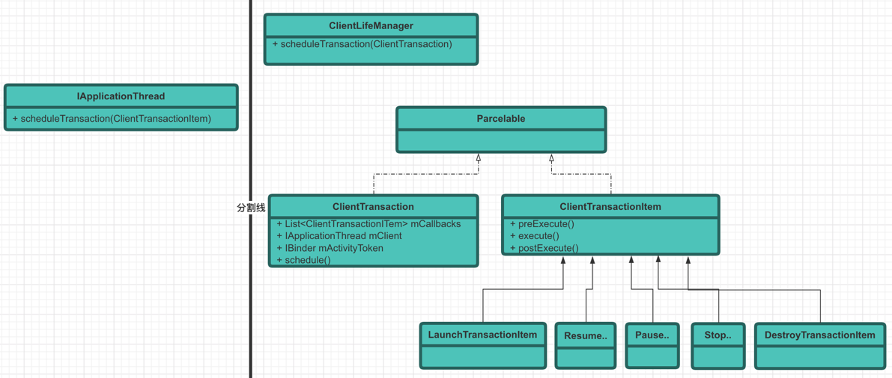

# 一些思路

从数据流的角度来分析： activity--ActivityClientRecord--activityRecord--activityinfo--activity
app端发起一个activity启动请求，到AMS。这其中的对于activity数据的封装是怎么样变化的？ 进程内 以及 进程间activity是如何传递数据的？ 从而引出了数据结构。。

# app测：

intent activity ActivityClientRecord ActivityResult 启动结果

# AMS测：

ResolveInfo 通过activitySuperVisor-AMS-PMS的接口 resolveIntent(),得到intent对应的component解析信息。
里面包含了activityInfo、 serviceInfo、broadcastInfo、providerInfo、intent-filter等。

ActivityInfo 从iResolveInfo 中获取要启动activity的信息。

Display 一个对应一个 ActivityStackSuperVisor ActivityStackSuperVisor 栈式管理多个 ActivityStack ActivityStack
栈式管理多个 TaskRecord TaskRecord 栈式管理多个 ActivityRecord

## 疑问

Activity中的 Activity mParent 成员变量 是啥？

# AMS中的一些概念

```

ActivityStackSupervisor state:
  topDisplayFocusedStack=Task{acf637 #10 visible=false type=standard mode=fullscreen translucent=true A=10054:com.android.documentsui U=0 StackId=10 sz=2}
  mLastOrientationSource=ActivityRecord{87bbf5b u0 com.android.documentsui/.files.FilesActivity t10}
  Display: mDisplayId=0 stacks=4
    init=1080x2340 440dpi cur=1080x2340 app=1080x2072 rng=1080x1003-2072x2072
    deferred=false mLayoutNeeded=false mTouchExcludeRegion=SkRegion((0,0,1080,2340))

  mLayoutSeq=340
  mCurrentFocus=Window{6bbd515 u0 com.android.packageinstaller/com.android.packageinstaller.InstallStaging}
  mFocusedApp=ActivityRecord{afdf8a0 u0 com.android.packageinstaller/.InstallStaging t10}
  mLastStatusBarVisibility=0x8008

  displayId=0
  mWallpaperTarget=null
  mLastWallpaperX=0.33333334 mLastWallpaperY=0.5
/
  Task display areas in top down Z order:
    TaskDisplayArea DefaultTaskDisplayArea
      mLastOrientationSource=Task{acf637 #10 visible=false type=standard mode=fullscreen translucent=true A=10054:com.android.documentsui U=0 StackId=10 sz=2}
      mPreferredTopFocusableStack=Task{acf637 #10 visible=false type=standard mode=fullscreen translucent=true A=10054:com.android.documentsui U=0 StackId=10 sz=2}
      mLastFocusedStack=Task{acf637 #10 visible=false type=standard mode=fullscreen translucent=true A=10054:com.android.documentsui U=0 StackId=10 sz=2}
      Application tokens in top down Z order:
      * Task{acf637 #10 visible=false type=standard mode=fullscreen translucent=true A=10054:com.android.documentsui U=0 StackId=10 sz=2}
        mLastOrientationSource=ActivityRecord{87bbf5b u0 com.android.documentsui/.files.FilesActivity t10}
        bounds=[0,0][1080,2340]
        * ActivityRecord{afdf8a0 u0 com.android.packageinstaller/.InstallStaging t10}
        * ActivityRecord{87bbf5b u0 com.android.documentsui/.files.FilesActivity t10}
      * Task{ad52da0 #1 visible=false type=home mode=fullscreen translucent=true I=com.android.launcher3/.uioverrides.QuickstepLauncher U=0 StackId=1 sz=1}
        mLastOrientationSource=Task{7e0ec2a #8 visible=true type=home mode=fullscreen translucent=false I=com.android.launcher3/.uioverrides.QuickstepLauncher U=0 StackId=1 sz=1}
        bounds=[0,0][1080,2340]
        * Task{7e0ec2a #8 visible=true type=home mode=fullscreen translucent=false I=com.android.launcher3/.uioverrides.QuickstepLauncher U=0 StackId=1 sz=1}
          mLastOrientationSource=ActivityRecord{4c22c1e u0 com.android.launcher3/.uioverrides.QuickstepLauncher t8}
          bounds=[0,0][1080,2340]
          * ActivityRecord{4c22c1e u0 com.android.launcher3/.uioverrides.QuickstepLauncher t8}
      * Task{b080acc #4 visible=false type=undefined mode=split-screen-primary translucent=true ?? U=0 StackId=4 sz=0}
        bounds=[0,0][1080,1158]
      * Task{13d9a1b #5 visible=false type=undefined mode=split-screen-secondary translucent=true ?? U=0 StackId=5 sz=0}
        bounds=[0,1186][1080,2340]

```

## Activity

一个屏幕对应一个activityDisplay。里面包含多个activityStack。

一个ActivityStack 里面可能有多个TaskRecord。一个TaskRecord对应一个栈。

TaskRecord里面有很多activities。一个activity对应一个activityRecord。

## ProcessRecord

ProcessRecord 包含了一个进程中所有的activityRecord，不同TaskRecord中的activityRecord可能属于同一个ProcessRecord。
为甚？因为一个进程可以开辟多个activity栈，也就是多个TaskRecord。如 利用singleInstance启动模式。那么就有两个栈。

## 可以验证以上的关系吗？ 特别是activityStack??

```
adb shell dumpsys activity activities
```

### 利用singleInstance模式启动。

第一个启动activity(standard)： TaskInfo{userId=0 stackId=144 taskId=2344 displayId=0 isRunning=true
baseIntent=Intent { act=android.intent.action.MAIN cat=[android.intent.category.LAUNCHER]
flg=0x10000000 cmp=com.zygote.insight/.MainActivity }
baseActivity=ComponentInfo{com.zygote.insight/com.zygote.insight.MainActivity}
topActivity=ComponentInfo{com.zygote.insight/com.zygote.insight.MainActivity} origActivity=null
realActivity=ComponentInfo{com.zygote.insight/com.zygote.insight.MainActivity} numActivities=1
lastActiveTime=856901021 supportsSplitScreenMultiWindow=true resizeMode=1

第二个 activity(singleInstance)： TaskInfo{userId=0 stackId=145 taskId=2345 displayId=0 isRunning=true
baseIntent=Intent { flg=0x10000000 cmp=com.zygote.insight/.SecondActivity }
baseActivity=ComponentInfo{com.zygote.insight/com.zygote.insight.SecondActivity}
topActivity=ComponentInfo{com.zygote.insight/com.zygote.insight.SecondActivity} origActivity=null
realActivity=ComponentInfo{com.zygote.insight/com.zygote.insight.SecondActivity} numActivities=1
lastActiveTime=856909378 supportsSplitScreenMultiWindow=true resizeMode=1

dumpsys 信息： 确实是两个 ActivityStack,两个TaskRecord。

```
    // 最上面的 ActivityStack 155.
 Stack #155: type=standard mode=fullscreen
  isSleeping=false
  mBounds=Rect(0, 0 - 0, 0)
    Task id #2355
    mBounds=Rect(0, 0 - 0, 0)
    mMinWidth=-1
    mMinHeight=-1
    mLastNonFullscreenBounds=null
    * TaskRecord{77fa9e9 #2355 A=com.zygote.insight U=0 StackId=155 sz=1}
      userId=0 effectiveUid=u0a1398 mCallingUid=u0a1398 mUserSetupComplete=true mCallingPackage=com.zygote.insight
      affinity=com.zygote.insight
      intent={flg=0x10000000 cmp=com.zygote.insight/.SecondActivity}
      mActivityComponent=com.zygote.insight/.SecondActivity
      autoRemoveRecents=false isPersistable=true numFullscreen=1 activityType=1
      rootWasReset=false mNeverRelinquishIdentity=true mReuseTask=false mLockTaskAuth=LOCK_TASK_AUTH_PINNABLE
      Activities=[ActivityRecord{ce7f0e3 u0 com.zygote.insight/.SecondActivity t2355}]
      askedCompatMode=false inRecents=true isAvailable=true
      mRootProcess=ProcessRecord{dfef6f2 8961:com.zygote.insight/u0a1398}
      stackId=155
      hasBeenVisible=true mResizeMode=RESIZE_MODE_RESIZEABLE_VIA_SDK_VERSION mSupportsPictureInPicture=false isResizeable=true lastActiveTime=881512926 (inactive for 17s)
      mAppSceneMode == 0
      * Hist #0: ActivityRecord{ce7f0e3 u0 com.zygote.insight/.SecondActivity t2355}
          packageName=com.zygote.insight processName=com.zygote.insight
          launchedFromUid=11398 launchedFromPackage=com.zygote.insight userId=0
          app=ProcessRecord{dfef6f2 8961:com.zygote.insight/u0a1398}
          Intent { flg=0x10000000 cmp=com.zygote.insight/.SecondActivity }
          frontOfTask=true task=TaskRecord{77fa9e9 #2355 A=com.zygote.insight U=0 StackId=155 sz=1}
          taskAffinity=com.zygote.insight
          mActivityComponent=com.zygote.insight/.SecondActivity
          baseDir=/data/app/com.zygote.insight-p3qWjdGW1AgjwfX51lQN-A==/base.apk
          dataDir=/data/user/0/com.zygote.insight
          stateNotNeeded=false componentSpecified=true mActivityType=standard
          compat={420dpi} labelRes=0x7f0c001e icon=0x7f0b0001 theme=0x7f0d0006
          mLastReportedConfigurations:
           mGlobalConfig={1.0 0  ?mcc?mnc [zh_CN] ldltr sw411dp w411dp h750dp 420dpi nrml long port force dark=0 finger -keyb/v/h -nav/h winConfig={ mBounds=Rect(0, 0 - 1080, 2160) mAppBounds=Rect(0, 0 - 1080, 2034) mWindowingMode=fullscreen mDisplayWindowingMode=fullscreen mActivityType=undefined mAlwaysOnTop=undefined mRotation=ROTATION_0} s.21FontSeq = 1, FontUserId = 0, FontID = 1}
           mOverrideConfig={1.0 0  ?mcc?mnc [zh_CN] ldltr sw411dp w411dp h750dp 420dpi nrml long port force dark=0 finger -keyb/v/h -nav/h winConfig={ mBounds=Rect(0, 0 - 1080, 2160) mAppBounds=Rect(0, 0 - 1080, 2034) mWindowingMode=fullscreen mDisplayWindowingMode=fullscreen mActivityType=standard mAlwaysOnTop=undefined mRotation=ROTATION_0} s.1FontSeq = 1, FontUserId = 0, FontID = 1}
          CurrentConfiguration={1.0 0  ?mcc?mnc [zh_CN] ldltr sw411dp w411dp h750dp 420dpi nrml long port force dark=0 finger -keyb/v/h -nav/h winConfig={ mBounds=Rect(0, 0 - 1080, 2160) mAppBounds=Rect(0, 0 - 1080, 2034) mWindowingMode=fullscreen mDisplayWindowingMode=fullscreen mActivityType=standard mAlwaysOnTop=undefined mRotation=ROTATION_0} s.1FontSeq = 1, FontUserId = 0, FontID = 1}
          taskDescription: label="null" icon=null iconResource=0 iconFilename=null primaryColor=ff6200ee
           backgroundColor=fffafafa
           statusBarColor=ff3700b3
           navigationBarColor=ff000000
          launchFailed=false launchCount=1 lastLaunchTime=-17s645ms
          haveState=false icicle=null
          state=RESUMED stopped=false delayedResume=false finishing=false
          keysPaused=false inHistory=true visible=true sleeping=false idle=true mStartingWindowState=STARTING_WINDOW_SHOWN
          fullscreen=true noDisplay=false immersive=false launchMode=3
          frozenBeforeDestroy=false forceNewConfig=false
          mActivityType=standard
           nowVisible=true lastVisibleTime=-16s994ms
          resizeMode=RESIZE_MODE_RESIZEABLE_VIA_SDK_VERSION
          mLastReportedMultiWindowMode=false mLastReportedPictureInPictureMode=false

    Running activities (most recent first):
      TaskRecord{77fa9e9 #2355 A=com.zygote.insight U=0 StackId=155 sz=1}
        Run #0: ActivityRecord{ce7f0e3 u0 com.zygote.insight/.SecondActivity t2355}

    mResumedActivity: ActivityRecord{ce7f0e3 u0 com.zygote.insight/.SecondActivity t2355}

    // 从上往下，第二个 ActivityStack 154
  Stack #154: type=standard mode=fullscreen
  isSleeping=false
  mBounds=Rect(0, 0 - 0, 0)

    Task id #2354
    mBounds=Rect(0, 0 - 0, 0)
    mMinWidth=-1
    mMinHeight=-1
    mLastNonFullscreenBounds=null
    * TaskRecord{a56866e #2354 A=com.zygote.insight U=0 StackId=154 sz=1}
      userId=0 effectiveUid=u0a1398 mCallingUid=2000 mUserSetupComplete=true mCallingPackage=null
      affinity=com.zygote.insight
      intent={act=android.intent.action.MAIN cat=[android.intent.category.LAUNCHER] flg=0x10000000 cmp=com.zygote.insight/.MainActivity}
      mActivityComponent=com.zygote.insight/.MainActivity
      autoRemoveRecents=false isPersistable=true numFullscreen=1 activityType=1
      rootWasReset=false mNeverRelinquishIdentity=true mReuseTask=false mLockTaskAuth=LOCK_TASK_AUTH_PINNABLE
      Activities=[ActivityRecord{576278e u0 com.zygote.insight/.MainActivity t2354}]
      askedCompatMode=false inRecents=false isAvailable=true
      stackId=154
      hasBeenVisible=true mResizeMode=RESIZE_MODE_RESIZEABLE_VIA_SDK_VERSION mSupportsPictureInPicture=false isResizeable=true lastActiveTime=881512917 (inactive for 17s)
      mAppSceneMode == 0
      * Hist #0: ActivityRecord{576278e u0 com.zygote.insight/.MainActivity t2354}
          packageName=com.zygote.insight processName=com.zygote.insight
          launchedFromUid=2000 launchedFromPackage=null userId=0
          app=ProcessRecord{dfef6f2 8961:com.zygote.insight/u0a1398}
          Intent { act=android.intent.action.MAIN cat=[android.intent.category.LAUNCHER] flg=0x10000000 cmp=com.zygote.insight/.MainActivity }
          frontOfTask=true task=TaskRecord{a56866e #2354 A=com.zygote.insight U=0 StackId=154 sz=1}
          taskAffinity=com.zygote.insight
          mActivityComponent=com.zygote.insight/.MainActivity
          baseDir=/data/app/com.zygote.insight-p3qWjdGW1AgjwfX51lQN-A==/base.apk
          dataDir=/data/user/0/com.zygote.insight
          stateNotNeeded=false componentSpecified=true mActivityType=standard
          compat={420dpi} labelRes=0x7f0c001e icon=0x7f0b0001 theme=0x7f0d0006
          mLastReportedConfigurations:
           mGlobalConfig={1.0 0  ?mcc?mnc [zh_CN] ldltr sw411dp w411dp h750dp 420dpi nrml long port force dark=0 finger -keyb/v/h -nav/h winConfig={ mBounds=Rect(0, 0 - 1080, 2160) mAppBounds=Rect(0, 0 - 1080, 2034) mWindowingMode=fullscreen mDisplayWindowingMode=fullscreen mActivityType=undefined mAlwaysOnTop=undefined mRotation=ROTATION_0} s.21FontSeq = 1, FontUserId = 0, FontID = 1}
           mOverrideConfig={1.0 0  ?mcc?mnc [zh_CN] ldltr sw411dp w411dp h750dp 420dpi nrml long port force dark=0 finger -keyb/v/h -nav/h winConfig={ mBounds=Rect(0, 0 - 1080, 2160) mAppBounds=Rect(0, 0 - 1080, 2034) mWindowingMode=fullscreen mDisplayWindowingMode=fullscreen mActivityType=standard mAlwaysOnTop=undefined mRotation=ROTATION_0} s.1FontSeq = 1, FontUserId = 0, FontID = 1}
          CurrentConfiguration={1.0 0  ?mcc?mnc [zh_CN] ldltr sw411dp w411dp h750dp 420dpi nrml long port force dark=0 finger -keyb/v/h -nav/h winConfig={ mBounds=Rect(0, 0 - 1080, 2160) mAppBounds=Rect(0, 0 - 1080, 2034) mWindowingMode=fullscreen mDisplayWindowingMode=fullscreen mActivityType=standard mAlwaysOnTop=undefined mRotation=ROTATION_0} s.1FontSeq = 1, FontUserId = 0, FontID = 1}
          taskDescription: label="null" icon=null iconResource=0 iconFilename=null primaryColor=ff6200ee
           backgroundColor=fffafafa
           statusBarColor=ff3700b3
           navigationBarColor=ff000000
          launchFailed=false launchCount=0 lastLaunchTime=-21m9s54ms
          haveState=true icicle=Bundle[mParcelledData.dataSize=1588]
          state=STOPPED stopped=true delayedResume=false finishing=false
          keysPaused=false inHistory=true visible=false sleeping=false idle=true mStartingWindowState=STARTING_WINDOW_SHOWN
          fullscreen=true noDisplay=false immersive=false launchMode=0
          frozenBeforeDestroy=false forceNewConfig=false
          mActivityType=standard
           nowVisible=false lastVisibleTime=-21m8s53ms
          resizeMode=RESIZE_MODE_RESIZEABLE_VIA_SDK_VERSION
          mLastReportedMultiWindowMode=false mLastReportedPictureInPictureMode=false

    Running activities (most recent first):
      TaskRecord{a56866e #2354 A=com.zygote.insight U=0 StackId=154 sz=1}
        Run #0: ActivityRecord{576278e u0 com.zygote.insight/.MainActivity t2354}

    mLastPausedActivity: ActivityRecord{576278e u0 com.zygote.insight/.MainActivity t2354}

    // 第三个 ActivityStack 0 桌面
  Stack #0: type=home mode=fullscreen
  isSleeping=false
  mBounds=Rect(0, 0 - 0, 0)
    ......
```

总结： 第二个activity设置了singleInstance模式，ams里面会创建两个ActivityStack、每个ActivityStack里面会创建各自的TaskRecord
对象。每一个TaskRecord里面各有一个activityRecord。 提问：为什么查看任务栏只显示一个图标？
因为虽然分开了两个ActivityStack。但是由于TaskAffinity一样，所以会共用一个显示。点击返回，那么MainActivity会显示出来。
例外：如果你按了任务键，然后在按返回键。那么会回到home界面。为什么？为啥任务键ui默认是home的一部分。相当于 SecondActivity 的ActivityStack下面已经是home了。

提问： 想要分开显示两个图标怎么办？ 简单。设置一个TaskAffinity即可。

### 利用singleTask模式启动。

第一个： TaskInfo{userId=0 stackId=146 taskId=2346 displayId=0 isRunning=true baseIntent=Intent {
act=android.intent.action.MAIN cat=[android.intent.category.LAUNCHER] flg=0x10000000
cmp=com.zygote.insight/.MainActivity }
baseActivity=ComponentInfo{com.zygote.insight/com.zygote.insight.MainActivity}
topActivity=ComponentInfo{com.zygote.insight/com.zygote.insight.MainActivity} origActivity=null
realActivity=ComponentInfo{com.zygote.insight/com.zygote.insight.MainActivity} numActivities=1
lastActiveTime=857253418 supportsSplitScreenMultiWindow=true resizeMode=1

第二个： TaskInfo{userId=0 stackId=146 taskId=2346 displayId=0 isRunning=true baseIntent=Intent {
act=android.intent.action.MAIN cat=[android.intent.category.LAUNCHER] flg=0x10000000
cmp=com.zygote.insight/.MainActivity }
baseActivity=ComponentInfo{com.zygote.insight/com.zygote.insight.MainActivity}
topActivity=ComponentInfo{com.zygote.insight/com.zygote.insight.SecondActivity} origActivity=null
realActivity=ComponentInfo{com.zygote.insight/com.zygote.insight.MainActivity} numActivities=2
lastActiveTime=857259889 supportsSplitScreenMultiWindow=true resizeMode=1

总结： singleTask没有singleInstance强制性。 它可以在当前的TaskRecord。跟普通的没有什么区别。

1. 但是如果设置了TaskAffinity，则会另外起一个ActivityStack。
2. 如果重新启动，则不会重新onCreate，只会回调onNewIntent。
3. ABC,AC正常模式。B设置了singleTask+TaskAfinity。A启动B，此时会切换栈。B在启动C，C会被加入到B的任务栈中，而不是加入
   到A的任务栈中。这就是singleInstance与singleTask的区别。
4.

### standard模式跟之前task的一样。

```
OnePlus5T:/ $ dumpsys activity activities
ACTIVITY MANAGER ACTIVITIES (dumpsys activity activities)

Display #0 (activities from top to bottom): //display 0号屏幕，从上到下显示
   // 第一个AcitiityStack stacID=148 
  Stack #148: type=standard mode=fullscreen  
  isSleeping=false
  mBounds=Rect(0, 0 - 0, 0)
    Task id #2348 // TaskRecord 的 id= 2348 
    mBounds=Rect(0, 0 - 0, 0)
    mMinWidth=-1
    mMinHeight=-1
    mLastNonFullscreenBounds=null
    // 一个 TaskRecord
    * TaskRecord{8fd0eb7 #2348 A=com.zygote.insight U=0 StackId=148 sz=1}
      userId=0 effectiveUid=u0a1398 mCallingUid=2000 mUserSetupComplete=true mCallingPackage=null
      affinity=com.zygote.insight
      intent={act=android.intent.action.MAIN cat=[android.intent.category.LAUNCHER] flg=0x10000000 cmp=com.zygote.insight/.MainActivity}
      mActivityComponent=com.zygote.insight/.MainActivity
      autoRemoveRecents=false isPersistable=true numFullscreen=1 activityType=1
      rootWasReset=false mNeverRelinquishIdentity=true mReuseTask=false mLockTaskAuth=LOCK_TASK_AUTH_PINNABLE
      // 这个 TaskRecord 里面有多少个activities 
      Activities=[ActivityRecord{bc6313c u0 com.zygote.insight/.MainActivity t2348}]
      askedCompatMode=false inRecents=true isAvailable=true
      mRootProcess=ProcessRecord{4793241 4916:com.zygote.insight/u0a1398}
      stackId=148
      hasBeenVisible=true mResizeMode=RESIZE_MODE_RESIZEABLE_VIA_SDK_VERSION mSupportsPictureInPicture=false isResizeable=true lastActiveTime=861969273 (inactive for 48s)
      mAppSceneMode == 0
      // 历史栈
      * Hist #0: ActivityRecord{bc6313c u0 com.zygote.insight/.MainActivity t2348}
          packageName=com.zygote.insight processName=com.zygote.insight
          launchedFromUid=2000 launchedFromPackage=null userId=0
          app=ProcessRecord{4793241 4916:com.zygote.insight/u0a1398}
          Intent { act=android.intent.action.MAIN cat=[android.intent.category.LAUNCHER] flg=0x10000000 cmp=com.zygote.insight/.MainActivity }
          frontOfTask=true task=TaskRecord{8fd0eb7 #2348 A=com.zygote.insight U=0 StackId=148 sz=1}
          taskAffinity=com.zygote.insight
          mActivityComponent=com.zygote.insight/.MainActivity
          baseDir=/data/app/com.zygote.insight-GQw7Ovt1SRUEWk9rY6XxkQ==/base.apk
          dataDir=/data/user/0/com.zygote.insight
          stateNotNeeded=false componentSpecified=true mActivityType=standard
          compat={420dpi} labelRes=0x7f0c001e icon=0x7f0b0001 theme=0x7f0d0006
          mLastReportedConfigurations:
           mGlobalConfig={1.0 0  ?mcc?mnc [zh_CN] ldltr sw411dp w411dp h750dp 420dpi nrml long port force dark=0 finger -keyb/v/h -nav/h winConfig={ mBounds=Rect(0, 0 - 1080, 2160) mAppBounds=Rect(0, 0 - 1080, 2034) mWindowingMode=fullscreen mDisplayWindowingMode=fullscreen mActivityType=undefined mAlwaysOnTop=undefined mRotation=ROTATION_0} s.21FontSeq = 1, FontUserId = 0, FontID = 1}
           mOverrideConfig={1.0 0  ?mcc?mnc [zh_CN] ldltr sw411dp w411dp h750dp 420dpi nrml long port force dark=0 finger -keyb/v/h -nav/h winConfig={ mBounds=Rect(0, 0 - 1080, 2160) mAppBounds=Rect(0, 0 - 1080, 2034) mWindowingMode=fullscreen mDisplayWindowingMode=fullscreen mActivityType=standard mAlwaysOnTop=undefined mRotation=ROTATION_0} s.1FontSeq = 1, FontUserId = 0, FontID = 1}
          CurrentConfiguration={1.0 0  ?mcc?mnc [zh_CN] ldltr sw411dp w411dp h750dp 420dpi nrml long port force dark=0 finger -keyb/v/h -nav/h winConfig={ mBounds=Rect(0, 0 - 1080, 2160) mAppBounds=Rect(0, 0 - 1080, 2034) mWindowingMode=fullscreen mDisplayWindowingMode=fullscreen mActivityType=standard mAlwaysOnTop=undefined mRotation=ROTATION_0} s.1FontSeq = 1, FontUserId = 0, FontID = 1}
          taskDescription: label="null" icon=null iconResource=0 iconFilename=null primaryColor=ff6200ee
           backgroundColor=fffafafa
           statusBarColor=ff3700b3
           navigationBarColor=ff000000
          launchFailed=false launchCount=1 lastLaunchTime=-48s303ms
          haveState=false icicle=null
          state=RESUMED stopped=false delayedResume=false finishing=false
          keysPaused=false inHistory=true visible=true sleeping=false idle=true mStartingWindowState=STARTING_WINDOW_SHOWN
          fullscreen=true noDisplay=false immersive=false launchMode=0
          frozenBeforeDestroy=false forceNewConfig=false
          mActivityType=standard
           nowVisible=true lastVisibleTime=-47s304ms
          resizeMode=RESIZE_MODE_RESIZEABLE_VIA_SDK_VERSION
          mLastReportedMultiWindowMode=false mLastReportedPictureInPictureMode=false
    // 这个ActivityStack 里面处于running 的activities
    Running activities (most recent first):
      TaskRecord{8fd0eb7 #2348 A=com.zygote.insight U=0 StackId=148 sz=1}
        Run #0: ActivityRecord{bc6313c u0 com.zygote.insight/.MainActivity t2348}
 // 这个ActivityStack 里面处于 resummed 的activity
    mResumedActivity: ActivityRecord{bc6313c u0 com.zygote.insight/.MainActivity t2348}
  // 第二个 ActivityStack stackId=0.表示是桌面launcher
  Stack #0: type=home mode=fullscreen
  isSleeping=false
  mBounds=Rect(0, 0 - 0, 0)

    Task id #2202
    mBounds=Rect(0, 0 - 0, 0)
    mMinWidth=-1
    mMinHeight=-1
    mLastNonFullscreenBounds=null
    * TaskRecord{6c53624 #2202 I=net.oneplus.launcher/.Launcher U=0 StackId=0 sz=1}
      userId=0 effectiveUid=u0a60 mCallingUid=0 mUserSetupComplete=true mCallingPackage=null
      intent={act=android.intent.action.MAIN cat=[android.intent.category.HOME] flg=0x10000100 cmp=net.oneplus.launcher/.Launcher}
      mActivityComponent=net.oneplus.launcher/.Launcher
      autoRemoveRecents=false isPersistable=true numFullscreen=1 activityType=2
      rootWasReset=false mNeverRelinquishIdentity=true mReuseTask=false mLockTaskAuth=LOCK_TASK_AUTH_PINNABLE
      // 也只有一个 ActivityRecord 
      Activities=[ActivityRecord{a61e3f0 u0 net.oneplus.launcher/.Launcher t2202}]
      askedCompatMode=false inRecents=true isAvailable=true
      mRootProcess=ProcessRecord{8c8b5f2 3918:net.oneplus.launcher/u0a60}
      stackId=0
      hasBeenVisible=true mResizeMode=RESIZE_MODE_RESIZEABLE mSupportsPictureInPicture=false isResizeable=true lastActiveTime=861969168 (inactive for 48s)
      mAppSceneMode == 0
      * Hist #0: ActivityRecord{a61e3f0 u0 net.oneplus.launcher/.Launcher t2202}
          packageName=net.oneplus.launcher processName=net.oneplus.launcher
          launchedFromUid=0 launchedFromPackage=null userId=0
          app=ProcessRecord{8c8b5f2 3918:net.oneplus.launcher/u0a60}
          Intent { act=android.intent.action.MAIN cat=[android.intent.category.HOME] flg=0x10000100 cmp=net.oneplus.launcher/.Launcher }
          frontOfTask=true task=TaskRecord{6c53624 #2202 I=net.oneplus.launcher/.Launcher U=0 StackId=0 sz=1}
          taskAffinity=null
          mActivityComponent=net.oneplus.launcher/.Launcher
          baseDir=/data/app/net.oneplus.launcher-kY2BS4AdlYlco5EYBkCDWQ==/base.apk
          dataDir=/data/user/0/net.oneplus.launcher
          stateNotNeeded=true componentSpecified=false mActivityType=home
          compat={420dpi} labelRes=0x7f130081 icon=0x7f100005 theme=0x7f140118
          mLastReportedConfigurations:
           mGlobalConfig={1.0 0  ?mcc?mnc [zh_CN] ldltr sw411dp w411dp h750dp 420dpi nrml long port force dark=0 finger -keyb/v/h -nav/h winConfig={ mBounds=Rect(0, 0 - 1080, 2160) mAppBounds=Rect(0, 0 - 1080, 2034) mWindowingMode=fullscreen mDisplayWindowingMode=fullscreen mActivityType=undefined mAlwaysOnTop=undefined mRotation=ROTATION_0} s.21FontSeq = 1, FontUserId = 0, FontID = 1}
           mOverrideConfig={1.0 0  ?mcc?mnc [zh_CN] ldltr sw411dp w411dp h750dp 420dpi nrml long port force dark=0 finger -keyb/v/h -nav/h winConfig={ mBounds=Rect(0, 0 - 1080, 2160) mAppBounds=Rect(0, 0 - 1080, 2034) mWindowingMode=fullscreen mDisplayWindowingMode=fullscreen mActivityType=home mAlwaysOnTop=undefined mRotation=ROTATION_0} s.2FontSeq = 1, FontUserId = 0, FontID = 1}
          CurrentConfiguration={1.0 0  ?mcc?mnc [zh_CN] ldltr sw411dp w411dp h750dp 420dpi nrml long port force dark=0 finger -keyb/v/h -nav/h winConfig={ mBounds=Rect(0, 0 - 1080, 2160) mAppBounds=Rect(0, 0 - 1080, 2034) mWindowingMode=fullscreen mDisplayWindowingMode=fullscreen mActivityType=home mAlwaysOnTop=undefined mRotation=ROTATION_0} s.2FontSeq = 1, FontUserId = 0, FontID = 1}
          RequestedOverrideConfiguration={0.0 0  ?mcc?mnc ?localeList ?layoutDir ?swdp ?wdp ?hdp ?density ?lsize ?long ?ldr ?wideColorGamut ?orien ?uimode ?night force dark=0 ?touch ?keyb/?/? ?nav/? winConfig={ mBounds=Rect(0, 0 - 0, 0) mAppBounds=null mWindowingMode=undefined mDisplayWindowingMode=undefined mActivityType=home mAlwaysOnTop=undefined mRotation=undefined}FontSeq = 0, FontUserId = -1, FontID = 1}
          taskDescription: label="null" icon=null iconResource=0 iconFilename=null primaryColor=fff5f5f5
           backgroundColor=ffffffff
           statusBarColor=0
           navigationBarColor=0
          launchFailed=false launchCount=0 lastLaunchTime=-2d10h10m36s735ms
          haveState=true icicle=Bundle[mParcelledData.dataSize=11708]
          state=STOPPED stopped=true delayedResume=false finishing=false
          keysPaused=false inHistory=true visible=false sleeping=false idle=true mStartingWindowState=STARTING_WINDOW_REMOVED
          fullscreen=true noDisplay=false immersive=false launchMode=2
          frozenBeforeDestroy=false forceNewConfig=false
          mActivityType=home
           nowVisible=false lastVisibleTime=-4m19s96ms
          resizeMode=RESIZE_MODE_RESIZEABLE
          mLastReportedMultiWindowMode=false mLastReportedPictureInPictureMode=false

    //
    Running activities (most recent first):
      TaskRecord{6c53624 #2202 I=net.oneplus.launcher/.Launcher U=0 StackId=0 sz=1}
        Run #0: ActivityRecord{a61e3f0 u0 net.oneplus.launcher/.Launcher t2202}

    mLastPausedActivity: ActivityRecord{a61e3f0 u0 net.oneplus.launcher/.Launcher t2202}

 ResumedActivity:ActivityRecord{bc6313c u0 com.zygote.insight/.MainActivity t2348}

  ResumedActivity: ActivityRecord{bc6313c u0 com.zygote.insight/.MainActivity t2348}

// ActivityStackSupervisor 的状态
ActivityStackSupervisor state:
   // 当前获取到焦点的栈 ActivityStack stackID=148.
  topDisplayFocusedStack=ActivityStack{c4f358d stackId=148 type=standard mode=fullscreen visible=true translucent=false, 1 tasks}
  displayId=0 stacks=2 //一块屏幕，两个 ActivityStack。
   mHomeStack=ActivityStack{818f342 stackId=0 type=home mode=fullscreen visible=false translucent=true, 1 tasks}
   mPreferredTopFocusableStack=ActivityStack{c4f358d stackId=148 type=standard mode=fullscreen visible=true translucent=false, 1 tasks}
   mLastFocusedStack=ActivityStack{c4f358d stackId=148 type=standard mode=fullscreen visible=true translucent=false, 1 tasks}
  mCurTaskIdForUser={0=2348}
  mUserStackInFront={}
  isHomeRecentsComponent=true  KeyguardController:
    mKeyguardShowing=false
    mAodShowing=false
    mKeyguardGoingAway=false
    Occluded=false DismissingKeyguardActivity=null at display=0
    mDismissalRequested=false
    mVisibilityTransactionDepth=0
  LockTaskController
    mLockTaskModeState=NONE
    mLockTaskModeTasks=
    mLockTaskPackages (userId:packages)=
      u0:[]
```

如下： 在清单的SecondActivity中添加了taskAffinity还是在同一个栈？ 为啥？

```
TaskInfo{userId=0 stackId=148 taskId=2348 displayId=0 isRunning=true baseIntent=Intent { act=android.intent.action.MAIN cat=[android.intent.category.LAUNCHER] flg=0x10000000 cmp=com.zygote.insight/.MainActivity } baseActivity=ComponentInfo{com.zygote.insight/com.zygote.insight.MainActivity} topActivity=ComponentInfo{com.zygote.insight/com.zygote.insight.MainActivity} origActivity=null realActivity=ComponentInfo{com.zygote.insight/com.zygote.insight.MainActivity} numActivities=1 lastActiveTime=861969273 supportsSplitScreenMultiWindow=true resizeMode=1

TaskInfo{userId=0 stackId=148 taskId=2348 displayId=0 isRunning=true baseIntent=Intent { act=android.intent.action.MAIN cat=[android.intent.category.LAUNCHER] flg=0x10000000 cmp=com.zygote.insight/.MainActivity } baseActivity=ComponentInfo{com.zygote.insight/com.zygote.insight.MainActivity} topActivity=ComponentInfo{com.zygote.insight/com.zygote.insight.SecondActivity} origActivity=null realActivity=ComponentInfo{com.zygote.insight/com.zygote.insight.MainActivity} numActivities=2 lastActiveTime=863268388 supportsSplitScreenMultiWindow=true resizeMode=1

```

dumpsys如下：

```
  Stack #148: type=standard mode=fullscreen
  isSleeping=false
  mBounds=Rect(0, 0 - 0, 0)
    Task id #2348
    mBounds=Rect(0, 0 - 0, 0)
    mMinWidth=-1
    mMinHeight=-1
    mLastNonFullscreenBounds=null
    * TaskRecord{8fd0eb7 #2348 A=com.zygote.insight U=0 StackId=148 sz=2}
      userId=0 effectiveUid=u0a1398 mCallingUid=2000 mUserSetupComplete=true mCallingPackage=null
      affinity=com.zygote.insight
      intent={act=android.intent.action.MAIN cat=[android.intent.category.LAUNCHER] flg=0x10000000 cmp=com.zygote.insight/.MainActivity}
      mActivityComponent=com.zygote.insight/.MainActivity
      autoRemoveRecents=false isPersistable=true numFullscreen=2 activityType=1
      rootWasReset=false mNeverRelinquishIdentity=true mReuseTask=false mLockTaskAuth=LOCK_TASK_AUTH_PINNABLE
      Activities=[ActivityRecord{bc6313c u0 com.zygote.insight/.MainActivity t2348}, ActivityRecord{6bcb748 u0 com.zygote.insight/.SecondActivity t2348}]
      askedCompatMode=false inRecents=true isAvailable=true
      mRootProcess=ProcessRecord{4793241 4916:com.zygote.insight/u0a1398}
      stackId=148
      hasBeenVisible=true mResizeMode=RESIZE_MODE_RESIZEABLE_VIA_SDK_VERSION mSupportsPictureInPicture=false isResizeable=true lastActiveTime=863268388 (inactive for 51s)
      mAppSceneMode == 0
      * Hist #1: ActivityRecord{6bcb748 u0 com.zygote.insight/.SecondActivity t2348}
          packageName=com.zygote.insight processName=com.zygote.insight
          launchedFromUid=11398 launchedFromPackage=com.zygote.insight userId=0
          app=ProcessRecord{4793241 4916:com.zygote.insight/u0a1398}
          Intent { cmp=com.zygote.insight/.SecondActivity }
          frontOfTask=false task=TaskRecord{8fd0eb7 #2348 A=com.zygote.insight U=0 StackId=148 sz=2}
          taskAffinity=com.zygote.insight.task11 // 这里确实设置了 taskAffinity，为啥还在同一个栈
          mActivityComponent=com.zygote.insight/.SecondActivity
          baseDir=/data/app/com.zygote.insight-GQw7Ovt1SRUEWk9rY6XxkQ==/base.apk
          dataDir=/data/user/0/com.zygote.insight
          stateNotNeeded=false componentSpecified=true mActivityType=standard
          compat={420dpi} labelRes=0x7f0c001e icon=0x7f0b0001 theme=0x7f0d0006
          mLastReportedConfigurations:
           mGlobalConfig={1.0 0  ?mcc?mnc [zh_CN] ldltr sw411dp w411dp h750dp 420dpi nrml long port force dark=0 finger -keyb/v/h -nav/h winConfig={ mBounds=Rect(0, 0 - 1080, 2160) mAppBounds=Rect(0, 0 - 1080, 2034) mWindowingMode=fullscreen mDisplayWindowingMode=fullscreen mActivityType=undefined mAlwaysOnTop=undefined mRotation=ROTATION_0} s.21FontSeq = 1, FontUserId = 0, FontID = 1}
           mOverrideConfig={1.0 0  ?mcc?mnc [zh_CN] ldltr sw411dp w411dp h750dp 420dpi nrml long port force dark=0 finger -keyb/v/h -nav/h winConfig={ mBounds=Rect(0, 0 - 1080, 2160) mAppBounds=Rect(0, 0 - 1080, 2034) mWindowingMode=fullscreen mDisplayWindowingMode=fullscreen mActivityType=standard mAlwaysOnTop=undefined mRotation=ROTATION_0} s.1FontSeq = 1, FontUserId = 0, FontID = 1}
          CurrentConfiguration={1.0 0  ?mcc?mnc [zh_CN] ldltr sw411dp w411dp h750dp 420dpi nrml long port force dark=0 finger -keyb/v/h -nav/h winConfig={ mBounds=Rect(0, 0 - 1080, 2160) mAppBounds=Rect(0, 0 - 1080, 2034) mWindowingMode=fullscreen mDisplayWindowingMode=fullscreen mActivityType=standard mAlwaysOnTop=undefined mRotation=ROTATION_0} s.1FontSeq = 1, FontUserId = 0, FontID = 1}
          taskDescription: label="null" icon=null iconResource=0 iconFilename=null primaryColor=ff6200ee
           backgroundColor=fffafafa
           statusBarColor=ff3700b3
           navigationBarColor=ff000000
          launchFailed=false launchCount=1 lastLaunchTime=-51s78ms
          haveState=false icicle=null
          state=RESUMED stopped=false delayedResume=false finishing=false
          keysPaused=false inHistory=true visible=true sleeping=false idle=true mStartingWindowState=STARTING_WINDOW_NOT_SHOWN
          fullscreen=true noDisplay=false immersive=false launchMode=0
          frozenBeforeDestroy=false forceNewConfig=false
          mActivityType=standard
           nowVisible=true lastVisibleTime=-50s583ms
          resizeMode=RESIZE_MODE_RESIZEABLE_VIA_SDK_VERSION
          mLastReportedMultiWindowMode=false mLastReportedPictureInPictureMode=false
      * Hist #0: ActivityRecord{bc6313c u0 com.zygote.insight/.MainActivity t2348}
          packageName=com.zygote.insight processName=com.zygote.insight
          launchedFromUid=2000 launchedFromPackage=null userId=0
          app=ProcessRecord{4793241 4916:com.zygote.insight/u0a1398}
          Intent { act=android.intent.action.MAIN cat=[android.intent.category.LAUNCHER] flg=0x10000000 cmp=com.zygote.insight/.MainActivity }
          frontOfTask=true task=TaskRecord{8fd0eb7 #2348 A=com.zygote.insight U=0 StackId=148 sz=2}
          taskAffinity=com.zygote.insight
          mActivityComponent=com.zygote.insight/.MainActivity
          baseDir=/data/app/com.zygote.insight-GQw7Ovt1SRUEWk9rY6XxkQ==/base.apk
          dataDir=/data/user/0/com.zygote.insight
          stateNotNeeded=false componentSpecified=true mActivityType=standard
          compat={420dpi} labelRes=0x7f0c001e icon=0x7f0b0001 theme=0x7f0d0006
          mLastReportedConfigurations:
           mGlobalConfig={1.0 0  ?mcc?mnc [zh_CN] ldltr sw411dp w411dp h750dp 420dpi nrml long port force dark=0 finger -keyb/v/h -nav/h winConfig={ mBounds=Rect(0, 0 - 1080, 2160) mAppBounds=Rect(0, 0 - 1080, 2034) mWindowingMode=fullscreen mDisplayWindowingMode=fullscreen mActivityType=undefined mAlwaysOnTop=undefined mRotation=ROTATION_0} s.21FontSeq = 1, FontUserId = 0, FontID = 1}
           mOverrideConfig={1.0 0  ?mcc?mnc [zh_CN] ldltr sw411dp w411dp h750dp 420dpi nrml long port force dark=0 finger -keyb/v/h -nav/h winConfig={ mBounds=Rect(0, 0 - 1080, 2160) mAppBounds=Rect(0, 0 - 1080, 2034) mWindowingMode=fullscreen mDisplayWindowingMode=fullscreen mActivityType=standard mAlwaysOnTop=undefined mRotation=ROTATION_0} s.1FontSeq = 1, FontUserId = 0, FontID = 1}
          CurrentConfiguration={1.0 0  ?mcc?mnc [zh_CN] ldltr sw411dp w411dp h750dp 420dpi nrml long port force dark=0 finger -keyb/v/h -nav/h winConfig={ mBounds=Rect(0, 0 - 1080, 2160) mAppBounds=Rect(0, 0 - 1080, 2034) mWindowingMode=fullscreen mDisplayWindowingMode=fullscreen mActivityType=standard mAlwaysOnTop=undefined mRotation=ROTATION_0} s.1FontSeq = 1, FontUserId = 0, FontID = 1}
          taskDescription: label="null" icon=null iconResource=0 iconFilename=null primaryColor=ff6200ee
           backgroundColor=fffafafa
           statusBarColor=ff3700b3
           navigationBarColor=ff000000
          launchFailed=false launchCount=0 lastLaunchTime=-22m30s263ms
          haveState=true icicle=Bundle[mParcelledData.dataSize=1588]
          state=STOPPED stopped=true delayedResume=false finishing=false
          keysPaused=false inHistory=true visible=false sleeping=false idle=true mStartingWindowState=STARTING_WINDOW_REMOVED
          fullscreen=true noDisplay=false immersive=false launchMode=0
          frozenBeforeDestroy=false forceNewConfig=false
          mActivityType=standard
           nowVisible=false lastVisibleTime=-22m29s264ms
          resizeMode=RESIZE_MODE_RESIZEABLE_VIA_SDK_VERSION
          mLastReportedMultiWindowMode=false mLastReportedPictureInPictureMode=false

    Running activities (most recent first):
      TaskRecord{8fd0eb7 #2348 A=com.zygote.insight U=0 StackId=148 sz=2}
        Run #1: ActivityRecord{6bcb748 u0 com.zygote.insight/.SecondActivity t2348}
        Run #0: ActivityRecord{bc6313c u0 com.zygote.insight/.MainActivity t2348}

    mResumedActivity: ActivityRecord{6bcb748 u0 com.zygote.insight/.SecondActivity t2348}
    mLastPausedActivity: ActivityRecord{bc6313c u0 com.zygote.insight/.MainActivity t2348}

  Stack #0: type=home mode=fullscreen
  isSleeping=false
  mBounds=Rect(0, 0 - 0, 0)

   ..... //下面都大同小异

```

总结： taskAffinity 表示栈的名字。优先级小于launchMode。如果启动模式standard/singletop，那么不会起作用。因为属于正常启动嘛！
如果启动模式为singelTask，表示我想要一个独立的栈来展示。那么会重新创建一个独立的ActivityStack、独立的taskRecord。 此时，app有两个栈。

关键点就是： 先看启动模式，你想不想单独在一个栈里面呢？ singleTask？ singleInstance？？

所谓包，都是静态形式存在磁盘中的文件。apk、so、jar都可以被称为包。包的管理者面临的第一任务： 如何让静态的文件转变内存中的数据结构。 负责将静态文件转变为内存的数据结构的是
packageParse 包解析者。

一个包就对应内存中的一个 Package。而Package有哪些属性？ 这些属性是如何赋值的？这就是解析过程。

```
apk--------PP----->Package
apk--------PP----->Package
apk--------PP----->Package
```

1，ActivityInfo 到底有什么？！

- parcelable我知道，可以跨进程传输。那么是app和 ams之间传输吗？
- ActivityInfo继承了 ComponentInfo，因此，ComponentInfo 有什么用？

```
Component：
  | intent 为何会有这个属性呢。因为activity可以配置意图啊！草！是的哦！
  | classname
  | ...
  
```

2， 是不是还有 ServiceInfo、broadcastInfo、providerInfo？ 是的。还有权限permission，这些都是通过解析manifest.xml文件来获得的。

```
public class ActivityInfo extends ComponentInfo implements Parcelable{}

```

3， ResolveInfo 是什么？ 是intent解析后的最终数据结构。 包含
activityInfo、serviceInfo、providerInfo、broadcastInfo，其中只有一个不为空。

ActivityIntentResolver 用来解析发往 Activity和broadcast的 intent。 ServiceIntentResolve 用来解析发往 Service的
intent。 ProviderIntentResolve 用力啊解析发往 Provider的 intent。 系统每收到一个intent，就会使用对应的解析器来解析。以上三者都是
IntentResolver 的子类。

4，ActivityRecord 是什么？ An entry in the history stack, representing an activity.

5, TaskRecord ?? 任务栈。栈里面有很多activity？

6,ActivityClientRecord 在app端的 activity封装。ActivityClientRecord是ActivityThread的内部类

7, HandlerParams 是PMS中的抽象内部类。 是packageHandler 中使用的数据结构。子类有：

InstallParams： MultiPackageInstallParams:
8,为了让apk在 内部空间和sd卡可以移动 InstallArgs

# 启动流程

# App侧

# AMS侧

## Activity.java

```
  public void startActivity(Intent intent, @Nullable Bundle options) {
        if (options != null) {
            startActivityForResult(intent, -1, options);
        } else {
            // Note we want to go through this call for compatibility with
            // applications that may have overridden the method.
            startActivityForResult(intent, -1);
        }
    }
```

```
 public void startActivityForResult(@RequiresPermission Intent intent, int requestCode) {
        startActivityForResult(intent, requestCode, null);
    }
```

```
public void startActivityForResult(@RequiresPermission Intent intent, int requestCode,
        @Nullable Bundle options) {
    if (mParent == null) { // mParent一直为空 ，走该分支
        options = transferSpringboardActivityOptions(options);
        Instrumentation.ActivityResult ar =
            mInstrumentation.execStartActivity(
                  //      1 传入参数 
                this, mMainThread.getApplicationThread(), mToken, this,
                intent, requestCode, options);
        if (ar != null) {
            mMainThread.sendActivityResult(
                mToken, mEmbeddedID, requestCode, ar.getResultCode(),
                ar.getResultData());
        }
        if (requestCode >= 0) {
            // If this start is requesting a result, we can avoid making
            // the activity visible until the result is received.  Setting
            // this code during onCreate(Bundle savedInstanceState) or onResume() will keep the
            // activity hidden during this time, to avoid flickering.
            // This can only be done when a result is requested because
            // that guarantees we will get information back when the
            // activity is finished, no matter what happens to it.
            mStartedActivity = true;
        }

        cancelInputsAndStartExitTransition(options);
        // TODO Consider clearing/flushing other event sources and events for child windows.
    } else {
       ...
    }
}
```

ActivityResult 启动结果 mMainThread 是 ActivityThread 对象。

mToken IBinder对象。 应该是跟AMS测的ActivityRecord 保持跨进程对应的的一个标识？？？？？？todo

getApplicationThread 是 ActivityThread 静态内部类对象 ApplicationThread 。

# Instrumentation.execStartActivity

Instrumentation 到底是干啥的？ 引导类？？

```
  public ActivityResult execStartActivity(
            Context who, IBinder contextThread, IBinder token, Activity target,
            Intent intent, int requestCode, Bundle options) {
            //发起者的 IApplicationThread ，用来给AMS回调
        IApplicationThread whoThread = (IApplicationThread) contextThread;
        // 引荐者。表示谁发起的这个启动Acitivity请求
        Uri referrer = target != null ? target.onProvideReferrer() : null;
        if (referrer != null) {
            intent.putExtra(Intent.EXTRA_REFERRER, referrer);
        }
        if (mActivityMonitors != null) {
            synchronized (mSync) {
                final int N = mActivityMonitors.size();
                for (int i=0; i<N; i++) {
                    final ActivityMonitor am = mActivityMonitors.get(i);
                    ActivityResult result = null;
                    if (am.ignoreMatchingSpecificIntents()) {
                        result = am.onStartActivity(intent);
                    }
                    if (result != null) {
                        am.mHits++;
                        return result;
                    } else if (am.match(who, null, intent)) {
                        am.mHits++;
                        if (am.isBlocking()) {
                            return requestCode >= 0 ? am.getResult() : null;
                        }
                        break;
                    }
                }
            }
        }
        try {
            intent.migrateExtraStreamToClipData();
            intent.prepareToLeaveProcess(who);
            // atm服务 
            int result = ActivityTaskManager.getService()
                .startActivity(whoThread, who.getBasePackageName(), intent,
                        intent.resolveTypeIfNeeded(who.getContentResolver()),
                        token, target != null ? target.mEmbeddedID : null,
                        requestCode, 0, null, options);
            checkStartActivityResult(result, intent);
        } catch (RemoteException e) {
            throw new RuntimeException("Failure from system", e);
        }
        return null;
    }
```

List<ActivityMonitor> mActivityMonitors;是什么东西？？ todo Context who： 正在启动activity是从哪个context过来的 IBinder
contextThread ： 启动activity的context所在的主线程 IBinder token：
system系统内部Activity的唯一凭证，表示谁正在启动activity，可以为null。如：从service的context中启动activity。 Activity target：
哪一个activity正在启动activity(可以理解为接收结果的target activity)。可能为null，如从service中启动。跟上一个的区别？？ 前者是系统，后者是app侧。
Intent intent： 实际要启动的intent。 int requestCode： 请求码，用来定义启动结果的唯一凭证。如果不需要启动结果，那么设置为负数。 Bundle options ：
附加参数。

简简单单的一个binder请求。到atm侧： Android 10 已经把 activity相关的逻辑都转移到了atm中。

疑问：

1. token到底是啥？ 用来干什么？ 答： token就是表示系统中谁在启动activity。

ActivityTaskManager 位于app侧，通过binder跨进程调用到 AMS的 atm(ActivityManagerService)中。

2. IActivityManager 和 IActivityTaskManager 什么关系？ IActivityManager 是AMS实现的接口。 IActivityTaskManager
   是ATM实现的接口。

# AMS侧

```
 @Override
 public final int startActivity(IApplicationThread caller, String callingPackage,
         Intent intent, String resolvedType, IBinder resultTo, String resultWho, int requestCode,
         int startFlags, ProfilerInfo profilerInfo, Bundle bOptions) {
         // startFlags=0；profileinfo=null；
     return startActivityAsUser(caller, callingPackage, intent, resolvedType, resultTo,
             resultWho, requestCode, startFlags, profilerInfo, bOptions,
             UserHandle.getCallingUserId()); // 添加了userid参数
 }
```

caller 表示是哪个app侧调用的。 applicationThread 本身就是一个binder服务。  
callingPackage 启动的包名 resultTo IBinder 对象。 就是app传递过来的 token 表示启动者，同时也是结果接受者。 resultWho string 类型
target.mEmbeddedID。 也是启动者。 profilerInfo : null

```

   @Override
    public int startActivityAsUser(IApplicationThread caller, String callingPackage,
            Intent intent, String resolvedType, IBinder resultTo, String resultWho, int requestCode,
            int startFlags, ProfilerInfo profilerInfo, Bundle bOptions, int userId) {
        return startActivityAsUser(caller, callingPackage, intent, resolvedType, resultTo,
                resultWho, requestCode, startFlags, profilerInfo, bOptions, userId,
                true /*validateIncomingUser*/); // 经过验证的用户：true。
    }

```

userId: 当前用户id。Android支持多用户。
```
 int startActivityAsUser(IApplicationThread caller, String callingPackage,
            Intent intent, String resolvedType, IBinder resultTo, String resultWho, int requestCode,
            int startFlags, ProfilerInfo profilerInfo, Bundle bOptions, int userId,
            boolean validateIncomingUser) {
        enforceNotIsolatedCaller("startActivityAsUser");
        // 检测发起者用户是否合法？
        userId = getActivityStartController().checkTargetUser(userId, validateIncomingUser,
                Binder.getCallingPid(), Binder.getCallingUid(), "startActivityAsUser");

        // TODO: Switch to user app stacks here.
        // 在这里切换app的栈
        return getActivityStartController().obtainStarter(intent, "startActivityAsUser")
                .setCaller(caller)
                .setCallingPackage(callingPackage)
                .setResolvedType(resolvedType)
                .setResultTo(resultTo)
                .setResultWho(resultWho)
                .setRequestCode(requestCode)
                .setStartFlags(startFlags)
                .setProfilerInfo(profilerInfo)
                .setActivityOptions(bOptions)
                //这个很关键 
                .setMayWait(userId) 
                .execute();

    }
```

```
 // 设置maywait属性为true 
 ActivityStarter setMayWait(int userId) {
     mRequest.mayWait = true;
     mRequest.userId = userId;

     return this;
 }
```

ActivityStartController.obtainStarter() 返回一个 ActivityStarter启动器。用来执行execute()方法，一旦执行完毕就不应该修改了。
ActivityStarter 启动器。 调用了一些列的set方法往 ActivityStarter 的成员变量 mRequest中设置参数。把app传递过来的参数，封装到了mRequest对象。

# ActivityStarter.execute()

```
 int execute() {
        try {
            // TODO(b/64750076): Look into passing request directly to these methods to allow
            // for transactional diffs and preprocessing.
            // 在上一步的set方法中 
            if (mRequest.mayWait) {
            // 走这个分支
                return startActivityMayWait(mRequest.caller, mRequest.callingUid,
                        mRequest.callingPackage, mRequest.realCallingPid, mRequest.realCallingUid,
                        mRequest.intent, mRequest.resolvedType,
                        mRequest.voiceSession, mRequest.voiceInteractor, mRequest.resultTo,
                        mRequest.resultWho, mRequest.requestCode, mRequest.startFlags,
                        mRequest.profilerInfo, mRequest.waitResult, mRequest.globalConfig,
                        mRequest.activityOptions, mRequest.ignoreTargetSecurity, mRequest.userId,
                        mRequest.inTask, mRequest.reason,
                        mRequest.allowPendingRemoteAnimationRegistryLookup,
                        mRequest.originatingPendingIntent, mRequest.allowBackgroundActivityStart);
            } else {
                return startActivity(mRequest.caller, mRequest.intent, mRequest.ephemeralIntent,
                        mRequest.resolvedType, mRequest.activityInfo, mRequest.resolveInfo,
                        mRequest.voiceSession, mRequest.voiceInteractor, mRequest.resultTo,
                        mRequest.resultWho, mRequest.requestCode, mRequest.callingPid,
                        mRequest.callingUid, mRequest.callingPackage, mRequest.realCallingPid,
                        mRequest.realCallingUid, mRequest.startFlags, mRequest.activityOptions,
                        mRequest.ignoreTargetSecurity, mRequest.componentSpecified,
                        mRequest.outActivity, mRequest.inTask, mRequest.reason,
                        mRequest.allowPendingRemoteAnimationRegistryLookup,
                        mRequest.originatingPendingIntent, mRequest.allowBackgroundActivityStart);
            }
        } finally {
            onExecutionComplete();
        }
    }
```

把启动activity的所有信息封装到了一个 mRequest 中，开始启动。 为什么要叫 maywait？ 因为启动时候activity所在的进程不一定已经被拉起。

> ActivityStarter.java
# startActivityMayWait()

```
 private int startActivityMayWait(IApplicationThread caller, int callingUid,
            String callingPackage, int requestRealCallingPid, int requestRealCallingUid,
            Intent intent, String resolvedType, IVoiceInteractionSession voiceSession,
            IVoiceInteractor voiceInteractor, IBinder resultTo, String resultWho, int requestCode,
            int startFlags, ProfilerInfo profilerInfo, WaitResult outResult,
            Configuration globalConfig, SafeActivityOptions options, boolean ignoreTargetSecurity,
            int userId, TaskRecord inTask, String reason,
            boolean allowPendingRemoteAnimationRegistryLookup,
            PendingIntentRecord originatingPendingIntent, boolean allowBackgroundActivityStart) {
            
          ...
          
        // Save a copy in case ephemeral needs it
        // 拷贝保存一份临时intent
        final Intent ephemeralIntent = new Intent(intent);
        // Don't modify the client's object!
        // 要修改的话，我们创建一份新的intent
        intent = new Intent(intent);
         ...
        // 2 根据intent最终通过PMS去获取 ActivityInfo 
        ResolveInfo rInfo = mSupervisor.resolveIntent(intent, resolvedType, userId,
                0 /* matchFlags */,
                        computeResolveFilterUid(
                                callingUid, realCallingUid, mRequest.filterCallingUid));
        if (rInfo == null) {
           //...
        }
        // Collect information about the target of the Intent.
        // 简单从 ResolveInfo 获取 ActivityInfo
        ActivityInfo aInfo = mSupervisor.resolveActivity(intent, rInfo, startFlags, profilerInfo);

        synchronized (mService.mGlobalLock) {
            // 3 从display屏幕中获取顶层的ActivityStack 
            final ActivityStack stack = mRootActivityContainer.getTopDisplayFocusedStack();
            //...

            // 新建ActivityRecord 
            final ActivityRecord[] outRecord = new ActivityRecord[1];
            
            int res = startActivity(caller, intent, ephemeralIntent, resolvedType, aInfo, rInfo,
                    voiceSession, voiceInteractor, resultTo, resultWho, requestCode, callingPid,
                    callingUid, callingPackage, realCallingPid, realCallingUid, startFlags, options,
                    ignoreTargetSecurity, componentSpecified, outRecord, inTask, reason,
                    allowPendingRemoteAnimationRegistryLookup, originatingPendingIntent,
                    allowBackgroundActivityStart);

            Binder.restoreCallingIdentity(origId);
           ...

         }

}

```

mRequest 中 TaskRecord 什么时候赋值的？ ResolveInfo 通过activitySuperVisor-AMS-PMS的接口 resolveIntent()
,得到intent对应的component解析信息。 里面包含了activityInfo、 serviceInfo、broadcastInfo、providerInfo、intent-filter等。

一个 ResolveInfo 只包含一个组件的信息。此处是 ActivityInfo。 ActivityInfo 从iResolveInfo 中获取要启动activity的信息。

为什么叫mayWait？ 关键就是在 outRecord 上，

startActivity 内部会调用同名的方法： startActivity().

> ActivityStarter.java

# startActivity()

```
private int startActivity(IApplicationThread caller, Intent intent, Intent ephemeralIntent,
            String resolvedType, ActivityInfo aInfo, ResolveInfo rInfo,
            IVoiceInteractionSession voiceSession, IVoiceInteractor voiceInteractor,
            IBinder resultTo, String resultWho, int requestCode, int callingPid, int callingUid,
            String callingPackage, int realCallingPid, int realCallingUid, int startFlags,
            SafeActivityOptions options,
            boolean ignoreTargetSecurity, boolean componentSpecified, ActivityRecord[] outActivity,
            TaskRecord inTask, boolean allowPendingRemoteAnimationRegistryLookup,
            PendingIntentRecord originatingPendingIntent, boolean allowBackgroundActivityStart) {

       // 1 获取调用者进程对象 ProcessRecord
        WindowProcessController callerApp = null;
        if (caller != null) {
            callerApp = mService.getProcessController(caller);
            if (callerApp != null) {
                callingPid = callerApp.getPid();
                callingUid = callerApp.mInfo.uid;
            } else {
                Slog.w(TAG, "Unable to find app for caller " + caller
                        + " (pid=" + callingPid + ") when starting: "
                        + intent.toString());
                err = ActivityManager.START_PERMISSION_DENIED;
            }
        }    

      //2 处理intent，以及 FLAG_ACTIVITY_FORWARD_RESULT 标志逻辑
       final int launchFlags = intent.getFlags();

        if ((launchFlags & Intent.FLAG_ACTIVITY_FORWARD_RESULT) != 0 && sourceRecord != null) {
            // Transfer the result target from the source activity to the new
            // one being started, including any failures.
            if (requestCode >= 0) {
                SafeActivityOptions.abort(options);
                return ActivityManager.START_FORWARD_AND_REQUEST_CONFLICT;
            }
            resultRecord = sourceRecord.resultTo;
            if (resultRecord != null && !resultRecord.isInStackLocked()) {
                resultRecord = null;
            }
            resultWho = sourceRecord.resultWho;
            requestCode = sourceRecord.requestCode;
            sourceRecord.resultTo = null;
            if (resultRecord != null) {
                resultRecord.removeResultsLocked(sourceRecord, resultWho, requestCode);
            }
            //...
        }
        
        // 3 启动权限检查
         boolean abort = !mSupervisor.checkStartAnyActivityPermission(intent, aInfo, resultWho,
                requestCode, callingPid, callingUid, callingPackage, ignoreTargetSecurity,
                inTask != null, callerApp, resultRecord, resultStack);
        abort |= !mService.mIntentFirewall.checkStartActivity(intent, callingUid,
                callingPid, resolvedType, aInfo.applicationInfo);
        abort |= !mService.getPermissionPolicyInternal().checkStartActivity(intent, callingUid,
                callingPackage);

        boolean restrictedBgActivity = false;
        //... 
        
        // 4 创建启动activity在AMS内存中的对象  ActivityRecord 
         ActivityRecord r = new ActivityRecord(mService, callerApp, callingPid, callingUid,
                callingPackage, intent, resolvedType, aInfo, mService.getGlobalConfiguration(),
                resultRecord, resultWho, requestCode, componentSpecified, voiceSession != null,
                mSupervisor, checkedOptions, sourceRecord);
        if (outActivity != null) {
            // 把启动对象ar，赋值到 outActivity列表中第一个位置。
            outActivity[0] = r;
        }
        // 5 继续调用另外一个 startActivity() 
        final int res = startActivity(r, sourceRecord, voiceSession, voiceInteractor, startFlags,
                true /* doResume */, checkedOptions, inTask, outActivity, restrictedBgActivity);

}
```

总结： todo

> ActivityStarter.java

# startActivity()

```
 private int startActivity(final ActivityRecord r, ActivityRecord sourceRecord,
                IVoiceInteractionSession voiceSession, IVoiceInteractor voiceInteractor,
                int startFlags, boolean doResume, ActivityOptions options, TaskRecord inTask,
                ActivityRecord[] outActivity, boolean restrictedBgActivity) {
        int result = START_CANCELED;
        final ActivityStack startedActivityStack;
        try {
            mService.mWindowManager.deferSurfaceLayout();
            // 继续调用  startActivityUnchecked()
            result = startActivityUnchecked(r, sourceRecord, voiceSession, voiceInteractor,
                    startFlags, doResume, options, inTask, outActivity, restrictedBgActivity);
        } finally {
        
        
        }
 }      
```

> ActivityStarter.java

# startActivityUnchecked()

```
 private int startActivityUnchecked(final ActivityRecord r, ActivityRecord sourceRecord,
            IVoiceInteractionSession voiceSession, IVoiceInteractor voiceInteractor,
            int startFlags, boolean doResume, ActivityOptions options, TaskRecord inTask,
            ActivityRecord[] outActivity, boolean restrictedBgActivity) {
 
      // ...
      // 1 是否要新建一个taskRecord，栈？
       boolean newTask = false;
        final TaskRecord taskToAffiliate = (mLaunchTaskBehind && mSourceRecord != null)
                ? mSourceRecord.getTaskRecord() : null;

        // Should this be considered a new task?
        int result = START_SUCCESS;
        if (mStartActivity.resultTo == null && mInTask == null && !mAddingToTask
                && (mLaunchFlags & FLAG_ACTIVITY_NEW_TASK) != 0) {
            newTask = true;
            result = setTaskFromReuseOrCreateNewTask(taskToAffiliate);
        } else if (mSourceRecord != null) {
            result = setTaskFromSourceRecord();
        } else if (mInTask != null) {
            result = setTaskFromInTask();
        } else {
            // This not being started from an existing activity, and not part of a new task...
            // just put it in the top task, though these days this case should never happen.
            result = setTaskToCurrentTopOrCreateNewTask();
        }
        if (result != START_SUCCESS) {
            return result;
        }
            
        ...
        // 2 处理 activityRecord和 TaskRecord 的关系   
         mTargetStack.startActivityLocked(mStartActivity, topFocused, newTask, mKeepCurTransition,
                mOptions);
                
         // 3 resume顶部的activity        
        
          if (mDoResume) {
            final ActivityRecord topTaskActivity =
                    mStartActivity.getTaskRecord().topRunningActivityLocked();
            if (!mTargetStack.isFocusable()
                    || (topTaskActivity != null && topTaskActivity.mTaskOverlay
                    && mStartActivity != topTaskActivity)) {
                mTargetStack.ensureActivitiesVisibleLocked(mStartActivity, 0, !PRESERVE_WINDOWS);
                // Go ahead and tell window manager to execute app transition for this activity
                // since the app transition will not be triggered through the resume channel.
                mTargetStack.getDisplay().mDisplayContent.executeAppTransition();
            } else {
              
                // 启动栈顶的activity 
                mRootActivityContainer.resumeFocusedStacksTopActivities(
                        mTargetStack, mStartActivity, mOptions);
            }
        } else if (mStartActivity != null) {
            mSupervisor.mRecentTasks.add(mStartActivity.getTaskRecord());
        }   
            
 
 }           
```

> /com/android/server/wm/RootActivityContainer.java

# resumeFocusedStacksTopActivities()

```
 boolean resumeFocusedStacksTopActivities(
            ActivityStack targetStack, ActivityRecord target, ActivityOptions targetOptions) {
      
        boolean result = false;
        if (targetStack != null && (targetStack.isTopStackOnDisplay()
                || getTopDisplayFocusedStack() == targetStack)) {
                // 开始启动 
            result = targetStack.resumeTopActivityUncheckedLocked(target, targetOptions);
        }
        
         for (int displayNdx = mActivityDisplays.size() - 1; displayNdx >= 0; --displayNdx) {
            boolean resumedOnDisplay = false;
            final ActivityDisplay display = mActivityDisplays.get(displayNdx);
            for (int stackNdx = display.getChildCount() - 1; stackNdx >= 0; --stackNdx) {
                final ActivityStack stack = display.getChildAt(stackNdx);
                final ActivityRecord topRunningActivity = stack.topRunningActivityLocked();
                if (!stack.isFocusableAndVisible() || topRunningActivity == null) {
                    continue;
                }
                if (stack == targetStack) {
                    // Simply update the result for targetStack because the targetStack had
                    // already resumed in above. We don't want to resume it again, especially in
                    // some cases, it would cause a second launch failure if app process was dead.
                    resumedOnDisplay |= result;
                    continue;
                }
                if (display.isTopStack(stack) && topRunningActivity.isState(RESUMED)) {
                    // Kick off any lingering app transitions form the MoveTaskToFront operation,
                    // but only consider the top task and stack on that display.
                    stack.executeAppTransition(targetOptions);
                } else {
                    resumedOnDisplay |= topRunningActivity.makeActiveIfNeeded(target);
                }
            }
            // 以防万一，如果没有resume，那么就resuem
            if (!resumedOnDisplay) {
                // In cases when there are no valid activities (e.g. device just booted or launcher
                // crashed) it's possible that nothing was resumed on a display. Requesting resume
                // of top activity in focused stack explicitly will make sure that at least home
                // activity is started and resumed, and no recursion occurs.
                final ActivityStack focusedStack = display.getFocusedStack();
                if (focusedStack != null) {
                
                    focusedStack.resumeTopActivityUncheckedLocked(target, targetOptions);
                }
            }

}
```

> ActivityStack.java

# resumeTopActivityUncheckedLocked()

```
 boolean resumeTopActivityUncheckedLocked(ActivityRecord prev, ActivityOptions options) {
        if (mInResumeTopActivity) {
            // Don't even start recursing.
            return false;
        }

        boolean result = false;
         boolean result = false;
        try {
            // Protect against recursion.
            mInResumeTopActivity = true;
            result = resumeTopActivityInnerLocked(prev, options);
         ...
         
        }
        
 }
 
         
```

> ActivityStack.java

# resumeTopActivityInnerLocked()

```
 private boolean resumeTopActivityInnerLocked(ActivityRecord prev, ActivityOptions options) {
      
      //找到当前栈的顶部 是否有activity 
      ActivityRecord next = topRunningActivityLocked(true /* focusableOnly */);   
      // 当前的activity是否正在running？？        
      final boolean hasRunningActivity = next != null;
      
      // 一些安全的操作确认，如用户、pausing等
      ...
      // 如有activity正在pauseing，那么啥都不能做，直到pausing完成。
       if (!mRootActivityContainer.allPausedActivitiesComplete()) {
            if (DEBUG_SWITCH || DEBUG_PAUSE || DEBUG_STATES) Slog.v(TAG_PAUSE,
                    "resumeTopActivityLocked: Skip resume: some activity pausing.");

            return false;
        }
        
        ... 
       
       if(next.attachedToProcess()){
       ...
       } else {
         // Whoops, need to restart this activity!
         if (!next.hasBeenLaunched) {
             next.hasBeenLaunched = true;
         } else {
             if (SHOW_APP_STARTING_PREVIEW) {
                 next.showStartingWindow(null /* prev */, false /* newTask */,
                         false /* taskSwich */);
             }
             if (DEBUG_SWITCH) Slog.v(TAG_SWITCH, "Restarting: " + next);
         }
         if (DEBUG_STATES) Slog.d(TAG_STATES, "resumeTopActivityLocked: Restarting " + next);
         
         // 
         mStackSupervisor.startSpecificActivityLocked(next, true, true);
     }
 
 
 }
```

> android-29/com/android/server/wm/ActivityStackSupervisor.java

# startSpecificActivityLocked()

```
 void startSpecificActivityLocked(ActivityRecord r, boolean andResume, boolean checkConfig) {
        // Is this activity's application already running?
      // 当前进程是否已经拉起？ 
   final WindowProcessController wpc =
                mService.getProcessController(r.processName, r.info.applicationInfo.uid);

        boolean knownToBeDead = false;
        if (wpc != null && wpc.hasThread()) {
            try {
                realStartActivityLocked(r, wpc, andResume, checkConfig);
                return;
            } catch (RemoteException e) {
                Slog.w(TAG, "Exception when starting activity "
                        + r.intent.getComponent().flattenToShortString(), e);
            }

            // If a dead object exception was thrown -- fall through to
            // restart the application.
            knownToBeDead = true;
        }
        ...
        // 如果没有起来，则发送消息给 atms，通过zygote fork() 出 进程
         // Post message to start process to avoid possible deadlock of calling into AMS with the
            // ATMS lock held.
            final Message msg = PooledLambda.obtainMessage(
                    ActivityManagerInternal::startProcess, mService.mAmInternal, r.processName,
                    r.info.applicationInfo, knownToBeDead, "activity", r.intent.getComponent());
            mService.mH.sendMessage(msg);

}
```

> android-29/com/android/server/wm/ActivityStackSupervisor.java

# realStartActivityLocked

```
boolean realStartActivityLocked(ActivityRecord r, WindowProcessController proc,
         boolean andResume, boolean checkConfig) throws RemoteException {
   // ...
   
    // Create activity launch transaction.
    
    // 1, 创建launch transactionItem
    final ClientTransaction clientTransaction = ClientTransaction.obtain(
            proc.getThread(), r.appToken);

    final DisplayContent dc = r.getDisplay().mDisplayContent;
    clientTransaction.addCallback(LaunchActivityItem.obtain(new Intent(r.intent),
            System.identityHashCode(r), r.info,
            // TODO: Have this take the merged configuration instead of separate global
            // and override configs.
            mergedConfiguration.getGlobalConfiguration(),
            mergedConfiguration.getOverrideConfiguration(), r.compat,
            r.launchedFromPackage, task.voiceInteractor, proc.getReportedProcState(),
            r.icicle, r.persistentState, results, newIntents,
            dc.isNextTransitionForward(), proc.createProfilerInfoIfNeeded(),
                    r.assistToken));
    
    // 2 设置最终生命周期状态 Set desired final state.
    final ActivityLifecycleItem lifecycleItem;
    if (andResume) {
        // 设置resume
        lifecycleItem = ResumeActivityItem.obtain(dc.isNextTransitionForward());
    } else {
        lifecycleItem = PauseActivityItem.obtain();
    }
    clientTransaction.setLifecycleStateRequest(lifecycleItem);                           
                                       
      //3，开始启动任务 Schedule transaction.
      mService.getLifecycleManager().scheduleTransaction(clientTransaction);                                    
         
   // ...
}         

```

这里不得不说下 ClientTransaction 机制。 看关系图：



ClientLifeManager 调用 .scheduleTransaction(clientTransaction)方法，内部调用的是ClientTransaction的 schdule()
方法。内部的mClient 对象是一个IBinder对象，其实就是App端的的ApplicationThread对象，继续调用 mClient的 scheduleTransaction()
。至此跨进程把数据传输到了App端。最终，调用ActivityThread的 HandleLaunchActivity(0)。

具体详情，可以参考 Launch篇，这里简单过一遍流程。

# ClientLifeManager.scheduleTransaction()

```
 void scheduleTransaction(ClientTransaction transaction) throws RemoteException {
        final IApplicationThread client = transaction.getClient();
        // 
        transaction.schedule();
        ....
    }

```

调用了ClientTransaction的 schedule():

# ClientTransaction.schedule()

```
  public void schedule() throws RemoteException {
        mClient.scheduleTransaction(this);
    }
```

# ApplicationThread. scheduleTransaction()

```
 @Override
        public void scheduleTransaction(ClientTransaction transaction) throws RemoteException {
            ActivityThread.this.scheduleTransaction(transaction);
        }
```

# ActivityThread.scheduleTransaction()

ActivityThread没有这个方法，但是继承了 ClientTransactionHandler，父类有这个方法：

```
/** Prepare and schedule transaction for execution. */
 void scheduleTransaction(ClientTransaction transaction) {
     transaction.preExecute(this);
     sendMessage(ActivityThread.H.EXECUTE_TRANSACTION, transaction);
 }
```

1. preExecute()，此时还处于binder线程
2. 发送了一个消息 sendMessage 到主线程的 H，其实就是从binder线程切换到app端的主线程

# ActivityThread.H.EXECUTE_TRANSACTION分支

```
case EXECUTE_TRANSACTION:
     final ClientTransaction transaction = (ClientTransaction) msg.obj;
     // 开始执行
     mTransactionExecutor.execute(transaction);
     
     if (isSystem()) {
         // Client transactions inside system process are recycled on the client side
         // instead of ClientLifecycleManager to avoid being cleared before this
         // message is handled.
         transaction.recycle();
     }
     // TODO(lifecycler): Recycle locally scheduled transactions.
     break;
```

> android-29/android/app/servertransaction/TransactionExecutor.java

# TransactionExecutor.execute()

```
  public void execute(ClientTransaction transaction) {
         // 这个token很熟悉，可以简单理解为对应 AMS侧的ActivityRecord的凭证
        final IBinder token = transaction.getActivityToken();
         //... 
         //执行callback，
        executeCallbacks(transaction);
        // 执行生命周期
        executeLifecycleState(transaction);
        mPendingActions.clear();
       
    }
```

# executeCallbacks()

```
 public void executeCallbacks(ClientTransaction transaction) {
        final List<ClientTransactionItem> callbacks = transaction.getCallbacks();
        if (callbacks == null || callbacks.isEmpty()) {
            // No callbacks to execute, return early.
            return;
        }

        final IBinder token = transaction.getActivityToken();
        // r此时为空 
        ActivityClientRecord r = mTransactionHandler.getActivityClient(token);

        final int size = callbacks.size();
        for (int i = 0; i < size; ++i) {
           // ... 

            item.execute(mTransactionHandler, token, mPendingActions);
            item.postExecute(mTransactionHandler, token, mPendingActions);
            if (r == null) {
            // 赋值 
                // Launch activity request will create an activity record.
                r = mTransactionHandler.getActivityClient(token);
            }
            //...
        }
    }
```

内部调用 execute() 和postExecute() 方法： 我们之前加入过一个LaunchAcitivityIitem。

# LaunchActivityItem.execute()

```
  @Override
    public void execute(ClientTransactionHandler client, IBinder token,
            PendingTransactionActions pendingActions) {
        Trace.traceBegin(TRACE_TAG_A CTIVITY_MANAGER, "activityStart");
        // 创建了一个 ActivityClientRecord 对象
        ActivityClientRecord r = new ActivityClientRecord(token, mIntent, mIdent, mInfo,
                mOverrideConfig, mCompatInfo, mReferrer, mVoiceInteractor, mState, mPersistentState,
                mPendingResults, mPendingNewIntents, mIsForward,
                mProfilerInfo, client, mAssistToken);
        // 调用 ClientTransactionHandler 的 handleLaunchActivity 方法(),
        client.handleLaunchActivity(r, pendingActions, null /* customIntent */);
        Trace.traceEnd(TRACE_TAG_ACTIVITY_MANAGER);
    }
```

ClientTransactionHandler中的 handleLaunchActivity() 是抽象的。所以看 ActivityThread 子类的：

# ActivityThread.handleLaunchActivity()

```
public Activity handleLaunchActivity(ActivityClientRecord r,
            PendingTransactionActions pendingActions, Intent customIntent) {

        // ...
         
          final Activity a = performLaunchActivity(r, customIntent);
          
        //  ...


}

```

至此，内部会去创建activity对象实例，同时回调onCreate方法。

# executeLifecycleState

内部会调整生命周期的正确性，确保生命周期按照onCreate、onStart、onResume等顺序回调。一次调用 handleStartActivity handleResumeActivity
handlePauseActivity handleStopActivity handleDestroyActivity

我们依次看看：

### handleStartActivity()

```
 @Override
    public void handleStartActivity(ActivityClientRecord r,
            PendingTransactionActions pendingActions) {
        final Activity activity = r.activity;
        ... 

        // Start
        activity.performStart("handleStartActivity");
        r.setState(ON_START);

```

performStart():

```
final void performStart(String reason) {
        dispatchActivityPreStarted();
        mActivityTransitionState.setEnterActivityOptions(this, getActivityOptions());
        mFragments.noteStateNotSaved();
        mCalled = false;
        // fragmentsg管理
        mFragments.execPendingActions();
        
        mInstrumentation.callActivityOnStart(this);
        writeEventLog(LOG_AM_ON_START_CALLED, reason);

        if (!mCalled) {
            throw new SuperNotCalledException(
                "Activity " + mComponent.toShortString() +
                " did not call through to super.onStart()");
        }
        mFragments.dispatchStart();
        mFragments.reportLoaderStart();
        ...
     

}
```

### handleResumeActivity()

```
@Override
    public void handleResumeActivity(IBinder token, boolean finalStateRequest, boolean isForward,
            String reason) {
        // If we are getting ready to gc after going to the background, well
        // we are back active so skip it.
        unscheduleGcIdler();
        mSomeActivitiesChanged = true;

        // TODO Push resumeArgs into the activity for consideration
        // 1 执行activity的  onResume() 方法
        final ActivityClientRecord r = performResumeActivity(token, finalStateRequest, reason);
        if (r == null) {
            // 避免多次onResume（） 执行 
            // We didn't actually resume the activity, so skipping any follow-up actions.
            return;
        }
        // 如果该activity准备要destroy，那么久没必要去渲染UI了
        if (mActivitiesToBeDestroyed.containsKey(token)) {
            // Although the activity is resumed, it is going to be destroyed. So the following
            // UI operations are unnecessary and also prevents exception because its token may
            // be gone that window manager cannot recognize it. All necessary cleanup actions
            // performed below will be done while handling destruction.
            return;
        }

        final Activity a = r.activity;

        if (localLOGV) {
            Slog.v(TAG, "Resume " + r + " started activity: " + a.mStartedActivity
                    + ", hideForNow: " + r.hideForNow + ", finished: " + a.mFinished);
        }

         //...
         
        if (r.window == null && !a.mFinished && willBeVisible) {
            r.window = r.activity.getWindow();
            // 获取decorView
            View decor = r.window.getDecorView();
            // 设置decorView 可见
            decor.setVisibility(View.INVISIBLE);
            // 获取 windowmanager
            ViewManager wm = a.getWindowManager();
            // 获取window的布局参数 
            WindowManager.LayoutParams l = r.window.getAttributes();
            a.mDecor = decor;
            // window 类型
            l.type = WindowManager.LayoutParams.TYPE_BASE_APPLICATION;
            l.softInputMode |= forwardBit;
            if (r.mPreserveWindow) {
                a.mWindowAdded = true;
                r.mPreserveWindow = false;
                // Normally the ViewRoot sets up callbacks with the Activity
                // in addView->ViewRootImpl#setView. If we are instead reusing
                // the decor view we have to notify the view root that the
                // callbacks may have changed.
                ViewRootImpl impl = decor.getViewRootImpl();
                if (impl != null) {
                    impl.notifyChildRebuilt();
                }
            }
            if (a.mVisibleFromClient) {
                if (!a.mWindowAdded) {
                    a.mWindowAdded = true;
                    // 把decorView添加到 window
                    wm.addView(decor, l);
                } else {
                    // The activity will get a callback for this {@link LayoutParams} change
                    // earlier. However, at that time the decor will not be set (this is set
                    // in this method), so no action will be taken. This call ensures the
                    // callback occurs with the decor set.
                    a.onWindowAttributesChanged(l);
                }
            }

            // If the window has already been added, but during resume
            // we started another activity, then don't yet make the
            // window visible.
        } else if (!willBeVisible) {
            if (localLOGV) Slog.v(TAG, "Launch " + r + " mStartedActivity set");
            r.hideForNow = true;
        }

        // Get rid of anything left hanging around.
        cleanUpPendingRemoveWindows(r, false /* force */);

        // The window is now visible if it has been added, we are not
        // simply finishing, and we are not starting another activity.
        if (!r.activity.mFinished && willBeVisible && r.activity.mDecor != null && !r.hideForNow) {
            if (r.newConfig != null) {
                performConfigurationChangedForActivity(r, r.newConfig);
                if (DEBUG_CONFIGURATION) {
                    Slog.v(TAG, "Resuming activity " + r.activityInfo.name + " with newConfig "
                            + r.activity.mCurrentConfig);
                }
                r.newConfig = null;
            }
            if (localLOGV) Slog.v(TAG, "Resuming " + r + " with isForward=" + isForward);
            WindowManager.LayoutParams l = r.window.getAttributes();
            if ((l.softInputMode
                    & WindowManager.LayoutParams.SOFT_INPUT_IS_FORWARD_NAVIGATION)
                    != forwardBit) {
                l.softInputMode = (l.softInputMode
                        & (~WindowManager.LayoutParams.SOFT_INPUT_IS_FORWARD_NAVIGATION))
                        | forwardBit;
                if (r.activity.mVisibleFromClient) {
                    ViewManager wm = a.getWindowManager();
                    View decor = r.window.getDecorView();
                    wm.updateViewLayout(decor, l);
                }
            }

            r.activity.mVisibleFromServer = true;
            mNumVisibleActivities++;
            if (r.activity.mVisibleFromClient) {
                r.activity.makeVisible();
            }
        }

        r.nextIdle = mNewActivities;
        mNewActivities = r;
        if (localLOGV) Slog.v(TAG, "Scheduling idle handler for " + r);
        Looper.myQueue().addIdleHandler(new Idler());
    }

```

performResumeActivity():

```
  public ActivityClientRecord performResumeActivity(IBinder token, boolean finalStateRequest,
            String reason) {
        final ActivityClientRecord r = mActivities.get(token);

        if (r == null || r.activity.mFinished) {
            return null;
        }
        if (r.getLifecycleState() == ON_RESUME) {
           // ... 避免多次onResume
            return null;
        }
        if (finalStateRequest) {
            r.hideForNow = false;
            r.activity.mStartedActivity = false;
        }
        try {
            r.activity.onStateNotSaved();
            r.activity.mFragments.noteStateNotSaved();
            checkAndBlockForNetworkAccess();
            if (r.pendingIntents != null) {
                deliverNewIntents(r, r.pendingIntents);
                r.pendingIntents = null;
            }
            if (r.pendingResults != null) {
                deliverResults(r, r.pendingResults, reason);
                r.pendingResults = null;
            }
            // 执行activity的 onResume方法 
            r.activity.performResume(r.startsNotResumed, reason);

            r.state = null;
            r.persistentState = null;
            r.setState(ON_RESUME);

            reportTopResumedActivityChanged(r, r.isTopResumedActivity, "topWhenResuming");
        } ...
        return r;
    }
```

performResume():

```
 final void performResume(boolean followedByPause, String reason) {
        dispatchActivityPreResumed();
        performRestart(true /* start */, reason);

        mFragments.execPendingActions();

        mLastNonConfigurationInstances = null;

        if (mAutoFillResetNeeded) {
            // When Activity is destroyed in paused state, and relaunch activity, there will be
            // extra onResume and onPause event,  ignore the first onResume and onPause.
            // see ActivityThread.handleRelaunchActivity()
            mAutoFillIgnoreFirstResumePause = followedByPause;
            if (mAutoFillIgnoreFirstResumePause && DEBUG_LIFECYCLE) {
                Slog.v(TAG, "autofill will ignore first pause when relaunching " + this);
            }
        }

        mCalled = false;
        // mResumed is set by the instrumentation
        // 真正执行onResume方法
        mInstrumentation.callActivityOnResume(this);
      
        // invisible activities must be finished before onResume() completes
        if (!mVisibleFromClient && !mFinished) {
            Log.w(TAG, "An activity without a UI must call finish() before onResume() completes");
            if (getApplicationInfo().targetSdkVersion
                    > android.os.Build.VERSION_CODES.LOLLIPOP_MR1) {
                throw new IllegalStateException(
                        "Activity " + mComponent.toShortString() +
                        " did not call finish() prior to onResume() completing");
            }
        }

        // Now really resume, and install the current status bar and menu.
        mCalled = false;
        // fragments分发
        mFragments.dispatchResume();
        mFragments.execPendingActions();
        ... 
    }

```

## handlePauseActivity()

```
 @Override
    public void handlePauseActivity(IBinder token, boolean finished, boolean userLeaving,
            int configChanges, PendingTransactionActions pendingActions, String reason) {
        ActivityClientRecord r = mActivities.get(token);
        if (r != null) {
            ...
            
            performPauseActivity(r, finished, reason, pendingActions);

            // Make sure any pending writes are now committed.
            if (r.isPreHoneycomb()) {
                QueuedWork.waitToFinish();
            }
            mSomeActivitiesChanged = true;
        }
    }

```

## performPauseActivity()

```
private Bundle performPauseActivity(ActivityClientRecord r, boolean finished, String reason,
         PendingTransactionActions pendingActions) {
    ...
     if (finished) {
         r.activity.mFinished = true;
     }

     // Pre-Honeycomb apps always save their state before pausing
     // 是否应该保存 state
     final boolean shouldSaveState = !r.activity.mFinished && r.isPreHoneycomb();
     if (shouldSaveState) {
         callActivityOnSaveInstanceState(r);
     }
      
     performPauseActivityIfNeeded(r, reason);

     // Notify any outstanding on paused listeners
     // 通知注册了pause监听器
     ArrayList<OnActivityPausedListener> listeners;
     synchronized (mOnPauseListeners) {
         listeners = mOnPauseListeners.remove(r.activity);
     }
     int size = (listeners != null ? listeners.size() : 0);
     for (int i = 0; i < size; i++) {
         listeners.get(i).onPaused(r.activity);
     }

     ....

     return shouldSaveState ? r.state : null;
 }
```

## performPauseActivityIfNeeded()

```
 private void performPauseActivityIfNeeded(ActivityClientRecord r, String reason) {
        if (r.paused) {
            // You are already paused silly...
            return;
        }

        // Always reporting top resumed position loss when pausing an activity. If necessary, it
        // will be restored in performResumeActivity().
        reportTopResumedActivityChanged(r, false /* onTop */, "pausing");

        try {
            r.activity.mCalled = false;
            // 调用activity的 performPause() 
            mInstrumentation.callActivityOnPause(r.activity);
            if (!r.activity.mCalled) {
                throw new SuperNotCalledException("Activity " + safeToComponentShortString(r.intent)
                        + " did not call through to super.onPause()");
            }
        }....
        r.setState(ON_PAUSE);
    }
```

## Activity.performPause()

```
final void performPause() {
        dispatchActivityPrePaused();
        mDoReportFullyDrawn = false;
        mFragments.dispatchPause();
        mCalled = false;
        onPause();
        writeEventLog(LOG_AM_ON_PAUSE_CALLED, "performPause");
        mResumed = false;
        if (!mCalled && getApplicationInfo().targetSdkVersion
                >= android.os.Build.VERSION_CODES.GINGERBREAD) {
            throw new SuperNotCalledException(
                    "Activity " + mComponent.toShortString() +
                    " did not call through to super.onPause()");
        }
        dispatchActivityPostPaused();
    }
```

## handleStopActivity()

```
@Override
    public void handleStopActivity(IBinder token, boolean show, int configChanges,
            PendingTransactionActions pendingActions, boolean finalStateRequest, String reason) {
        final ActivityClientRecord r = mActivities.get(token);
        r.activity.mConfigChangeFlags |= configChanges;

        final StopInfo stopInfo = new StopInfo();
        performStopActivityInner(r, stopInfo, show, true /* saveState */, finalStateRequest,
                reason);

        if (localLOGV) Slog.v(
            TAG, "Finishing stop of " + r + ": show=" + show
            + " win=" + r.window);

        updateVisibility(r, show);

        // Make sure any pending writes are now committed.
        if (!r.isPreHoneycomb()) {
            QueuedWork.waitToFinish();
        }

        stopInfo.setActivity(r);
        stopInfo.setState(r.state);
        stopInfo.setPersistentState(r.persistentState);
        pendingActions.setStopInfo(stopInfo);
        mSomeActivitiesChanged = true;
    }
```

## performStopActivityInner()

````
private void performStopActivityInner(ActivityClientRecord r, StopInfo info, boolean keepShown,
            boolean saveState, boolean finalStateRequest, String reason) {
        if (localLOGV) Slog.v(TAG, "Performing stop of " + r);
        if (r != null) {
            
            // One must first be paused before stopped...
            // 确保先执行 pause方法
            performPauseActivityIfNeeded(r, reason);

            if (info != null) {
                try {
                    // First create a thumbnail for the activity...
                    // For now, don't create the thumbnail here; we are
                    // doing that by doing a screen snapshot.
                    info.setDescription(r.activity.onCreateDescription());
                } catch (Exception e) {
                    if (!mInstrumentation.onException(r.activity, e)) {
                        throw new RuntimeException(
                                "Unable to save state of activity "
                                + r.intent.getComponent().toShortString()
                                + ": " + e.toString(), e);
                    }
                }
            }

            if (!keepShown) {
                callActivityOnStop(r, saveState, reason);
            }
        }
    }

````

## callActivityOnStop()

```
 private void callActivityOnStop(ActivityClientRecord r, boolean saveState, String reason) {
        // Before P onSaveInstanceState was called before onStop, starting with P it's
        // called after. Before Honeycomb state was always saved before onPause.
        final boolean shouldSaveState = saveState && !r.activity.mFinished && r.state == null
                && !r.isPreHoneycomb();
        final boolean isPreP = r.isPreP();
        if (shouldSaveState && isPreP) {
            // 执行 callActivityOnSaveInstanceState方法
            callActivityOnSaveInstanceState(r);
        }

        try {
            r.activity.performStop(r.mPreserveWindow, reason);
        } ...
        r.setState(ON_STOP);

        if (shouldSaveState && !isPreP) {
            callActivityOnSaveInstanceState(r);
        }
    }
```

## Activity.performStop()

```
final void performStop(boolean preserveWindow, String reason) {
        mDoReportFullyDrawn = false;
        mFragments.doLoaderStop(mChangingConfigurations /*retain*/);

        // Disallow entering picture-in-picture after the activity has been stopped
        mCanEnterPictureInPicture = false;

        if (!mStopped) {
            dispatchActivityPreStopped();
            if (mWindow != null) {
                mWindow.closeAllPanels();
            }

            // If we're preserving the window, don't setStoppedState to true, since we
            // need the window started immediately again. Stopping the window will
            // destroys hardware resources and causes flicker.
            if (!preserveWindow && mToken != null && mParent == null) {
                WindowManagerGlobal.getInstance().setStoppedState(mToken, true);
            }

            mFragments.dispatchStop();

            mCalled = false;
            mInstrumentation.callActivityOnStop(this);
            writeEventLog(LOG_AM_ON_STOP_CALLED, reason);
            if (!mCalled) {
                throw new SuperNotCalledException(
                    "Activity " + mComponent.toShortString() +
                    " did not call through to super.onStop()");
            }

            synchronized (mManagedCursors) {
                final int N = mManagedCursors.size();
                for (int i=0; i<N; i++) {
                    ManagedCursor mc = mManagedCursors.get(i);
                    if (!mc.mReleased) {
                        mc.mCursor.deactivate();
                        mc.mReleased = true;
                    }
                }
            }

            mStopped = true;
            dispatchActivityPostStopped();
        }
        mResumed = false;
    }
```

## handleDestroyActivity()

```
 @Override
    public void handleDestroyActivity(IBinder token, boolean finishing, int configChanges,
            boolean getNonConfigInstance, String reason) {
            // 执行 onDestroy方法 
        ActivityClientRecord r = performDestroyActivity(token, finishing,
                configChanges, getNonConfigInstance, reason);
                // 清理window绑定 
        if (r != null) {
            cleanUpPendingRemoveWindows(r, finishing);
            WindowManager wm = r.activity.getWindowManager();
            View v = r.activity.mDecor;
            if (v != null) {
                if (r.activity.mVisibleFromServer) {
                    mNumVisibleActivities--;
                }
                IBinder wtoken = v.getWindowToken();
                if (r.activity.mWindowAdded) {
                    if (r.mPreserveWindow) {
                        // Hold off on removing this until the new activity's
                        // window is being added.
                        r.mPendingRemoveWindow = r.window;
                        r.mPendingRemoveWindowManager = wm;
                        // We can only keep the part of the view hierarchy that we control,
                        // everything else must be removed, because it might not be able to
                        // behave properly when activity is relaunching.
                        r.window.clearContentView();
                    } else {
                        wm.removeViewImmediate(v);
                    }
                }
                if (wtoken != null && r.mPendingRemoveWindow == null) {
                    WindowManagerGlobal.getInstance().closeAll(wtoken,
                            r.activity.getClass().getName(), "Activity");
                } else if (r.mPendingRemoveWindow != null) {
                    // We're preserving only one window, others should be closed so app views
                    // will be detached before the final tear down. It should be done now because
                    // some components (e.g. WebView) rely on detach callbacks to perform receiver
                    // unregister and other cleanup.
                    WindowManagerGlobal.getInstance().closeAllExceptView(token, v,
                            r.activity.getClass().getName(), "Activity");
                }
                r.activity.mDecor = null;
            }
            if (r.mPendingRemoveWindow == null) {
                // If we are delaying the removal of the activity window, then
                // we can't clean up all windows here.  Note that we can't do
                // so later either, which means any windows that aren't closed
                // by the app will leak.  Well we try to warning them a lot
                // about leaking windows, because that is a bug, so if they are
                // using this recreate facility then they get to live with leaks.
                WindowManagerGlobal.getInstance().closeAll(token,
                        r.activity.getClass().getName(), "Activity");
            }

            // Mocked out contexts won't be participating in the normal
            // process lifecycle, but if we're running with a proper
            // ApplicationContext we need to have it tear down things
            // cleanly.
            Context c = r.activity.getBaseContext();
            if (c instanceof ContextImpl) {
                ((ContextImpl) c).scheduleFinalCleanup(
                        r.activity.getClass().getName(), "Activity");
            }
        }
        if (finishing) {
            try {
                ActivityTaskManager.getService().activityDestroyed(token);
            } catch (RemoteException ex) {
                throw ex.rethrowFromSystemServer();
            }
        }
        mSomeActivitiesChanged = true;
    }
```

## performDestroyActivity()

```
 /** Core implementation of activity destroy call. */
    ActivityClientRecord performDestroyActivity(IBinder token, boolean finishing,
            int configChanges, boolean getNonConfigInstance, String reason) {
        ActivityClientRecord r = mActivities.get(token);
        Class<? extends Activity> activityClass = null;
        if (localLOGV) Slog.v(TAG, "Performing finish of " + r);
        if (r != null) {
            activityClass = r.activity.getClass();
            r.activity.mConfigChangeFlags |= configChanges;
            if (finishing) {
                r.activity.mFinished = true;
            }

            performPauseActivityIfNeeded(r, "destroy");

            if (!r.stopped) {
                callActivityOnStop(r, false /* saveState */, "destroy");
            }
            if (getNonConfigInstance) {
                try {
                    r.lastNonConfigurationInstances
                            = r.activity.retainNonConfigurationInstances();
                } catch (Exception e) {
                    if (!mInstrumentation.onException(r.activity, e)) {
                        throw new RuntimeException(
                                "Unable to retain activity "
                                + r.intent.getComponent().toShortString()
                                + ": " + e.toString(), e);
                    }
                }
            }
            try {
                r.activity.mCalled = false;
                // 
                mInstrumentation.callActivityOnDestroy(r.activity);
                if (!r.activity.mCalled) {
                    throw new SuperNotCalledException(
                        "Activity " + safeToComponentShortString(r.intent) +
                        " did not call through to super.onDestroy()");
                }
                if (r.window != null) {
                    r.window.closeAllPanels();
                }
            } catch (SuperNotCalledException e) {
                throw e;
            } catch (Exception e) {
                if (!mInstrumentation.onException(r.activity, e)) {
                    throw new RuntimeException(
                            "Unable to destroy activity " + safeToComponentShortString(r.intent)
                            + ": " + e.toString(), e);
                }
            }
            r.setState(ON_DESTROY);
        }
        schedulePurgeIdler();
        // updatePendingActivityConfiguration() reads from mActivities to update
        // ActivityClientRecord which runs in a different thread. Protect modifications to
        // mActivities to avoid race.
        synchronized (mResourcesManager) {
            mActivities.remove(token);
        }
        StrictMode.decrementExpectedActivityCount(activityClass);
        return r;
    }
```

## callActivityOnDestroy()

```
    public void callActivityOnDestroy(Activity activity) {
      // TODO: the following block causes intermittent hangs when using startActivity
      // temporarily comment out until root cause is fixed (bug 2630683)

      
      activity.performDestroy();
  }
```

## Activity.performDestroy()

```
final void performDestroy() {
        dispatchActivityPreDestroyed();
        mDestroyed = true;
        mWindow.destroy();
        // fragments先来 
        mFragments.dispatchDestroy();
        onDestroy();
        writeEventLog(LOG_AM_ON_DESTROY_CALLED, "performDestroy");
        mFragments.doLoaderDestroy();
        if (mVoiceInteractor != null) {
            mVoiceInteractor.detachActivity();
        }
        dispatchActivityPostDestroyed();
    }
```

> ActivityThread.java

# ActivityThread.performLaunchActivity()

```
 private Activity performLaunchActivity(ActivityClientRecord r, Intent customIntent) {
      // 设置  ActivityClientRecord 一些信息 
    ActivityInfo aInfo = r.activityInfo;
        if (r.packageInfo == null) {
            r.packageInfo = getPackageInfo(aInfo.applicationInfo, r.compatInfo,
                    Context.CONTEXT_INCLUDE_CODE);
        }

        ComponentName component = r.intent.getComponent();
        if (component == null) {
            component = r.intent.resolveActivity(
                mInitialApplication.getPackageManager());
            r.intent.setComponent(component);
        }

        if (r.activityInfo.targetActivity != null) {
            component = new ComponentName(r.activityInfo.packageName,
                    r.activityInfo.targetActivity);
        }

      // 2 创建activity的上下文，
      ContextImpl appContext = createBaseContextForActivity(r);
      // 3 通过反射，创建 Activity 对象
       Activity activity = null;
        try {
            java.lang.ClassLoader cl = appContext.getClassLoader();
            
            activity = mInstrumentation.newActivity(
                    cl, component.getClassName(), r.intent);
                    
            StrictMode.incrementExpectedActivityCount(activity.getClass());
            r.intent.setExtrasClassLoader(cl);
            r.intent.prepareToEnterProcess();
            if (r.state != null) {
                r.state.setClassLoader(cl);
            }
        } catch (Exception e) {
        // 实例化activity失败 
            if (!mInstrumentation.onException(activity, e)) {
                throw new RuntimeException(
                    "Unable to instantiate activity " + component
                    + ": " + e.toString(), e);
            }
        }
        
        // 4, 创建application 对象 ，但是这里不会真正的去创建，因为在拉起进程的阶段已经做过了。直接返回之前的对象即可
          Application app = r.packageInfo.makeApplication(false, mInstrumentation);
        ...
        // 5. attach 绑定上下文和window相关信息
         appContext.setOuterContext(activity);
          activity.attach(appContext, this, getInstrumentation(), r.token,
                        r.ident, app, r.intent, r.activityInfo, title, r.parent,
                        r.embeddedID, r.lastNonConfigurationInstances, config,
                        r.referrer, r.voiceInteractor, window, r.configCallback,
                        r.assistToken);
       // 6, 设置主题
       
       int theme = r.activityInfo.getThemeResource();
       if (theme != 0) {
           activity.setTheme(theme);
       }
                
        // 7, 回调onCreate() 方法   
      if (r.isPersistable()) {
           mInstrumentation.callActivityOnCreate(activity, r.state, r.persistentState);
       } else {
           mInstrumentation.callActivityOnCreate(activity, r.state);
       }
       // 8 ,存入键值对中 ArrayMap<IBinder, ActivityClientRecord> mActivities
         synchronized (mResourcesManager) {
                mActivities.put(r.token, r);
            }
       // ... 
 }
 
```

2. 创建activity的上下文。内部通过 new contextImpl() 对象。包含activity相关的资源信息、屏幕信息、包信息等。
3. 第七步中，会回调 Activity中的 performCreate(),最终调用 onCreate()方法。

## ActivityThread.createBaseContextForActivity()

```
 private ContextImpl createBaseContextForActivity(ActivityClientRecord r) {
   //...
   ContextImpl appContext = ContextImpl.createActivityContext(
                this, r.packageInfo, r.activityInfo, r.token, displayId, r.overrideConfig);
   //...
 }
```

## ContextImpl.createActivityContext()

```
static ContextImpl createActivityContext(ActivityThread mainThread,
            LoadedApk packageInfo, ActivityInfo activityInfo, IBinder activityToken, int displayId,
            Configuration overrideConfiguration) {

        String[] splitDirs = packageInfo.getSplitResDirs();
        ClassLoader classLoader = packageInfo.getClassLoader();

        // ...
        // new出 ContextImpl对象
        ContextImpl context = new ContextImpl(null, mainThread, packageInfo, activityInfo.splitName,
                activityToken, null, 0, classLoader, null);

        // Clamp display ID to DEFAULT_DISPLAY if it is INVALID_DISPLAY.
        displayId = (displayId != Display.INVALID_DISPLAY) ? displayId : Display.DEFAULT_DISPLAY;
      
        final CompatibilityInfo compatInfo = (displayId == Display.DEFAULT_DISPLAY)
                ? packageInfo.getCompatibilityInfo()
                : CompatibilityInfo.DEFAULT_COMPATIBILITY_INFO;
        // 资源管理
        final ResourcesManager resourcesManager = ResourcesManager.getInstance();

        // Create the base resources for which all configuration contexts for this Activity
        // will be rebased upon.
        // 设置资源信息到context 
        context.setResources(resourcesManager.createBaseActivityResources(activityToken,
                packageInfo.getResDir(),
                splitDirs,
                packageInfo.getOverlayDirs(),
                packageInfo.getApplicationInfo().sharedLibraryFiles,
                displayId,
                overrideConfiguration,
                compatInfo,
                classLoader));
        context.mDisplay = resourcesManager.getAdjustedDisplay(displayId,
                context.getResources());
        return context;
    }   

```

## Activity.attach()

绑定信息

```

 final void attach(Context context, ActivityThread aThread,
            Instrumentation instr, IBinder token, int ident,
            Application application, Intent intent, ActivityInfo info,
            CharSequence title, Activity parent, String id,
            NonConfigurationInstances lastNonConfigurationInstances,
            Configuration config, String referrer, IVoiceInteractor voiceInteractor,
            Window window, ActivityConfigCallback activityConfigCallback, IBinder assistToken) {
            
            // 1 绑定context，因为activity是继承context的，所以mBase的赋值就在此处 
            attachBaseContext(context);
            
           // 2 fragments attach
            mFragments.attachHost(null /*parent*/);
            
            // 3 绑定window
            mWindow = new PhoneWindow(this, window, activityConfigCallback);
           mWindow.setWindowControllerCallback(this);
           mWindow.setCallback(this); // 设置callback 
           mWindow.setOnWindowDismissedCallback(this);
           mWindow.getLayoutInflater().setPrivateFactory(this);
            
           // 4 一堆赋值 
           mInstrumentation = instr;
           mToken = token;
           mAssistToken = assistToken;
           mIdent = ident;
           mApplication = application;
           mIntent = intent;
           mReferrer = referrer;
           mComponent = intent.getComponent();
           mActivityInfo = info;
           mTitle = title;
           mParent = parent;
           mEmbeddedID = id; 
          // ....
            
 }           
 
```

> android-29/android/app/Instrumentation.java

## Instrumentation.callActivityOnCreate

```
  public void callActivityOnCreate(Activity activity, Bundle icicle) {
        prePerformCreate(activity);
        activity.performCreate(icicle);
        postPerformCreate(activity);
    }
```

## Activity.performCreate()

```
 final void performCreate(Bundle icicle) {
        performCreate(icicle, null);
    }

    @UnsupportedAppUsage
    final void performCreate(Bundle icicle, PersistableBundle persistentState) {
        dispatchActivityPreCreated(icicle);
        mCanEnterPictureInPicture = true;
        restoreHasCurrentPermissionRequest(icicle);
        
        if (persistentState != null) {
            onCreate(icicle, persistentState);
        } else {
            // 调用  onCreate() 方法 
            onCreate(icicle);
        }
        writeEventLog(LOG_AM_ON_CREATE_CALLED, "performCreate");
        mActivityTransitionState.readState(icicle);

        mVisibleFromClient = !mWindow.getWindowStyle().getBoolean(
                com.android.internal.R.styleable.Window_windowNoDisplay, false);
                // 分发到fragment 
        mFragments.dispatchActivityCreated();
        mActivityTransitionState.setEnterActivityOptions(this, getActivityOptions());
        dispatchActivityPostCreated(icicle);
    }
```

至此，一个activity的对象就被创建出来，并且执行了onCreate()方法。 那么其他生命周期方法是什么时候调用的呢？

还记得 


   


