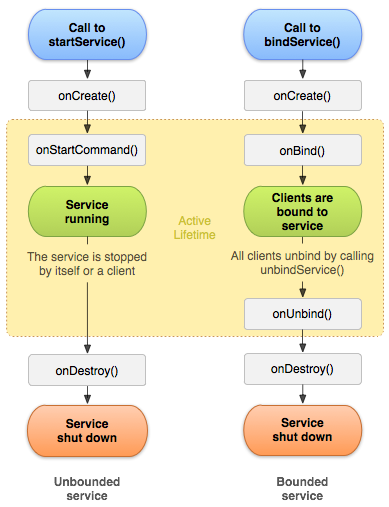

# startService() 启动流程

# 疑问

什么时候调 onStartCommand() ? 什么时候启动算超时？

前台、后台的区别

# 服务的三种状态

前台、后台、绑定

# 生命周期



# startService和bindService的区别

# 系统提供的服务子类

service IntentService

# 一、 startService()

context提供了两个接口来启动service。

```
    @Override
    public ComponentName startService(Intent service) {
        return mBase.startService(service);
    }

    @Override
    public ComponentName startForegroundService(Intent service) {
        return mBase.startForegroundService(service);
    }
```

## 1.1 contextImpl

```
  @Override
    public ComponentName startService(Intent service) {
        warnIfCallingFromSystemProcess();
        return startServiceCommon(service, false, mUser);
    }

    @Override
    public ComponentName startForegroundService(Intent service) {
        warnIfCallingFromSystemProcess();
        return startServiceCommon(service, true, mUser);
    }
```

```

 private ComponentName startServiceCommon(Intent service, boolean requireForeground,
            UserHandle user) {
        try {
            validateServiceIntent(service);
            service.prepareToLeaveProcess(this);
            // 直接调用 AMS的 startService方法 ， 返回一个 ComponentName 对象。
            ComponentName cn = ActivityManager.getService().startService(
                mMainThread.getApplicationThread(), service, service.resolveTypeIfNeeded(
                            getContentResolver()), requireForeground,
                            getOpPackageName(), user.getIdentifier());
            if (cn != null) {
                if (cn.getPackageName().equals("!")) {
                    throw new SecurityException(
                            "Not allowed to start service " + service
                            + " without permission " + cn.getClassName());
                } else if (cn.getPackageName().equals("!!")) {
                    throw new SecurityException(
                            "Unable to start service " + service
                            + ": " + cn.getClassName());
                } else if (cn.getPackageName().equals("?")) {
                    throw new IllegalStateException(
                            "Not allowed to start service " + service + ": " + cn.getClassName());
                }
            }
            return cn;
        } catch (RemoteException e) {
            throw e.rethrowFromSystemServer();
        }
    }
```

# AMS

## startService()

> ActivityManagerService.java

```
 @Override
    public ComponentName startService(IApplicationThread caller, Intent service,
            String resolvedType, boolean requireForeground, String callingPackage, int userId)
            throws TransactionTooLargeException {
            // requireForeground 是否是前台服务 
        enforceNotIsolatedCaller("startService");
       ...
        if (DEBUG_SERVICE) Slog.v(TAG_SERVICE,
                "*** startService: " + service + " type=" + resolvedType + " fg=" + requireForeground);
        synchronized(this) {
            final int callingPid = Binder.getCallingPid();
            final int callingUid = Binder.getCallingUid();
            final long origId = Binder.clearCallingIdentity();
            ComponentName res;
            try {
            // 调用  startServiceLocked
                res = mServices.startServiceLocked(caller, service,
                        resolvedType, callingPid, callingUid,
                        requireForeground, callingPackage, userId);
            } finally {
                Binder.restoreCallingIdentity(origId);
            }
            return res;
        }
    }

```

调用 startServiceLocked(),allowBackgroundActivityStarts传入false，再内部继续调用同名的 方法：

## startServiceLocked()

> ActiveServices.java

ActiveServices 是 什么东西啊？

内部有一系列的集合list，用来存储ServiceRecord 对象。 那就是系统所有的service都由 ActiveServices 来管理。

```
 ComponentName startServiceLocked(IApplicationThread caller, Intent service, String resolvedType,
            int callingPid, int callingUid, boolean fgRequired, String callingPackage,
            final int userId, boolean allowBackgroundActivityStarts)
            throws TransactionTooLargeException {
            
            // fgRequired 是否是前台服务 
            //  allowBackgroundActivityStarts 为false。
            
            
            final boolean callerFg;
            // 如果当前进程对象存在， todo？？ 
            if (caller != null) {
                final ProcessRecord callerApp = mAm.getRecordForAppLocked(caller);
                if (callerApp == null) {
                    throw new SecurityException(
                            "Unable to find app for caller " + caller
                            + " (pid=" + callingPid
                            + ") when starting service " + service);
                }
                callerFg = callerApp.setSchedGroup != ProcessList.SCHED_GROUP_BACKGROUND;
            } else {
                callerFg = true;
            }
            
            // 通过PMS解析得到 serviceRecord 对象信息 
            ServiceLookupResult res =
            retrieveServiceLocked(service, null, resolvedType, callingPackage,
                    callingPid, callingUid, userId, true, callerFg, false, false);
            if (res == null) {
                return null;
            }
            if (res.record == null) {
                return new ComponentName("!", res.permission != null
                        ? res.permission : "private to package");
            }
            // ...
        
        ComponentName cmp = startServiceInnerLocked(smap, service, r, callerFg, addToStarting);
        return cmp;


}
```

ServiceMap 是什么东西啊？

### retrieveServiceLocked()  TODO 这是干嘛的额？？？

### startServiceInnerLocked()

> ActiveServices.java
>

```
ComponentName startServiceInnerLocked(ServiceMap smap, Intent service, ServiceRecord r,
            boolean callerFg, boolean addToStarting) throws TransactionTooLargeException {
        ServiceState stracker = r.getTracker();
        if (stracker != null) {
            stracker.setStarted(true, mAm.mProcessStats.getMemFactorLocked(), r.lastActivity);
        }
        r.callStart = false;
        StatsLog.write(StatsLog.SERVICE_STATE_CHANGED, r.appInfo.uid, r.name.getPackageName(),
                r.name.getClassName(), StatsLog.SERVICE_STATE_CHANGED__STATE__START);
        synchronized (r.stats.getBatteryStats()) {
            r.stats.startRunningLocked();
        }
        String error = bringUpServiceLocked(r, service.getFlags(), callerFg, false, false);
        
        if (error != null) {
            return new ComponentName("!!", error);
        }

        if (r.startRequested && addToStarting) {
            boolean first = smap.mStartingBackground.size() == 0;
            smap.mStartingBackground.add(r);
            r.startingBgTimeout = SystemClock.uptimeMillis() + mAm.mConstants.BG_START_TIMEOUT;
            if (DEBUG_DELAYED_SERVICE) {
                RuntimeException here = new RuntimeException("here");
                here.fillInStackTrace();
                Slog.v(TAG_SERVICE, "Starting background (first=" + first + "): " + r, here);
            } else if (DEBUG_DELAYED_STARTS) {
                Slog.v(TAG_SERVICE, "Starting background (first=" + first + "): " + r);
            }
            if (first) {
                smap.rescheduleDelayedStartsLocked();
            }
        } else if (callerFg || r.fgRequired) {
            smap.ensureNotStartingBackgroundLocked(r);
        }

        return r.name;
    }
```

## bringUpServiceLocked()

> ActiveServices.java
>

```
 private String bringUpServiceLocked(ServiceRecord r, int intentFlags, boolean execInFg,
            boolean whileRestarting, boolean permissionsReviewRequired)
            throws TransactionTooLargeException {
        if (r.app != null && r.app.thread != null) {
            sendServiceArgsLocked(r, execInFg, false);
            return null;
        }

        if (!whileRestarting && mRestartingServices.contains(r)) {
            // If waiting for a restart, then do nothing.
            return null;
        }

        if (DEBUG_SERVICE) {
            Slog.v(TAG_SERVICE, "Bringing up " + r + " " + r.intent + " fg=" + r.fgRequired);
        }

        // We are now bringing the service up, so no longer in the
        // restarting state.
        if (mRestartingServices.remove(r)) {
            clearRestartingIfNeededLocked(r);
        }

        // Make sure this service is no longer considered delayed, we are starting it now.
        if (r.delayed) {
            if (DEBUG_DELAYED_STARTS) Slog.v(TAG_SERVICE, "REM FR DELAY LIST (bring up): " + r);
            getServiceMapLocked(r.userId).mDelayedStartList.remove(r);
            r.delayed = false;
        }

        // Make sure that the user who owns this service is started.  If not,
        // we don't want to allow it to run.
        if (!mAm.mUserController.hasStartedUserState(r.userId)) {
            String msg = "Unable to launch app "
                    + r.appInfo.packageName + "/"
                    + r.appInfo.uid + " for service "
                    + r.intent.getIntent() + ": user " + r.userId + " is stopped";
            Slog.w(TAG, msg);
            bringDownServiceLocked(r);
            return msg;
        }

        // Service is now being launched, its package can't be stopped.
        try {
            AppGlobals.getPackageManager().setPackageStoppedState(
                    r.packageName, false, r.userId);
        } catch (RemoteException e) {
        } catch (IllegalArgumentException e) {
            Slog.w(TAG, "Failed trying to unstop package "
                    + r.packageName + ": " + e);
        }

        final boolean isolated = (r.serviceInfo.flags&ServiceInfo.FLAG_ISOLATED_PROCESS) != 0;
        final String procName = r.processName;
        HostingRecord hostingRecord = new HostingRecord("service", r.instanceName);
        ProcessRecord app;
        // 正常情况下， 不在独立进程
        if (!isolated) {
            app = mAm.getProcessRecordLocked(procName, r.appInfo.uid, false);
            if (DEBUG_MU) Slog.v(TAG_MU, "bringUpServiceLocked: appInfo.uid=" + r.appInfo.uid
                        + " app=" + app);
            if (app != null && app.thread != null) {
                try {
                    app.addPackage(r.appInfo.packageName, r.appInfo.longVersionCode, mAm.mProcessStats);
                    
                    // 
                    realStartServiceLocked(r, app, execInFg);
                    
                    return null;
                } catch (TransactionTooLargeException e) {
                    throw e;
                } catch (RemoteException e) {
                    Slog.w(TAG, "Exception when starting service " + r.shortInstanceName, e);
                }

                // If a dead object exception was thrown -- fall through to
                // restart the application.
            }
        } else {
            // If this service runs in an isolated process, then each time
            // we call startProcessLocked() we will get a new isolated
            // process, starting another process if we are currently waiting
            // for a previous process to come up.  To deal with this, we store
            // in the service any current isolated process it is running in or
            // waiting to have come up.
            app = r.isolatedProc;
            if (WebViewZygote.isMultiprocessEnabled()
                    && r.serviceInfo.packageName.equals(WebViewZygote.getPackageName())) {
                hostingRecord = HostingRecord.byWebviewZygote(r.instanceName);
            }
            if ((r.serviceInfo.flags & ServiceInfo.FLAG_USE_APP_ZYGOTE) != 0) {
                hostingRecord = HostingRecord.byAppZygote(r.instanceName, r.definingPackageName,
                        r.definingUid);
            }
        }

        // Not running -- get it started, and enqueue this service record
        // to be executed when the app comes up.
        if (app == null && !permissionsReviewRequired) {
            if ((app=mAm.startProcessLocked(procName, r.appInfo, true, intentFlags,
                    hostingRecord, false, isolated, false)) == null) {
                String msg = "Unable to launch app "
                        + r.appInfo.packageName + "/"
                        + r.appInfo.uid + " for service "
                        + r.intent.getIntent() + ": process is bad";
                Slog.w(TAG, msg);
                bringDownServiceLocked(r);
                return msg;
            }
            if (isolated) {
                r.isolatedProc = app;
            }
        }

        if (r.fgRequired) {
            if (DEBUG_FOREGROUND_SERVICE) {
                Slog.v(TAG, "Whitelisting " + UserHandle.formatUid(r.appInfo.uid)
                        + " for fg-service launch");
            }
            mAm.tempWhitelistUidLocked(r.appInfo.uid,
                    SERVICE_START_FOREGROUND_TIMEOUT, "fg-service-launch");
        }

        if (!mPendingServices.contains(r)) {
            mPendingServices.add(r);
        }

        if (r.delayedStop) {
            // Oh and hey we've already been asked to stop!
            r.delayedStop = false;
            if (r.startRequested) {
                if (DEBUG_DELAYED_STARTS) Slog.v(TAG_SERVICE,
                        "Applying delayed stop (in bring up): " + r);
                stopServiceLocked(r);
            }
        }

        return null;
    }
```

## realStartServiceLocked()

> /Users/avengong/Library/Android/sdk/sources/android-29/com/android/server/am/ActiveServices.java

/**

* Note the name of this method should not be confused with the started services concept.
* The "start" here means bring up the instance in the client, and this method is called
* from bindService() as well.
  */ 翻译： 不要被startService开头的方法名字迷惑了。这里的start意思是 拉起app端的service 实例。bindService()启动方式也会调用到这里。

```
 private final void realStartServiceLocked(ServiceRecord r,
            ProcessRecord app, boolean execInFg) throws RemoteException {
        ....
        r.setProcess(app);
        r.restartTime = r.lastActivity = SystemClock.uptimeMillis();

        final boolean newService = app.services.add(r);
        bumpServiceExecutingLocked(r, execInFg, "create");
        // 更新AMS中的 processRecord Lru集合
        mAm.updateLruProcessLocked(app, false, null);
        updateServiceForegroundLocked(r.app, /* oomAdj= */ false);
        mAm.updateOomAdjLocked(OomAdjuster.OOM_ADJ_REASON_START_SERVICE);

        boolean created = false;
        try {
            ...
            // 开始launch service
            synchronized (r.stats.getBatteryStats()) {
                r.stats.startLaunchedLocked();
            }
            mAm.notifyPackageUse(r.serviceInfo.packageName,
                                 PackageManager.NOTIFY_PACKAGE_USE_SERVICE);
            app.forceProcessStateUpTo(ActivityManager.PROCESS_STATE_SERVICE);
            // 回到 app端的 service 实例
            app.thread.scheduleCreateService(r, r.serviceInfo,
                    mAm.compatibilityInfoForPackage(r.serviceInfo.applicationInfo),
                    app.getReportedProcState());
            r.postNotification();
            // 至此，表示系统侧的 service 创建完毕。 
            created = true;
            
        } catch (DeadObjectException e) {
            Slog.w(TAG, "Application dead when creating service " + r);
            mAm.appDiedLocked(app);
            throw e;
        } finally {
            if (!created) {
                // Keep the executeNesting count accurate.
                final boolean inDestroying = mDestroyingServices.contains(r);
                serviceDoneExecutingLocked(r, inDestroying, inDestroying);

                // Cleanup.
                if (newService) {
                    app.services.remove(r);
                    r.setProcess(null);
                }

                // Retry. 如果没有启动，会再次尝试
                if (!inDestroying) {
                    scheduleServiceRestartLocked(r, false);
                }
            }
        }

        if (r.whitelistManager) {
            app.whitelistManager = true;
        }

        requestServiceBindingsLocked(r, execInFg);

        updateServiceClientActivitiesLocked(app, null, true);

        if (newService && created) {
            app.addBoundClientUidsOfNewService(r);
        }

        // If the service is in the started state, and there are no
        // pending arguments, then fake up one so its onStartCommand() will
        // be called.
        if (r.startRequested && r.callStart && r.pendingStarts.size() == 0) {
            r.pendingStarts.add(new ServiceRecord.StartItem(r, false, r.makeNextStartId(),
                    null, null, 0));
        }

        sendServiceArgsLocked(r, execInFg, true);

        if (r.delayed) {
            if (DEBUG_DELAYED_STARTS) Slog.v(TAG_SERVICE, "REM FR DELAY LIST (new proc): " + r);
            getServiceMapLocked(r.userId).mDelayedStartList.remove(r);
            r.delayed = false;
        }

        if (r.delayedStop) {
            // Oh and hey we've already been asked to stop!
            r.delayedStop = false;
            if (r.startRequested) {
                if (DEBUG_DELAYED_STARTS) Slog.v(TAG_SERVICE,
                        "Applying delayed stop (from start): " + r);
                stopServiceLocked(r);
            }
        }
    }
```

关键点： 回调 app端的 service 实例： r： ServiceRecord

app.thread.scheduleCreateService(r, r.serviceInfo, mAm.compatibilityInfoForPackage(
r.serviceInfo.applicationInfo), app.getReportedProcState());

# app 端

## scheduleCreateService

> ActivityThread.java

```
 public final void scheduleCreateService(IBinder token,
                ServiceInfo info, CompatibilityInfo compatInfo, int processState) {
                
                
            updateProcessState(processState, false);
            CreateServiceData s = new CreateServiceData();
            s.token = token;
            s.info = info;
            s.compatInfo = compatInfo;
            // 发送了一个消息到 主线程
            sendMessage(H.CREATE_SERVICE, s);
        }
```

IBinder token: 对应 ServiceRecord ServiceInfo info： CompatibilityInfo compatInfo： int processState：

## H.CREATE_SERVICE 消息

> ActivityThread.java

```
 case CREATE_SERVICE:
        Trace.traceBegin(Trace.TRACE_TAG_ACTIVITY_MANAGER, ("serviceCreate: " + String.valueOf(msg.obj)));
        handleCreateService((CreateServiceData)msg.obj);
        Trace.traceEnd(Trace.TRACE_TAG_ACTIVITY_MANAGER);
        break;
```

## handleCreateService()

> ActivityThread.java

```
private void handleCreateService(CreateServiceData data) {
        // If we are getting ready to gc after going to the background, well
        // we are back active so skip it.
        unscheduleGcIdler();
        // 得到apk信息 
        LoadedApk packageInfo = getPackageInfoNoCheck(
                data.info.applicationInfo, data.compatInfo);
        Service service = null;
        try {
            ///  反射初年service实例
            java.lang.ClassLoader cl = packageInfo.getClassLoader();
            service = packageInfo.getAppFactory()
                    .instantiateService(cl, data.info.name, data.intent);
        } catch (Exception e) {
            if (!mInstrumentation.onException(service, e)) {
                throw new RuntimeException(
                    "Unable to instantiate service " + data.info.name
                    + ": " + e.toString(), e);
            }
        }

        try {
            if (localLOGV) Slog.v(TAG, "Creating service " + data.info.name);
            // 创建service 的context 对象
            ContextImpl context = ContextImpl.createAppContext(this, packageInfo);
            context.setOuterContext(service);
            
            Application app = packageInfo.makeApplication(false, mInstrumentation);
            // attach app信息到service
            service.attach(context, this, data.info.name, data.token, app,
                    ActivityManager.getService());
            // 调用 service的 onCreate()方法
            service.onCreate();
            // 把token作为key，存入到 mServices map中
            mServices.put(data.token, service);
            
            try {
                // 告知 AMS service已经启动完毕 
                ActivityManager.getService().serviceDoneExecuting(
                        data.token, SERVICE_DONE_EXECUTING_ANON, 0, 0);
            } catch (RemoteException e) {
                throw e.rethrowFromSystemServer();
            }
        } catch (Exception e) {
            if (!mInstrumentation.onException(service, e)) {
                throw new RuntimeException(
                    "Unable to create service " + data.info.name
                    + ": " + e.toString(), e);
            }
        }
    }

```

至此， startService启动完毕 。


