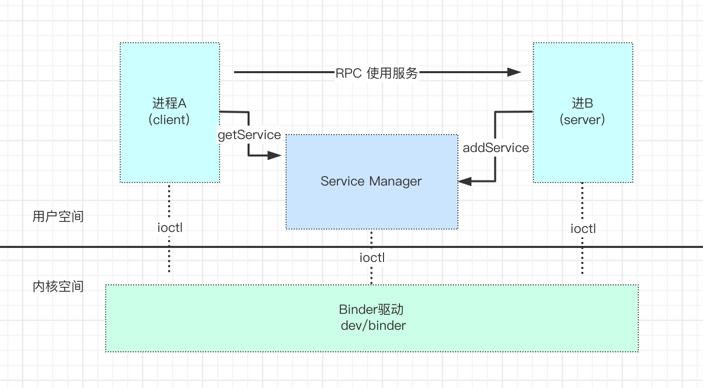
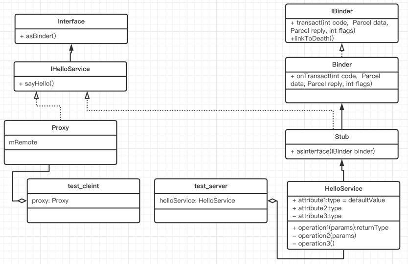
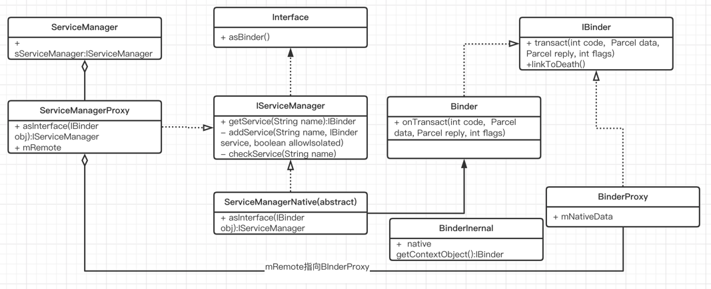

# Binder 总体架构概述(一)

Binder是Android进程间的一种通信方式，属于C/S架构。 Android系统的底层基于Linux内核。相对与传统的IPC方式，Binder在效率上
有显著的优势。通过Binder来实现进程间通信本质上是通过Binder驱动来完成的。

Binder Driver将自己注册为一个misc device(杂项设备)，并向上层提供驱动节点：dev/binder。 这种"杂项"设备不是真正的物理
硬件设备，而是虚拟驱动。它运行在内核态中，提供open()、mmap()、ioctl()等常用操作。

Binder通信涉及到四个部分： Server： 提供接口服务的具体实现；向ServiceManager(SM)注册服务。 client： 从SM获取服务，调用服务提供的接口。
ServiceManager： Binder大管家。管理binder相关的服务。提供注册、查询服务等接口 Binder驱动： 本质上实现跨进程通信。



# 一、Android为什么要采用Binder机制

Linux本身提供了多种多进程的通信方式： 管道、信号量、队列、socket、共享内存

- 管道：只能单向通信。 进程A到管道一次拷贝，管道到进程B一次拷贝，总共两次拷贝(用户->内核->用户)。
- 信号量：一般作为进程间的同步锁来使用。
- 信号：一般是用来内核给应用发送某个信号通知，如非法访问某个内存地址、杀死进程信号。
- 队列：进程A到队列一次拷贝，队列到进程B一次拷贝，总共两次拷贝(用户->内核->用户)。
- socket： 通信效率较低，开销大。分为本机基于fd的socket低速通信，和基于网络的tcp/udp的socket。需要两次拷贝。
- 共享内存：让两个进程映射到同一个内存缓冲区，实现共享，无需拷贝。但是需要自己维护同步过程，复杂且难用。
- Binder：通过mmap映射机制，让应用进程可以直接访问内核内存，减少了一次拷贝。效率仅次于共享内存。

# 二、C/S 角度

Binder通信过程中涉及到了多个C/S场景： 一般情况下是client作为客户端，server作为服务端。 当注册服务时，Server作为client端，SM作为server端。
当获取服务时，client作为客户端，SM作为服务端。

# 三、分层角度

## 3.1 java层

涉及到的类：假设定义一个IHelloService.aidl文件，经过编译会生成IHelloService.java文件。 通信过程如下：

- Server：

1. HelloService继承内部抽象类Stub，实现接口sayHello()。
2. 调用ServiceManager.addService方法，注册服务到ServiceManager

- Client:

1. client通过ServiceManager获取到Server的本IBinder对象
2. 通过调用IHelloService.asInterface(IBinder obj) 转换成一个IHelloService本地对象。 3，调用接口sayHello()完成跟服务端通信

整个过程涉及到类图 ：

重点： proxy中的mRemote其实是一个binderProxy对象。

IBinder接口： Binder类： stub类： proxy类



ServiceManager类 serviceManager

## 3.2 c++层

对于client，最核心的是handle。 defaultServiceManager 在 frameworks/native/libs/binder/IServiceManager.cpp
中实现的。

```
sp<IServiceManager> defaultServiceManager()
{
    if (gDefaultServiceManager != nullptr) return gDefaultServiceManager;

    {
        AutoMutex _l(gDefaultServiceManagerLock);
        while (gDefaultServiceManager == nullptr) {
            // 转换的意思。模板函数，转成IServiceManager。
            gDefaultServiceManager = interface_cast<IServiceManager>(
                ProcessState::self()->getContextObject(nullptr));
            if (gDefaultServiceManager == nullptr)
                sleep(1);
        }
    }

    return gDefaultServiceManager;
}


```

gDefaultServiceManager 指向的是 BpServiceManager对象,强转成为IServiceManager对象。

asInterface到底是怎么操作的？ frameworks/native/libs/binder/include/binder/IInterface.h

````
 

template<typename INTERFACE>
inline sp<INTERFACE> interface_cast(const sp<IBinder>& obj)
{
    return INTERFACE::asInterface(obj);
}

模板函数：
// Macro to be used by both IMPLEMENT_META_INTERFACE and IMPLEMENT_META_NESTED_INTERFACE
#define DO_NOT_DIRECTLY_USE_ME_IMPLEMENT_META_INTERFACE0(ITYPE, INAME, BPTYPE)                     \
    const ::android::String16& ITYPE::getInterfaceDescriptor() const { return ITYPE::descriptor; } \
    ::android::sp<ITYPE> ITYPE::asInterface(const ::android::sp<::android::IBinder>& obj) {        \
        ::android::sp<ITYPE> intr;                                                                 \
        if (obj != nullptr) {                                                                      \
            intr = ::android::sp<ITYPE>::cast(obj->queryLocalInterface(ITYPE::descriptor));        \
            if (intr == nullptr) {                                                                 \
                intr = ::android::sp<BPTYPE>::make(obj);   //重点，会创建出BpServiceManager对象，
                obj指向bpbinder对象，           
                    
            }                                                                                      \
        }                                                                                          \
        return intr;                                                                               \
    }                                                                                              \
    ::android::sp<ITYPE> ITYPE::default_impl;                                                      \
    bool ITYPE::setDefaultImpl(::android::sp<ITYPE> impl) {                                        \
        /* Only one user of this interface can use this function     */                            \
        /* at a time. This is a heuristic to detect if two different */                            \
        /* users in the same process use this function.              */                            \
        assert(!ITYPE::default_impl);                                                              \
        if (impl) {                                                                                \
            ITYPE::default_impl = std::move(impl);                                                 \
            return true;                                                                           \
        }                                                                                          \
        return false;                                                                              \
    }                                                                                              \
    const ::android::sp<ITYPE>& ITYPE::getDefaultImpl() { return ITYPE::default_impl; }            \
    ITYPE::INAME() {}                                                                              \
    ITYPE::~INAME() {}


````

---------
bnhelloservice是通过addService触发加载到sm中的。

最终会创建一个flat_binder_object 对象，里面的 obj.binder obj.cookies=new BnHelloService();

## 3.3 内核驱动层

# 四、IPC/RPC角度

# 五、问题总结
