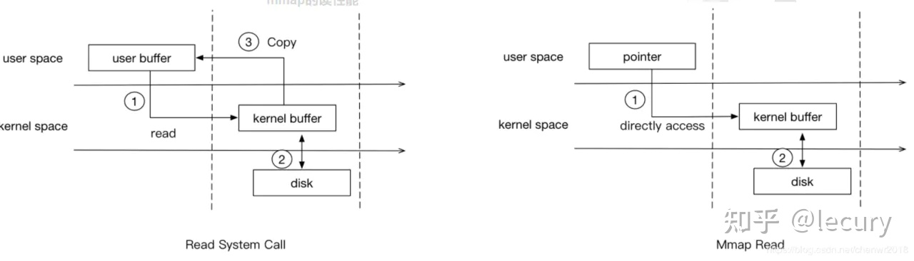
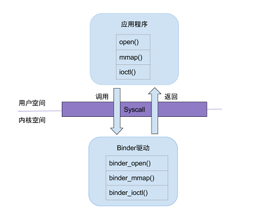

# serviceManager的启动

# 背景

init进程中解析init.rc的时候启动的。 init进程通过解析serviceManager.rc文件里启动。

mmap 和 shm 两者共享内存的区别和关系？ shm：shared memory：使用了物理内存，把一块物理内存作为共享对象，直接让多个进程通过用户级页表来建立访问关系，没有进程同步机制。
需要手动同步，容易产生死锁。收到物理内存的制约，存储量也不能太大。特点是无需拷贝，速度很快。

mmap：没有经过用户进程的物理内存，直接在内核区的物理内存开辟了一块高速缓冲区， 且与用户进程 建立映射。因此，用户进程可以直接访问这块高速缓存区。此外，系统会维护这块缓存区与文件的数据同步。
对进程来说，访问这个文件就相当于访问内存那样简单。

mmap具体过程：当进程访问这个文件时候，MMU会产生缺页中断，此时内核会把文件内容/部分内容读进告诉缓存区，更新进程的页表，让进程页表
直接指向该高速缓冲区，从而不会有用户态物理内存的存在。因此不需要拷贝。当其他进程也访问该文件的时候，页表会直接指向到这高速缓冲区， 直接从缓存区读取数据到进程(内核-->用户)
，只有一次拷贝。仅次于共享内存。 特点：仅需在内核与用户态之间拷贝一次。存储量很大。



注意，第二个图中的用户态，拥有的是指针类型，而非真正的buffer。

binder_ioctl 中 copy_to_user copy_from_user 涉及到了两次拷贝问题吗？todo

# 一、初探

init进程在解析init.rc文件的时候，会解析service_manager.rc文件。 然后拉起一个服务service，fork()新的进程serviceManager。
让服务来运行对应的可执行文件xxx.cpp。

基于Android10的源码

## 1.1 init.rc文件

```
# Start essential services.
start servicemanager //开启服务
start hwservicemanager
start vndservicemanager
```

在Androidbp中对应的rc文件是 servicemanager.rc

## 1.2 servicemanager.rc

> frameworks/native/cmds/servicemanager/servicemanager.rc

```
service servicemanager /system/bin/servicemanager
    class core animation
    user system
    group system readproc
    critical
    onrestart restart apexd
    onrestart restart audioserver
    onrestart restart gatekeeperd
    onrestart class_restart --only-enabled main
    onrestart class_restart --only-enabled hal
    onrestart class_restart --only-enabled early_hal
    task_profiles ServiceCapacityLow
    shutdown critical
```

## 1.3 androidbp

> frameworks/native/cmds/servicemanager/Android.bp

```
cc_binary {
    name: "servicemanager",
    defaults: ["servicemanager_flags"],
    srcs: [
        "service_manager.c",
        "binder.c",
    ],
    shared_libs: ["libcutils", "libselinux"],
    init_rc: ["servicemanager.rc"],
}

```

init会创建serviceManager进程，执行对应的可执行文件：service_manager.c的main()方法

# 二、service_manager.c

> frameworks/native/cmds/servicemanager/service_manager.c

```
int main(int argc, char** argv)
{
    struct binder_state *bs;
    union selinux_callback cb;
    char *driver;

    if (argc > 1) {
        driver = argv[1];
    } else {
        // binder驱动节点，万物可看成文件~
        driver = "/dev/binder";
    }
    //1 打开binder驱动，得到binder的状态结构体，大小为128kb
    bs = binder_open(driver, 128*1024);
    if (!bs) {
    // binder驱动打开失败
#ifdef VENDORSERVICEMANAGER
        ALOGW("failed to open binder driver %s\n", driver);
        while (true) {
            sleep(UINT_MAX);
        }
#else
        ALOGE("failed to open binder driver %s\n", driver);
#endif
        return -1;
    }
    //2 变成context manager，跨越进程的概念
    if (binder_become_context_manager(bs)) {
        ALOGE("cannot become context manager (%s)\n", strerror(errno));
        return -1;
    }
    ...
    //3 开启binder loop
    binder_loop(bs, svcmgr_handler);

    return 0;
}

```

总结：

1. 打开binder驱动
2. 成为context manager
3. 开启binder的loop循环，等待客户端发送过来的请求

疑问： binder驱动打开后 是一个怎么样的状态？？ 答：通过mmap()
，binder驱动与serviceManager进程建立了映射关系。本质上就是完成serviceManager进程的虚拟内存空间与 内核中binder驱动的物理内存的映射。

## 2.1 打开binder驱动

> frameworks/native/cmds/servicemanager/binder.c

```
struct binder_state *binder_open(const char* driver, size_t mapsize)
{
    struct binder_state *bs;
    struct binder_version vers;
    //在进程中分配一块内存区域用来存放打开binder驱动的结果
    bs = malloc(sizeof(*bs));
    if (!bs) {
        errno = ENOMEM;
        return NULL;
    }
    // 通过系统调用打开驱动文件，调用驱动层的 binder_open方法
    bs->fd = open(driver, O_RDWR | O_CLOEXEC);
    if (bs->fd < 0) {
        fprintf(stderr,"binder: cannot open %s (%s)\n",
                driver, strerror(errno));
        goto fail_open;
    }
    // 通过ioctl, 调用驱动层的binder_ioctrl，获取版本号信息
    if ((ioctl(bs->fd, BINDER_VERSION, &vers) == -1) ||
        (vers.protocol_version != BINDER_CURRENT_PROTOCOL_VERSION)) {
        fprintf(stderr,
                "binder: kernel driver version (%d) differs from user space version (%d)\n",
                vers.protocol_version, BINDER_CURRENT_PROTOCOL_VERSION);
        goto fail_open;// 内核空间和用户空间不是同一个binder版本
    }
    // 
    bs->mapsize = mapsize;
    //通过mmap系统调用来 把驱动we你安fd和进程的内存空间建立映射关系 ，也就是说这块虚拟内存区域是有文件关联的
    bs->mapped = mmap(NULL, mapsize, PROT_READ, MAP_PRIVATE, bs->fd, 0);
    if (bs->mapped == MAP_FAILED) {
        fprintf(stderr,"binder: cannot map device (%s)\n",
                strerror(errno));
        goto fail_map;
    }

    return bs;

v
```

不用想，结构体中肯定有驱动文件的fd，还有映射到进程的内存其实地址，以及所占大小128kb。

```
struct binder_state
{
    int fd; //binder设备的文件描述符
    void *mapped; //binder设备文件映射到进程的地址空间
    size_t mapsize; //内存映射后，系统分配的地址空间的大小，默认为128KB
};
```

总结：

1. 通过open()系统调用打开驱动文件，真正调用到了内核驱动中biner_open()
2. 通过mmap系统调用让进程中内存与驱动文件建立映射关系

一句话总结：建立虚拟内存与内核驱动文件(伪硬件)的映射关系。

### 2.1.1 内核态 binder_open()方法

> common/drivers/android/binder.c

```
static int binder_open(struct inode *nodp, struct file *filp)
{
    //代表某个进程对应的binder proc对象
    //注意，这里指的是serviceManager进程对应的proc对象
	struct binder_proc *proc, *itr;
	struct binder_device *binder_dev;
	struct binderfs_info *info;
	struct dentry *binder_binderfs_dir_entry_proc = NULL;
	bool existing_pid = false;

	binder_debug(BINDER_DEBUG_OPEN_CLOSE, "%s: %d:%d\n", __func__,
		     current->group_leader->pid, current->pid);
    //1 分配内核内存空间 
	proc = kzalloc(sizeof(*proc), GFP_KERNEL);
	if (proc == NULL)
		return -ENOMEM;
	spin_lock_init(&proc->inner_lock);
	spin_lock_init(&proc->outer_lock);
	get_task_struct(current->group_leader);
	proc->tsk = current->group_leader;
	proc->cred = get_cred(filp->f_cred);
	INIT_LIST_HEAD(&proc->todo);
	init_waitqueue_head(&proc->freeze_wait);
	binder_lock(__func__);

	binder_stats_created(BINDER_STAT_PROC);
	hlist_add_head(&proc->proc_node, &binder_procs);
	proc->pid = current->group_leader->pid;
	INIT_LIST_HEAD(&proc->delivered_death);
	filp->private_data = proc;//3
    ...
	return 0;
}
```

- 创建了进程对应的binder proc 对象，会生成proc/binder/state、/proc/binder/stats等各种进程管理信息。
  注意：这里指的是serviceManager进程对应的proc对象
- 完成proc的初始化。把proc放入全局链表binder_procs中？，把proc赋值给fd.private_data
- 之后对于binder设备的操作都会以这个对象为基础。

### 2.1.2 内核态 binder_mmap()

mmap调用最终会调用到内核驱动层的 binder_mmap()方法, 该方法会在驱动层建立binder_buffer对象，并放入 到当前binder_proc的 buffers 链表中。

本质上在这里完成binder驱动物理内存的分配，以及与虚拟内存的映射关系。每个进程只要用到binder，都会在这里进行内存的分配 和映射。
因此，一开始binder为每个进程只会分配一个页的物理内存，也就是4K，避免浪费。

进程的系统调用与binder驱动方法对应关系：



## 2.2 变成binder上下文管理者 context manager

```
int binder_become_context_manager(struct binder_state *bs)
{
    struct flat_binder_object obj;
    memset(&obj, 0, sizeof(obj));
    obj.flags = FLAT_BINDER_FLAG_TXN_SECURITY_CTX;
  
    int result = ioctl(bs->fd, BINDER_SET_CONTEXT_MGR_EXT, &obj);

    // fallback to original method
    if (result != 0) {
        android_errorWriteLog(0x534e4554, "121035042");
          // 通过ioctl系统调用，传递指令BINDER_SET_CONTEXT_MGR，最终调到binder驱动层的binder_ioctl
        result = ioctl(bs->fd, BINDER_SET_CONTEXT_MGR, 0);
    }
    return result;
}

```

通过ioctl调用，传递指令：传递指令BINDER_SET_CONTEXT_MGR，最终调到binder驱动层的binder_ioctl()方法。 将serviceManager设置为"
binder大管家"，整个Android系统只有这一个管理者。

### 2.2.1 内核态 binder_ioctl()

> common/drivers/android/binder.c

binder_ioctl()这个方法非常重要，在这里是让serviceManager进程成为了"binder大管家"。此外， 它还负责binder的数据读写操作，完全可以替代read()
/write()方法。 同时还提供loop进入、退出等操作、获取binder版本号等等大部分业务。

```
static long binder_ioctl(struct file *filp, unsigned int cmd, unsigned long arg)
{
    int ret;
    // 将binder_open中创建的binder proc对象
	struct binder_proc *proc = filp->private_data;
	struct binder_thread *thread;
	unsigned int size = _IOC_SIZE(cmd);
	void __user *ubuf = (void __user *)arg;

	/*pr_info("binder_ioctl: %d:%d %x %lx\n",
			proc->pid, current->pid, cmd, arg);*/

	binder_selftest_alloc(&proc->alloc);

	trace_binder_ioctl(cmd, arg);
	ret = wait_event_interruptible(binder_user_error_wait, binder_stop_on_user_error < 2);
	if (ret)
		goto err_unlocked;
    // 获取binder线程
	thread = binder_get_thread(proc);
	if (thread == NULL) {
		ret = -ENOMEM;
		goto err;
	}

	switch (cmd) {
	...
	//  确保serviceManager全局唯一
	case BINDER_SET_CONTEXT_MGR:
		ret = binder_ioctl_set_ctx_mgr(filp, NULL);
		if (ret)
			goto err;
		break;
	
	}
}
```

确保serviceManager是全局唯一的 binder管理者。

## 2.3 开启binder的loop循环

等待客户端发送过来的请求。

```
void binder_loop(struct binder_state *bs, binder_handler func)
{
    int res;
    struct binder_write_read bwr; // c创建bwr结构体 
    uint32_t readbuf[32];

    bwr.write_size = 0; // 写数据为0
    bwr.write_consumed = 0;
    bwr.write_buffer = 0;
    //指令 
    readbuf[0] = BC_ENTER_LOOPER; // 读的buffer为 BC_ENTER_LOOPER
    // 1 往binder写如指令BC_ENTER_LOOPER，第三个参数为write_size 
    binder_write(bs, readbuf, sizeof(uint32_t));

    for (;;) {
        bwr.read_size = sizeof(readbuf);
        bwr.read_consumed = 0;
        bwr.read_buffer = (uintptr_t) readbuf;
        //不断从binder缓冲区读数据
        res = ioctl(bs->fd, BINDER_WRITE_READ, &bwr);

        if (res < 0) {
            ALOGE("binder_loop: ioctl failed (%s)\n", strerror(errno));
            break;
        }
        // binder 解析 
        res = binder_parse(bs, 0, (uintptr_t) readbuf, bwr.read_consumed, func);
        if (res == 0) {
            ALOGE("binder_loop: unexpected reply?!\n");
            break;
        }
        if (res < 0) {
            ALOGE("binder_loop: io error %d %s\n", res, strerror(errno));
            break;
        }
    }
}
```

- 通过binder_write()往binder写入指令 BC_ENTER_LOOPER ，让serviceManager进程的主线程变成binder服务线程。
- ioctl() 在死循环中通过 BINDER_WRITE_READ 指令，不断从binder驱动中读取数据。如果没有数据则会进入休眠。
- binder_parse()，如果有数据则进行解析

### 2.3.1 binder_write()

```
int binder_write(struct binder_state *bs, void *data, size_t len)
{
    struct binder_write_read bwr;
    int res;

    bwr.write_size = len; // write_size> 0
    bwr.write_consumed = 0;
    bwr.write_buffer = (uintptr_t) data; //BC_ENTER_LOOPER
    bwr.read_size = 0;
    bwr.read_consumed = 0;
    bwr.read_buffer = 0;
    // ioctl调用 ，传入指令 ：BINDER_WRITE_READ
    res = ioctl(bs->fd, BINDER_WRITE_READ, &bwr);
    if (res < 0) {
        fprintf(stderr,"binder_write: ioctl failed (%s)\n",
                strerror(errno));
    }
    return res;
}
```

write_size>0、write_buffer有数据(BC_ENTER_LOOPER)、 read_size=0，进入到binder驱动层中的binder_ioctl()
方法中的BINDER_WRITE_READ指令分支， 在此之前先看下 binder_write_read 结构体：

```
struct binder_write_read {
    
	binder_size_t		write_size;	/* bytes to write */
	binder_size_t		write_consumed;	/* bytes consumed by driver */
	binder_uintptr_t	write_buffer;
	binder_size_t		read_size;	/* bytes to read */
	binder_size_t		read_consumed;	/* bytes consumed by driver */
	binder_uintptr_t	read_buffer;
};
```

好了，我们继续查看binder_ioctl()方法中的BINDER_WRITE_READ指令分支：

#### 2.3.1.1 内核态 binder_ioctl()

BINDER_WRITE_READ分支：

```
static long binder_ioctl(struct file *filp, unsigned int cmd, unsigned long arg)
{
	switch (cmd) {
	case BINDER_WRITE_READ:
		ret = binder_ioctl_write_read(filp, cmd, arg, thread);
		if (ret)
			goto err;
		break;
		}
		...
}
```

继续看 binder_ioctl_write_read():

```
static int binder_ioctl_write_read(struct file *filp,
				unsigned int cmd, unsigned long arg,
				struct binder_thread *thread)
{
	int ret = 0;
	struct binder_proc *proc = filp->private_data; // 获取当前进程的binder_proc对象
	unsigned int size = _IOC_SIZE(cmd);
	void __user *ubuf = (void __user *)arg;
	struct binder_write_read bwr;

	if (size != sizeof(struct binder_write_read)) {
		ret = -EINVAL;
		goto out;
	}
	// 把用户空间的bwr 拷贝到内核空间 
	if (copy_from_user(&bwr, ubuf, sizeof(bwr))) {
		ret = -EFAULT;
		goto out;
	}
	binder_debug(BINDER_DEBUG_READ_WRITE,
		     "%d:%d write %lld at %016llx, read %lld at %016llx\n",
		     proc->pid, thread->pid,
		     (u64)bwr.write_size, (u64)bwr.write_buffer,
		     (u64)bwr.read_size, (u64)bwr.read_buffer);

	if (bwr.write_size > 0) { // binder_write()此时的数据是 BC_ENTER_LOOPER
	    // 
		ret = binder_thread_write(proc, thread,
					  bwr.write_buffer,
					  bwr.write_size,
					  &bwr.write_consumed);
		trace_binder_write_done(ret);
		if (ret < 0) {
			bwr.read_consumed = 0;
			if (copy_to_user(ubuf, &bwr, sizeof(bwr)))
				ret = -EFAULT;
			goto out;
		}
	}
	if (bwr.read_size > 0) { // binder_write()此刻不会进入次分支; for()的不断读取数据则会进入此分支
		ret = binder_thread_read(proc, thread, bwr.read_buffer,
					 bwr.read_size,
					 &bwr.read_consumed,
					 filp->f_flags & O_NONBLOCK);
		trace_binder_read_done(ret);
		binder_inner_proc_lock(proc);
		if (!binder_worklist_empty_ilocked(&proc->todo))
			binder_wakeup_proc_ilocked(proc);
		binder_inner_proc_unlock(proc);
		if (ret < 0) {
		、   //？？？ 
			if (copy_to_user(ubuf, &bwr, sizeof(bwr)))
				ret = -EFAULT;
			goto out;
		}
	}
	binder_debug(BINDER_DEBUG_READ_WRITE,
		     "%d:%d wrote %lld of %lld, read return %lld of %lld\n",
		     proc->pid, thread->pid,
		     (u64)bwr.write_consumed, (u64)bwr.write_size,
		     (u64)bwr.read_consumed, (u64)bwr.read_size);
	// 把内核空间的数据拷贝会用户空间
	if (copy_to_user(ubuf, &bwr, sizeof(bwr))) {
		ret = -EFAULT;
		goto out;
	}
out:
	return ret;
}

```

通过copy_from_user(&bwr, ubuf, sizeof(bwr))，把用户空间的brw结构体拷贝到内核空间。 注意，此次拷贝是信息的拷贝，并不是数据拷贝！

继续看 binder_thread_write() ：

```
static int binder_thread_write(struct binder_proc *proc,
			struct binder_thread *thread,
			binder_uintptr_t binder_buffer, size_t size,
			binder_size_t *consumed)
{
    switch (cmd) {
		case BC_INCREFS:
		case BC_ACQUIRE:
		case BC_RELEASE:
		case BC_DECREFS: 
			...
		case BC_TRANSACTION:
		case BC_REPLY: {
			struct binder_transaction_data tr;

			if (copy_from_user(&tr, ptr, sizeof(tr)))
				return -EFAULT;
			ptr += sizeof(tr);
			binder_transaction(proc, thread, &tr,
					   cmd == BC_REPLY, 0);
			break;
		}
		case BC_REGISTER_LOOPER:
		...
		case BC_ENTER_LOOPER: // 终于看到了这个代码
			binder_debug(BINDER_DEBUG_THREADS,
				     "%d:%d BC_ENTER_LOOPER\n",
				     proc->pid, thread->pid);
			if (thread->looper & BINDER_LOOPER_STATE_REGISTERED) {
				thread->looper |= BINDER_LOOPER_STATE_INVALID;
				binder_user_error("%d:%d ERROR: BC_ENTER_LOOPER called after BC_REGISTER_LOOPER\n",
					proc->pid, thread->pid);
			}
			//设置线程的状态为 STATE_ENTERED 
			thread->looper |= BINDER_LOOPER_STATE_ENTERED;
			break;
		case BC_EXIT_LOOPER:
			binder_debug(BINDER_DEBUG_THREADS,
				     "%d:%d BC_EXIT_LOOPER\n",
				     proc->pid, thread->pid);
			thread->looper |= BINDER_LOOPER_STATE_EXITED;
			break;
}

```

至此，通过binder_write()方法设置serviceManager进程的主线程进入loop状态的工作已完成。也就是说serviceManager的 主线程变成了binder服务线程。

### 2.3.2 ioctl() 不断读取数据

```
  bwr.read_size = sizeof(readbuf);
        bwr.read_consumed = 0;
        bwr.read_buffer = (uintptr_t) readbuf;
        //不断从binder缓冲区读数据
        res = ioctl(bs->fd, BINDER_WRITE_READ, &bwr);
```

bwr.read_size>0,bwr.write_size=0, bwr.read_buffer有数据，进入系统调用ioctl()。

经过前面的分析，肯定会进入驱动层的binder_ioctl()，最终进入 binder_ioctl_write_read()方法：

```
static int binder_ioctl_write_read(struct file *filp,
				unsigned int cmd, unsigned long arg,
				struct binder_thread *thread)
{
if (bwr.read_size > 0) { // 通过binder_thread_read 不断读取缓冲区的数据
		ret = binder_thread_read(proc, thread, bwr.read_buffer,
					 bwr.read_size,
					 &bwr.read_consumed,
					 filp->f_flags & O_NONBLOCK);
		trace_binder_read_done(ret);
		binder_inner_proc_lock(proc);
		if (!binder_worklist_empty_ilocked(&proc->todo))
			binder_wakeup_proc_ilocked(proc);
		binder_inner_proc_unlock(proc);
		if (ret < 0) {
		、   //如果有数据，则拷贝会用户空间
			if (copy_to_user(ubuf, &bwr, sizeof(bwr)))
				ret = -EFAULT;
			goto out;
		}
	}
```

继续看 binder_thread_read():

```
static int binder_thread_read(struct binder_proc *proc,
			      struct binder_thread *thread,
			      binder_uintptr_t binder_buffer, size_t size,
			      binder_size_t *consumed, int non_block)
{

	if (non_block) {
		if (!binder_has_work(thread, wait_for_proc_work))
			ret = -EAGAIN;
	} else { 
	        //serviceManager进程是阻塞的，会走该分支，不断的等待数据到来
		ret = binder_wait_for_work(thread, wait_for_proc_work);
	}

    thread->looper &= ~BINDER_LOOPER_STATE_WAITING;
    if (ret)
		return ret;		
```

至此，serviceManager进程的主线程会不断等待binder数据的到来。

### 2.3.3 binder_parse()

```
//调用参数 
res = binder_parse(bs, 0, (uintptr_t) readbuf, bwr.read_consumed, func);
```

```
int binder_parse(struct binder_state *bs, struct binder_io *bio,
                 uintptr_t ptr, size_t size, binder_handler func)
{
    int r = 1;
    uintptr_t end = ptr + (uintptr_t) size;

    while (ptr < end) {
        uint32_t cmd = *(uint32_t *) ptr;
        ptr += sizeof(uint32_t);
#if TRACE
        fprintf(stderr,"%s:\n", cmd_name(cmd));
#endif
        switch(cmd) {
        case BR_NOOP: // 退出循环 
            break;
        case BR_TRANSACTION_COMPLETE:
            break;
        case BR_INCREFS:
        case BR_ACQUIRE:
        case BR_RELEASE:
        case BR_DECREFS:
#if TRACE
            fprintf(stderr,"  %p, %p\n", (void *)ptr, (void *)(ptr + sizeof(void *)));
#endif
            ptr += sizeof(struct binder_ptr_cookie);
            break;
        case BR_TRANSACTION_SEC_CTX:
        case BR_TRANSACTION: { // 数据的接收处理逻辑 
            struct binder_transaction_data_secctx txn;
            if (cmd == BR_TRANSACTION_SEC_CTX) {
                if ((end - ptr) < sizeof(struct binder_transaction_data_secctx)) {
                    ALOGE("parse: txn too small (binder_transaction_data_secctx)!\n");
                    return -1;
                }
                memcpy(&txn, (void*) ptr, sizeof(struct binder_transaction_data_secctx));
                ptr += sizeof(struct binder_transaction_data_secctx);
            } else /* BR_TRANSACTION */ {
                if ((end - ptr) < sizeof(struct binder_transaction_data)) {
                    ALOGE("parse: txn too small (binder_transaction_data)!\n");
                    return -1;
                }
                memcpy(&txn.transaction_data, (void*) ptr, sizeof(struct binder_transaction_data));
                ptr += sizeof(struct binder_transaction_data);

                txn.secctx = 0;
            }

            binder_dump_txn(&txn.transaction_data);
            if (func) {
                unsigned rdata[256/4];
                struct binder_io msg;
                struct binder_io reply;
                int res;
                /// bio对象的 初始化
                bio_init(&reply, rdata, sizeof(rdata), 4);
                //将readbuf数据赋值给bio对象的data字段 
                bio_init_from_txn(&msg, &txn.transaction_data);
                
                res = func(bs, &txn, &msg, &reply); // 回调逻辑
                if (txn.transaction_data.flags & TF_ONE_WAY) {
                    binder_free_buffer(bs, txn.transaction_data.data.ptr.buffer);
                } else {
                    binder_send_reply(bs, &reply, txn.transaction_data.data.ptr.buffer, res);
                }
            }
            break;
        }
        case BR_REPLY: {
            struct binder_transaction_data *txn = (struct binder_transaction_data *) ptr;
            if ((end - ptr) < sizeof(*txn)) {
                ALOGE("parse: reply too small!\n");
                return -1;
            }
            binder_dump_txn(txn);
            if (bio) {
                bio_init_from_txn(bio, txn);
                bio = 0;
            } else {
                /* todo FREE BUFFER */
            }
            ptr += sizeof(*txn);
            r = 0;
            break;
        }
        case BR_DEAD_BINDER: {
            struct binder_death *death = (struct binder_death *)(uintptr_t) *(binder_uintptr_t *)ptr;
            ptr += sizeof(binder_uintptr_t);
            death->func(bs, death->ptr); // 进程对应binder线程死亡回调 
            break;
        }
        case BR_FAILED_REPLY:
            r = -1;
            break;
        case BR_DEAD_REPLY:
            r = -1;
            break;
        default:
            ALOGE("parse: OOPS %d\n", cmd);
            return -1;
        }
    }

    return r;
}

```

在数据解析的逻辑中，参数prt指向了 BC_ENTER_LOOPER，func则是 svcmgr_handler，很明显只要有请求到来，就会触发 svcmgr_handler。

#### 2.3.3.1 svcmgr_handler

```
int svcmgr_handler(struct binder_state *bs,
                   struct binder_transaction_data_secctx *txn_secctx,
                   struct binder_io *msg,
                   struct binder_io *reply)
{
    struct svcinfo *si; // 每个service都用svcinfo结构体表示
    ...
    switch(txn->code) {
    case SVC_MGR_GET_SERVICE: //终于看到熟悉的东西了， getService
    case SVC_MGR_CHECK_SERVICE:
        s = bio_get_string16(msg, &len);
        if (s == NULL) {
            return -1;
        }
        handle = do_find_service(s, len, txn->sender_euid, txn->sender_pid,
                                 (const char*) txn_secctx->secctx);
        if (!handle)
            break;
        bio_put_ref(reply, handle);
        return 0;

    case SVC_MGR_ADD_SERVICE: // addService
        s = bio_get_string16(msg, &len);
        if (s == NULL) {
            return -1;
        }
        handle = bio_get_ref(msg);
        allow_isolated = bio_get_uint32(msg) ? 1 : 0;
        dumpsys_priority = bio_get_uint32(msg);
        if (do_add_service(bs, s, len, handle, txn->sender_euid, allow_isolated, dumpsys_priority,
                           txn->sender_pid, (const char*) txn_secctx->secctx))
            return -1;
        break;

    case SVC_MGR_LIST_SERVICES: {  // listServices
        uint32_t n = bio_get_uint32(msg);
        uint32_t req_dumpsys_priority = bio_get_uint32(msg);

        if (!svc_can_list(txn->sender_pid, (const char*) txn_secctx->secctx, txn->sender_euid)) {
            ALOGE("list_service() uid=%d - PERMISSION DENIED\n",
                    txn->sender_euid);
            return -1;
        }
        si = svclist;
        // walk through the list of services n times skipping services that
        // do not support the requested priority
        while (si) {
            if (si->dumpsys_priority & req_dumpsys_priority) {
                if (n == 0) break;
                n--;
            }
            si = si->next;
        }
        if (si) {
            bio_put_string16(reply, si->name);
            return 0;
        }
        return -1;
    }
    default:
        ALOGE("unknown code %d\n", txn->code);
        return -1;
    }

    bio_put_uint32(reply, 0);
    return 0;
}
```

该方法的功能：查询服务，注册服务，以及列举所有服务。

#### 2.3.3.2 svcinfo 结构体

```
struct svcinfo
{
    struct svcinfo *next;
    uint32_t handle; //服务的handle值
    struct binder_death death;
    int allow_isolated;
    size_t len; //名字长度
    uint16_t name[0]; //服务名
};
```

每一个服务用svcinfo结构体来表示，里面的handle值是在注册服务的过程中，由服务所在进程那一端所确定的。

# 三、ServiceManager启动总结

深入源码分析了整个serviceManager的启动过程，我们很有必要总结下整个启动流程，以免迷失在代码细节之中。

1.通过binder_open()打开binder驱动 内部通过系统调用最终调用到驱动层的binder_open()、binder_mmap()。分配binder内核中的物理内存(高速缓存区)；
完成进程与内核中的高速缓冲区的映射。 2.通过binder_become_context_manager()将serviceManager设置为""binder大管家"
整个系统只有一个这样的管家。所有的binder服务由我来守护！ 3.通过binder_loop让serviceManager主线程进入loop状态
进入loop等待client端请求，会不断的从内核缓存区中读取数据，回调svcmgr_handler方法。如果没有数据则进入阻塞。

4. 提供注册、获取等API给客户进程和服务进程使用 但同一个服务已注册，重新注册前会先移除之前的注册信息。
5. 死亡通知: 当binder所在进程死亡后,会调用binder_release方法,然后调用binder_node_release.这个过程便会发出死亡通知的回调.

那么， serviceManager到底想干什么？！

答(目前可能不完善)： 建立与binder驱动的联系，管理系统中每一个与binder驱动建立映射关系的进程的binder服务，负责管理binder service的
生命周期。提供add、get、check等API,让使用binder服务更加方便。隔离了应用进程与binder驱动的繁杂交互逻辑。

# 四、ServiceManager的核心工作

servicemanager的核心工作就是注册服务和查询服务。这个等具体的服务注册和查询的时候在学习。

如有疏忽之处，还望指正，谢谢。

# 五、参考

[Binder系列3—启动ServiceManager](http://gityuan.com/2015/11/07/binder-start-sm/)

[Android Binder机制分析(5) binder_ioctl()分析](https://blog.imallen.wang/2016/03/01/2016-03-01-android-binderji-zhi-fen-xi-5-binder-ioctl-fen-xi/)
[梳理Binder原理之ServiceManager的注册流程（启动流程）](https://its401.com/article/zhangshuny/112285009)

[共享内存与内存映射(mmap)](https://cana.space/%E5%85%B1%E4%BA%AB%E5%86%85%E5%AD%98%E4%B8%8E%E5%86%85%E5
%AD%98%E6%98%A0%E5%B0%84/#mmap%E7%B3%BB%E7%BB%9F%E8%B0%83%E7%94%A8%E4%BB%8B%E7%BB%8D)

[进程间通信——共享内存](https://blog.csdn.net/qq_26768741/article/details/56014845)

[mmap和shm共享内存的区别和联系](https://www.cnblogs.com/cthon/p/9063841.html)


