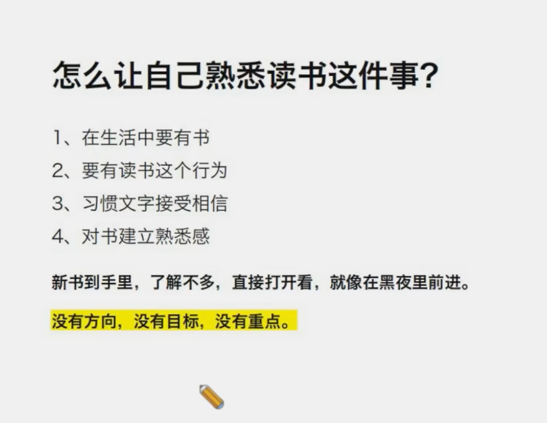
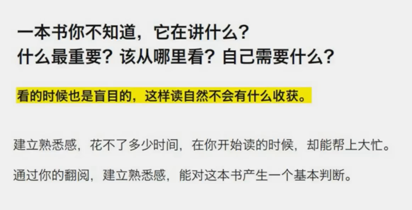
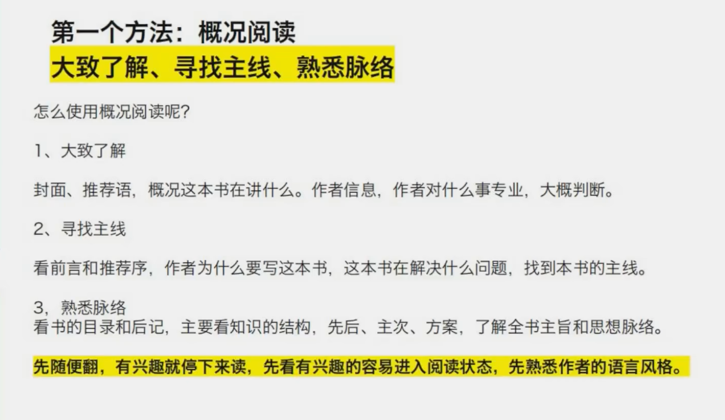
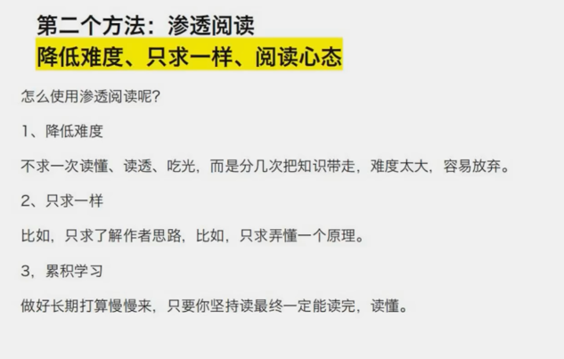
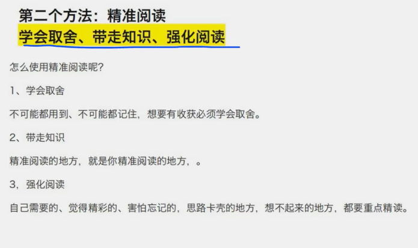
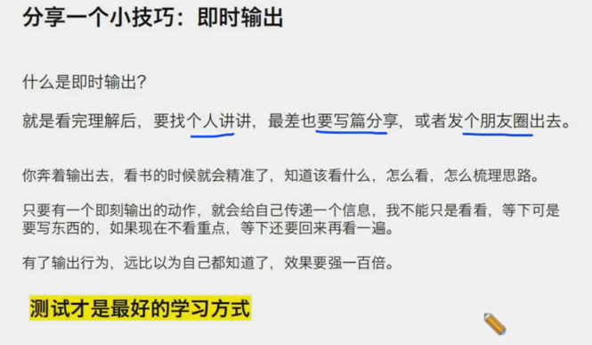
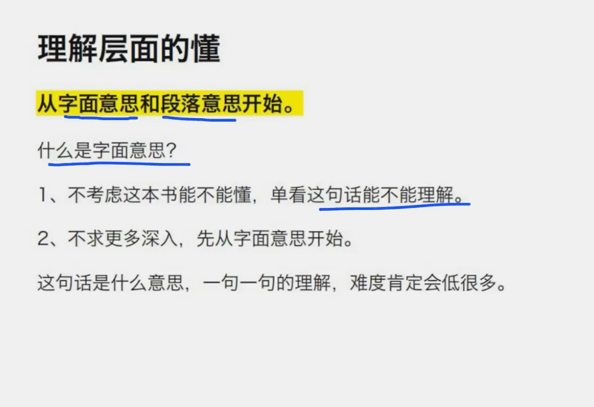
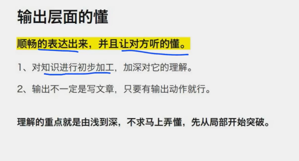
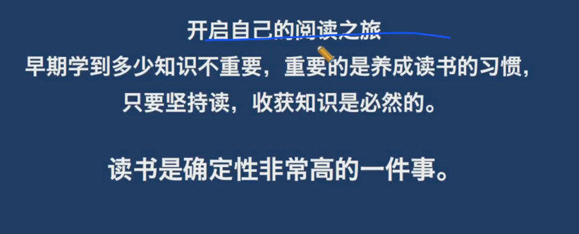

# 跨越门槛： 3个实用的读书方法

# 一、读书需要方法吗？

同一本书，有人收获大，有人没收获，为什么？ 三个原因： 1，知识储备 2，阅读能力 3，d读书方法

知识储备需要积累， 阅读能力需要训练，知识点、逻辑能力。 读书方法需要学习。

## 那么多读书方法，哪个最好？

开始去读最重要 不是方法越牛越好 找适合自己现阶段： 读了没？ 读懂了有输出吗？ 一个阶段一个阶段去提高自己。

## 用错读书方法会怎么样？

1，30分钟读完一本书？ 2，学了深度阅读，但是书本不好 方法和书错位了，无法发挥出方法的效果，书看完了，效果没有。

## 读书高手

高手说：要掌握并合理使用多种方法。速读、慢读，看需要。不要跟方法较劲。

## 哪些书可以快点读？

有些书你只需要知道其中一篇的内容，就没必要从头到尾的读？ 应该直奔目标，看完拉倒。

## 哪些慢点度？

1，明确需要的知识点 2，专业教材，解决问题的， 3，这类书读书 读完不是目的，吸收知识才是。

一句话，需要理解吸收的慢点读，增长见识的就快点读。

## 读书中最重要的事

建立阅读自信。相信自己能读书。 任何方法，都需要反馈时间，有足够的信心，才会给予方法足够的时间。

# 二、读书最重要的事

## 阅读自信=熟悉感+ 好方法+ 能看懂

相信自己能做到，那么就全力以赴，就真的能完成。 给自己一个挑战，相信自己能做到。真正做到了，信心就来了。

开始读书，先建立熟悉感。 先相信自己能有文字获取能力。

第一个是，习惯读书这件事 第二个是，对读的书有熟悉感

拆成两三个星期去读。每天打开，每天熟悉。

## 怎样让自己熟悉读书这件事？

1，生活中要右书 2，要有读书行为 3，习惯文字接受信息

新书到手里，直接看。就像在黑暗中前进。 那怎么熟悉一本书？ 序言要看，作者为什么要写这本书？

建立熟悉感，是为了降低对书本的恐惧，获得阅读的安全感。

看的时候是盲目的，这样阅读也不会有什么收获。

因此，一定要在阅读前建立熟悉感。对书以一个基本的判断。

# 三、怎么建立熟悉感？？

1，对作者的熟悉 ，序言 2，拿到一本书随意翻，有没有一个地方吸引你。后面看的时候就会有属性感。

# 四、分享三个读书方法

# 1，概括阅读

## 1，大致了解

不要从第一页就开始。 而是随便翻翻。对作者有个了解。

## 2，寻找主线

看序言，推荐言。这本书能解决什么问题。

## 3，熟悉脉络

大纲、目录。后记。 在看知识结构：先讲什么，再讲什么。

总结： 先随便翻，有兴趣就停下来。先看有兴趣的o容易进入阅读状态，先熟悉作者的语言风格。

# 2，渗透阅读

降低难度、只求一样、阅读心态 1，降低难度 不要一次读懂，读透，吃光，而是分几次将知识带走。。知识稀缺导致的。贪心，想着一次全部吸收。 2，只求一样 比如，只求l了解作者思路。比如，只弄懂一个原理
3，累计学习 做好长期打算慢慢来，只要坚持就一定能读完，读懂。

总结：降低阅读目标，不要有太多包袱，尽快建立阅读自信。 比如小时候学数字，并不是从12345678，可能是中间先学会后面在合在一起。
这就是自然学习法。因此，不要太讲逻辑。今天学1，明天学3，后面学8，最终都会学习。

# 3，精准阅读--放下贪念，不要背着包袱

学会取舍，带走知识，强化阅读。

1，学会取舍 不可能都记住 2，带走知识 人的大脑是用来思考的，不是用来记住的。 之所以输出，之所以清单就是为了清空大脑。 精准阅读的地方，要精确阅读 3，强化阅读
首先要自己想要的，才是重点。觉得精彩的、害怕忘记的、 思路卡壳的地方、想不起来的，都要重点阅读。这个时候就是输出的过程中遇到的问题。

# 最后，分享一个小技巧： 及时输出！

看完后，要找个人讲讲。最差也要写篇分享，或者发个朋友圈去。

奔着要输出的目的，那么就会更加精准了。 有了s输出行为，远比以为自己都知道了，效果要强一百倍。 因此： 测试才是最好的学习方式。 看完懂了，其实是作者的观点理顺了，你自己其实并不立交。

# 五、到底什么叫看懂了？

## 看懂 = 理解+输出

把看懂的感觉，划分一下层次，把感觉转变成了框架。

## 理解层次的懂

字面意思和 段落意思

1，不考虑整本书，单看这句话能不能理解。 2，不求更多深入理解，先从字面开始。

从局部入手。

## 输出层面的懂

顺畅表达出来，能让对方理解。

本质： 1，对知识进行初加工，加深对它的理解。 2，输出不一定是写文章，只要有输出动作就行。 发朋友圈的人事赚的。

总结：由浅入深，不求弄懂。从局部入手。

# 最后

长期和持续。

