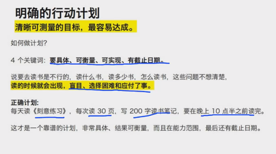
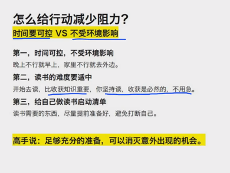
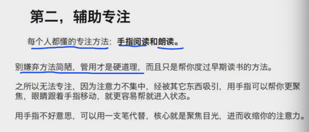

# 一、靠什么坚持100天

做大多事，蓄多大力。

## 读书要打持久战

读书不是一两天的事。

长期作战原则： 1，不能靠激动，一拍脑门决定。 2，要做长远的规划，设计详细的计划。 3，建立完善的读书后勤保障： 时间要规划好。构建好的环境。 高手说：定目标不是靠下狠心，而是合理的规划。

# 什么计划更容易达成？

计划是什么？ 计划是 使用用什么能力，做什么事，达成目标。 高手说：在自己能力范围内，匹配相应任务，才能达成计划。

做计划之前先测试： 1，能看什么类型的书 2，能看多久的书 3，能看多少页

真正的生活不是靠挑战极限的。 高手说：计划是链接能力和目标的桥梁。

测完后在看目的任务： 1，你读书的目的是什么 2，根据目的设定任务

目标计划有了，还是读不进去？

# 怎么做完成概率最大？

## 明确的行动计划

清晰可测量的目标，最容易完成。 四个要素： 要具体、可测量、可实现，有截止日期。

正确的目标： 读 刻意练习 每天30，每天200字，10.30前完成。

## 减少行动阻力

做事阻力越小，完成概率越大。 中断就是最大的阻力。 高手说： 早期不要挑战自己，越简单越容易完成。

## 好环境 坏环境

没有正视过行动问题。

高手说： 好环境，让你找不到放弃的理由。

## 怎么给行动减少阻力

时间可控 vs 不受环境影响

1，时间可控，不受环境影响 晚上不行就早上，家里不行就去外面。 2，读书难度要适中 不要挑战自己。 开始去读，比收获知识重要。你坚持去读，收获是必然的。读书是非常可控的一件事情。
3，给自己做读书启动清单 水，笔等等。耳机

高手说：充足的准备，可以消灭意外的出现。

# 如何增加自己的行动力？

助力是容易做，动力是想去做。

物理上的助力： 1，做事前的物品准备 2，建立读书清单 3，j建立读书流程 冷启动自己。

动力：

### 第一，给自己一个理由。

动机不重要，有动机才重要。 盲目跟风无法持续，明确需求，才是最好的动力。

### 第二，给自己一点反馈

人去做这件事，是因为相信做这件事，能给自己带来好处。 隔一段时间问自己：我为什么要读书？

### 第三，给自己寻找同伴

需要鼓励、需要扶持、需要帮助。不要孤立的努力，不要默默的努力，大声说出来。

无论功利，人性驱动，因势利导

### 内部反馈：

坚持达成一个目标； 设定一个里程碑事件； 奖励自己一个东西；

### 外部反馈：

有人给你点赞； 有人给你留言； 你能赚到钱；

高手说： 先追求内部反馈，在追求外部反馈。

# 怎么读进去，具体再讲讲

第一 ，清单启动 早期没有阅读习惯，先用清单流程帮助自己，开启读书的冷启动。

有一份启动清单，可以辅助自己更好的启动读书。

1，记录自己的读书步骤 2，观察自己读书需要的工具 3，把不合理的部分修改 4，慢慢形成固定流程 最后按流程走一遍，就可以进入读书状态。这个就是仪式感。

第二，辅助专注 =----不要纠结问题，要解决问题。

**每个人都懂的专注方法： 手指阅读和朗读。**

之所以无法专注，因为注意力被其他东西吸引。用手指可以帮你更聚焦，眼睛跟着手指移动。 核心是： 聚焦目光，收缩注意力。 别嫌弃方法简陋，管用才是硬道理。 朗读很牛逼！

第三，有目的阅读

注意力是需要引导的，每目的的读书，就分不清，该看哪里，哪里才是重点。

两个通用问题： 1，看到什么意外的内容。 2，看到什么激动的内容。

这些内容都是对自己需要重点关注的。

最后： 方法是诱饵，是为了把求知欲勾出来。

